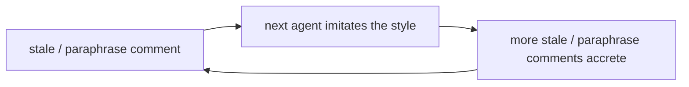

# Documentation writing — comments and prose

Reference for *how* comments and docs are written in this repo. Pairs
with `MODULES.md` (code shape) and `ENFORCEMENT.md` (how to promote a
claim from prose → comment → test → type).

For the deep, project-agnostic doc-writing framework, see the
`userSettings:writing-docs` skill — this file is the homelab-specific
overlay + the load-bearing meta-rule that makes the framework matter
*here*.

## Core principle

> **Code describes behavior. Comments encode intent.**
>
> A useful comment is a semantic test: it fires when a reader's eyeball
> spots the mismatch between what the code does and what it should do.
> If the next reader would figure out the intent without the comment,
> delete the comment.

## Why this lives in docs (the amnesiac-teammate loop)

This codebase is shaped by agents with no memory; they imitate the code
in proximity. Bad nearby conventions become a self-reinforcing negative
feedback loop:

The counter is to seed the repo with rent-paying examples so imitation
pulls in the right direction. The 2026-06-07 audit sweep
(`git log --grep "chore(comments):" --oneline`) is the seeding; this
file is the rule that keeps the next agent on the same axis. Rules
without examples drift; examples without rules don't generalise.

## Comments — the earn-its-keep test

> "Would the next reader figure out the intent without this comment?"

| Earns rent (KEEP)                          | Doesn't (CUT)                          |
|--------------------------------------------|----------------------------------------|
| Why the obvious approach didn't work       | What-paraphrase of the code            |
| Incident anchor (date + symptom + fix)     | How-step-by-step (the code is steps)   |
| Silent-breakage / sharp-edge warning       | Author / date / "added for X"          |
| Counter-intuitive constraint               | Status banners on dead code            |
| Deliberate absence (intentional omission)  | Transcribed framework / man-page docs  |
| Cross-ref to spec / skill / ADR / runbook  | List-of-derived-things                 |

## Docs — the four levers

(deep version: `userSettings:writing-docs`)

| Lever                  | Means                              | Failure smell                                |
|------------------------|------------------------------------|----------------------------------------------|
| Progressive disclosure | tiered docs; an index routes       | one fat doc; deep detail injected every turn |
| Concise                | reference, not story               | wall of text; "in session X..." narrative    |
| Visual                 | shape matches content              | enumerable facts buried in paragraphs        |
| Precise                | claims bound to evidence           | "is enforced" with nothing enforcing it      |

## Hard rules

- **Lists derived from code → derive from code, never duplicate in
  prose.** Lists of services / hosts / subvolumes / skills / lanRoutes /
  modules drift the second code changes. Generate them (`nix eval`),
  link the live registry (`nix flake show`, `just --list`,
  `ls .claude/skills/`), or eliminate the doc.
- **If a doc is purely derivative, eliminate the doc.** Code is the
  canonical source.
- **Cross-reference, never duplicate.** Two copies drift; pick one home
  (usually the abstraction site) and link from call sites.
- **Bind load-bearing claims to evidence.** "X is enforced" / "Y lives
  at Z" names the test, path, or type that makes it true. `INVARIANTS.md`
  tags each claim by enforcement rung.
- **What stays in docs.** WHY (decisions, ADRs, rationales), HOW
  (procedures, runbooks), mental models, frameworks, constraints —
  things code can't carry.

## Anti-patterns (caught during the 2026-06-07 sweep)

| Pattern                                  | Example                                                  | Fix                                                       |
|------------------------------------------|----------------------------------------------------------|-----------------------------------------------------------|
| Overshooting "Why this exists" headers   | 30-line essay once the abstraction has stuck             | compress to 2-5 lines of intent                           |
| Taxonomy duplicated 2-3 times            | header prose + option description + enum literal        | keep at the option description; cut header copies         |
| Inline assertion preamble                | *"the constraint is the documentation"*                  | drop; the assertion message IS the documentation          |
| Dead code with comment explaining why    | unused `context_color` var + "preserved from operator"   | delete the code; `git log` carries the option             |
| Misplaced comment block                  | shared-memory rationale 80 lines from its activation     | move comment adjacent to its code                         |
| Stale TODOs / "Open items"               | "Open items (post-deploy)" 6 weeks after deploy          | drop when the task closes (or `grep`-clean it then)       |
| Cross-referenced rationale at both ends  | role-enum docs restated in machine config                | pick one home (usually the abstraction), link             |
| Per-section paraphrase in a list literal | `# in-repo skills`, `# user-level CLAUDE.md` on attrs   | drop; the attribute name carries the meaning              |
| Transcribed framework docs               | per-flag systemd.exec glossary inline                    | drop; `man` is authoritative                              |
| Per-subvol layout enumeration            | layout diagram repeating disko's literals                | drop; the declaration carries the layout                  |

## Style for prose (the doc-refresh prompt)

> Be extremely precise. Sacrifice grammar for conciseness. Prefer visual
> explanations when possible, prose as complementary. Docs benefit from
> mermaid diagrams. Otherwise tables, lists, arrows and other visual
> shortcuts enhance understanding at a glance.

## Cross-references

- `userSettings:writing-docs` — deep doc-writing framework: tiers,
  bind-claims-to-evidence, mermaid legends, doc-drift guards.
- `MODULES.md` — code shape (this file is its prose-side companion).
- `INVARIANTS.md` — load-bearing claims tagged by enforcement tier.
- `ENFORCEMENT.md` — the prose → comment → test → type ladder; when to
  promote a claim a rung.
- `git log --grep "chore(comments):"` — the audit-sweep commits;
  worked examples seeded throughout `modules/`, `home/`, `machines/`.
