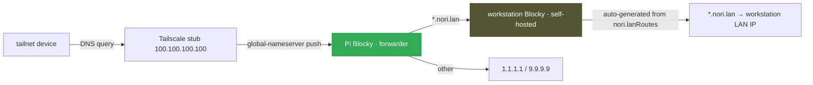

# Network

Three zones, default-deny everywhere. Services opt into specific access; nothing is wildcard-exposed.

## Zones

| Zone | What's there | Default posture |
|---|---|---|
| **localhost** | Services bind here unless explicitly exposed | Closed to outside |
| **tailnet** | Personal devices + family. SSH, Samba, `*.nori.lan` HTTPS, direct service ports | Closed by default; Caddy on 80+443 + Samba on 445 are the only globally-open tailnet ports |
| **public internet** | Personal apps that need public exposure live at Cloudflare edge (Pages for static, Workers + D1 for stateful) | **Homelab serves nothing publicly** by default. Tailscale Funnel is the prototyped path if a future service ever needs to land public traffic on workstation |

The Cloudflare edge apps (phibkro.org apex, filmder, drinks-app, finnbydel-app, heim) live as `Pages` for static + `Workers + D1` for stateful. The homelab keeps tailnet-only copies of `filmder` + `heim` via `nori.lanRoutes` for fast internal access. A `cloudflared` Tunnel approach was decommissioned 2026-05-08.

## `nori.lanRoutes` — the single declarative input

One declaration → three things generated automatically:

1. **Caddy vhost** at `<name>.nori.lan` reverse-proxying to the backend
2. **Blocky DNS** mapping `<name>.nori.lan` → workhorse LAN IP
3. **Gatus monitor** (if `monitor` is set) probing the backend, alerting via ntfy on failure

```nix
nori.lanRoutes.<name> = {
  port = 8080;                      # required, types.port
  scheme = "http";                  # default
  exposeOnTailnet = false;          # default; opt in for direct backend access
  audience = "operator";            # default; or "family" / "public"
  monitor = {                       # null = skip; { } = defaults
    path = "/health";               # default "/"
    interval = "60s";
    failureThreshold = 3;
  };
};
```

Schema + assertions in `modules/effects/lan-route.nix`. Adding a service is one declaration in its own module — no edits scattered across `caddy.nix` + `blocky.nix` + `gatus.nix`.

### Naming: function over brand

`chat.nori.lan` not `open-webui.nori.lan`. `media` not `jellyfin`. The brand changes (Uptime Kuma → Gatus); the function doesn't. Brand names only when the brand IS the identity (`auth` for Authelia, `samba`).

### Dashboard enrollment

`nori.lanRoutes.<n>.dashboard = { ... }` enrolls the route in the family-facing Glance dashboard at `home.nori.lan`. URL derives from the route name; metadata (title/icon/group/description) lives next to the rest of the service's route config. `glance.nix` is a pure transformer over `config.nori.lanRoutes`.

## Audience-driven trust model

Every route declares an audience. The auth stack is layered selectively from there:

| Audience | What it gates | Why |
|---|---|---|
| **operator** | admin UIs | Tailnet membership IS the auth. No Authelia overlay — layering it would duplicate the network-perimeter guarantee and make Authelia uptime load-bearing for operator workflows. qBittorrent's `LocalHostAuth = false` is a *deliberate design choice*: Caddy is the only HTTP entry, and Caddy is reachable only via tailnet. |
| **family** | per-user state (Jellyfin, Immich, Vaultwarden) | Native OIDC where the app supports it; forward-auth at Caddy where it doesn't (Komga, calibre-web). The auth layer carries identity *into* the app. |
| **public** | intentionally open dashboards + the SSO portal itself | Home dashboard (Glance), status (Gatus), auth (Authelia portal) — meant to be the unauthenticated entry surface |

Full rationale in the `audience` option description in `modules/effects/lan-route.nix`. The conceptual model: see `docs/CONCEPTS.md` § audience-driven trust topology.

## Caddy + TLS + naming

Caddy terminates TLS for every `<name>.nori.lan` using its **internal CA** (auto-generated). The root cert is committed at `modules/server/caddy-local-ca.crt` and added to system trust via `security.pki.certificateFiles` so `curl` / Go / OpenSSL trust it transparently.

**Python services** need explicit `SSL_CERT_FILE = "/etc/ssl/certs/ca-bundle.crt"` — `certifi` doesn't read system trust. See `.claude/skills/gotcha-python-certifi-bypass-system-trust/`.

**Devices** accessing the homelab need the Caddy root CA installed once:

| Device | Command / path |
|---|---|
| macOS system | `sudo security add-trusted-cert -d -r trustRoot -k /Library/Keychains/System.keychain modules/server/caddy-local-ca.crt` |
| Firefox / Zen | Settings → Privacy → Certificates → Import (browsers don't read macOS keychain) |
| iOS | AirDrop the cert → install via Settings → Profile → enable in Cert Trust Settings |

## Authelia OIDC (overview)

Authelia provides OIDC. Services that opt in get a one-click login flow (visit service → redirect to `auth.nori.lan` → log in once → returned authenticated). Per-service setup is auto-generated from the `nori.lanRoutes.<n>.oidc` block in each service module.

Hash material lives **only in sops** — Authelia's `template` config-filter reads the PBKDF2 hash from `/run/secrets/...` at startup. Zero hash material in committed Nix; the `forbidden-patterns` flake check fails if a `$pbkdf2-` string lands.

Bootstrap a new OIDC client via `/add-oidc-client`. The skill walks the secret generation + sops paste + route-block declaration + systemd wiring. Bootstrap script: `just oidc-key <name>`.

## Default-deny firewall

```nix
# Don't do this anymore — direct port exposure:
# networking.firewall.interfaces."tailscale0".allowedTCPPorts = [ 8096 ];

# Do this — single declaration generates Caddy vhost + DNS + monitor:
nori.lanRoutes.media = { port = 8096; monitor = { }; };
```

The only globally-open tailnet ports today are **80, 443** (Caddy) and **445** (Samba — not HTTP, can't go through Caddy). Backend ports stay closed on tailnet by default; opt in via `exposeOnTailnet = true` only when truly needed.

## DNS architecture



**Current state:** Pi runs Blocky in **forwarder mode** (primary, served to all tailnet devices via Tailscale's global-nameserver push). Workstation runs Blocky in **self-hosted mode** (auto-generates the `*.nori.lan` map from `nori.lanRoutes`; serves as fallback secondary). LAN-only devices (smart TV, guest phones) are NOT covered — they keep using whatever the router pushes.

**Why Tailscale push, not router DHCP:** the ISP-shipped Genexis EG400 locks DHCP DNS settings out of the user-facing admin UI. Router-side DNS replacement requires either (a) Altibox bridge-mode activation by phone request + a second router we control, or (b) double-NAT with a downstream router. Neither set up; Tailscale push is the zero-hardware-cost workaround.

**Future state:** Pi primary + workstation secondary via router DHCP, after bridge-mode or a second router lands.

**Bootstrap loop hazard:** workstation's `/etc/resolv.conf` points at Tailscale's stub (`100.100.100.100`); Tailscale forwards back to workstation's Blocky; Blocky can't resolve its own outbound URLs (blocklist sources, DoH endpoints) before serving DNS. `services.blocky.settings.bootstrapDns` MUST be set to direct upstream IPs. Without it, blocklist downloads silently fail on every restart. Codified in `.claude/skills/gotcha-blocky-bootstrap-loop/`.

Both Blocky instances forward to a public resolver (1.1.1.1 / Quad9) for non-blocked queries. Tailnet hostnames resolved via Tailscale MagicDNS independently of Blocky.

## Tailscale

Pi advertises:
- Subnet route for the home LAN (`--advertise-routes=192.168.1.0/24`)
- Exit node (`--advertise-exit-node`), opt-in per device

Both require approval in the Tailscale admin console (one-time).

Workstation runs Tailscale as a regular node, not a router. MagicDNS gives both hosts stable hostnames on the tailnet.

## Access summary

| Path | SSH (user) | SSH (root) | Samba | Snapshot |
|---|---|---|---|---|
| `/home/philip` | Yes | Yes | No | Hourly |
| `/srv/share` | Yes | Yes | Yes (auth) | Daily |
| `/mnt/media/streaming` | Yes | Yes | Yes (auth, RW) | Weekly |
| `/mnt/media/photos` | Yes | Yes | No | Daily |
| `/mnt/media/home-videos` | Yes | Yes | No | Weekly |
| `/mnt/media/projects` | Yes | Yes | Yes (auth) | Weekly |
| `/var/lib/<service>` | No | Yes | No | Daily |
| `/etc`, `/nix`, `/root` | No | Yes | No | Per rebuild (`@`) |

OS has one user (Philip). Family members get per-service accounts in Jellyfin, Immich, Open WebUI, Vaultwarden; their devices get Tailscale invites.
