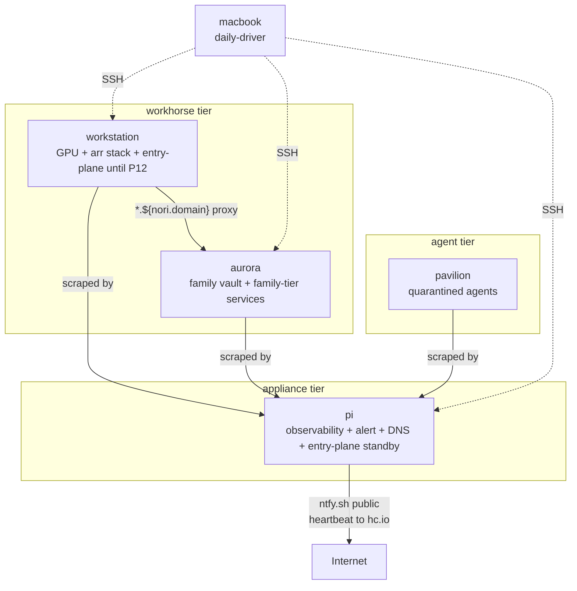

# Topology

Four persistent NixOS hosts on a single residential network plus a Mac on standalone home-manager. Roles are typed; placement assertions enforce them; cross-host refs go through `nori.hosts` registry — never IP literals.

## Hosts at a glance

| Host | Codename | Role | OS | Arch | Hardware | Primary job |
|---|---|---|---|---|---|---|
| **workstation** | emperor | `workhorse` | NixOS 26.05 | x86_64 | Ryzen 5600X · 32 GB DDR4 · RTX 5060 Ti 16 GB (Blackwell) | HTTP entry plane (Caddy + Authelia until P12), GPU services (Ollama / Jellyfin NVENC / *arr stack), workstation-tier file storage (downloads/streaming), daily-driver desktop |
| **pi** | fairy | `appliance` | NixOS 26.05 | aarch64 | Raspberry Pi 4 8 GB · USB-boot from Samsung FIT 128 GB | Observability hub, alert plane, DNS authoritative (Blocky self-hosted, post-ADR-0003), Tailscale subnet router + exit node, HTTP entry-plane standby (Caddy + Authelia + LE wildcard for `*.${nori.domain}`) |
| **pavilion** | pavilion | `agent` | NixOS 26.05 + impermanence | x86_64 | HP Pavilion g6 · AMD Athlon II · BIOS+GRUB · btrfs-rollback root | Agent quarantine — hermes / nixpkgs-agent / sandboxed claude work, headless |
| **aurora** | aurora | `workhorse` (always-on family vault) | NixOS 26.05 | x86_64 | Asus N552V · Intel Skylake-H · NVIDIA GTX 950M (legacy_535) | Family-tier service backends post-P8 (Vaultwarden, Radicale, Miniflux, Immich full stack + ML, Calibre-web, Komga, Glance, Heim, Filmder, Grafana). Family-tier file storage (`/mnt/family/{photos,home-videos,projects,library,archive}` on the Toshiba HDD). Samba shares for the same. Always-on so it survives workstation's sleep / outage. |
| **macbook** | adelie | (no role) | macOS · standalone home-manager | x86_64-darwin | Intel Mac (EOL clock — see ROADMAP) | Daily-driver laptop; Nix-managed CLI + brew for Mac-only |



Failure domain independence: each host shares no storage, no PSU, no critical boot-path dependency with the others. Any single failure does not block the rest.

## Workstation drives

| Drive | OS / use | Notes |
|---|---|---|
| WD Black SN750 1TB NVMe | NixOS root | btrfs, six subvolumes, label `nixos`, disko-managed |
| Corsair Force MP510 960GB NVMe | Backup + family replica | btrfs, label `mp510-backup`, disko-managed. `@backup-local` mounted at `/mnt/backup-local` (workstation's restic-local target, formerly the IronWolf `@restic-local` subvol — migrated 2026-06-11 P14); `@family-replica-*` for the nightly btrfs send/receive from aurora's `/mnt/family/*` (P15). Wiped from Windows on 2026-06-11 after operator extracted personal residue |
| Seagate IronWolf Pro 4TB (USB) | Media storage | btrfs, four subvolumes after P14 (`@downloads`, `@photos`, `@home-videos`, `@projects`, `@library`, `@archive`, `@snapshots`), label `ironwolf-storage`, disko-managed. Hosts the irreplaceable tier until P10 rsync moves it to aurora's family-vault HDD; afterward only `@downloads` + `@streaming` remain workstation-resident |

**NVMe enumeration is unstable across reboots.** `nvme0n1` was NixOS root at install time; post-reboot the drives swapped. Disko configs target `/dev/disk/by-id/...` paths for this reason. See `.claude/skills/gotcha-nvme-enumeration/`.

## Pi posture

USB-then-SD boot order via EEPROM `BOOT_ORDER=0xf41`. Anti-write storage posture:

```nix
swapDevices = [ ];
services.journald.extraConfig = "Storage=volatile";
boot.kernel.sysctl."vm.mmap_rnd_bits" = 18;  # aarch64 fixup
```

SD-card / flash wear is the #1 Pi failure mode. Volatile journald + no swap mitigate.

**Restic-as-target deferred:** Pi can host the workstation restic repo only when a real disk replaces the FIT — the anti-write posture rules out daily restic to flash.

## Topology registry (`nori.hosts`)

Cross-host references go through the registry, **never IP literals**. Schema in `modules/effects/hosts.nix`; values in `flake.nix` `identityFor`. A `readDir` over `./machines/` drives both `nixosConfigurations` enumeration and the registry — adding a host is "create the folder + add identity"; either omission fails eval.

```nix
config.nori.hosts.<name> = {
  role = "workhorse" | "appliance";  # typed; drives placement assertions
  tailnetIp = "100.x.y.z";            # the ONLY place IP literals live
  lanIp = "192.168.1.z";
  # … hardware-derived context, see modules/effects/hosts.nix
};
```

The `role` field drives the placement assertion in `modules/effects/backup.nix`: appliance hosts cannot use `paths`-based backups (they're observers, not state holders).

**Consumer-side lookup** (this is how cross-host wiring stays IP-literal-free):

```nix
# In a service module on workstation that reverse-proxies to pi:
nori.lanRoutes.metrics = {
  port = 8090;
  host = config.nori.hosts.pi.tailnetIp;   # ← never "100.100.71.3"
  monitor = { };
};
```

The `forbidden-patterns` flake check fails the build on a stray `100.x.y.z` literal anywhere outside `flake.nix`'s `identityFor`.

## Service placement

| Cluster | Where | Why |
|---|---|---|
| HTTP entry plane (Caddy + Authelia) | workstation today, pi post-P12 (ADR-0003) | Workhorse owned the user-facing surface; ADR-0003 moves the entry plane to pi so workstation can sleep. Pi's Caddy + Authelia + LE wildcard standing by; Tailscale DNS push order flips when critical mass of family-tier services have migrated to aurora and rebound to tailnet |
| GPU-bound (Ollama, Jellyfin NVENC, `*arr` stack, qBittorrent, Open WebUI) | workstation | RTX 5060 Ti — primary GPU |
| ML inference (Immich machine-learning / PyTorch) | aurora | Co-located with immich-server post-P8; GTX 950M is sufficient. `IMMICH_MACHINE_LEARNING_URL` resolves to aurora's tailnet IP whether immich-server runs on workstation (today, pre-P10) or aurora (post-state-migration) |
| Family-tier services (Vaultwarden, Radicale, Miniflux, Immich, Calibre-web, Komga, Glance, Heim, Filmder, Grafana) | aurora post-P8 | Always-on so they survive workstation sleep / outage; ADR-0002 |
| Family-tier file storage (`/mnt/family/{photos,home-videos,projects,library,archive}`) | aurora | Family vault — Toshiba HDD, btrfs label `family-vault` |
| Family Samba shares | aurora (post-P12 cutover, pre-positioned 2026-06-11) | Follows the drive — per-fs `samba = { }` blocks in `machines/aurora/disko-family.nix` |
| Workstation Samba shares (`media`, `share`, `nori`) | workstation | Whole-drive `media` share scoped to `/mnt/media` (IronWolf root) stays workstation-only; per-fs `share` + `nori` shares stay workstation-only via the gated workstation-shape check in `samba.nix` |
| Observability + alert plane (Beszel hub, Gatus, VictoriaMetrics, VictoriaLogs, ntfy server) | pi | Must survive workstation outage — that's *when* they fire |
| Heartbeat / dead-man-switch (healthchecks.io ping) | pi | SPOF mitigation — see `modules/services/heartbeat.nix` |
| DNS authoritative for `*.${nori.domain}` (Blocky self-hosted) | pi | Post-ADR-0003. Workstation's Blocky stays as secondary forwarder until the entry-plane cutover; the self-hosted role on pi was the prerequisite for the LE wildcard issuance (ADR-0004) |
| Network plumbing (subnet router + exit node) | pi | Appliance role; opt-in per device for exit node |
| Agent quarantine (hermes-agent CLI + dashboard) | pavilion | Sandboxed; pavilion's impermanence root makes pollution self-healing |
| Process metrics (`node-exporter` + `process-exporter`) | workstation + pavilion + aurora | Pi VM scrapes each; per-process RSS for leak hunts |
| Host-level high-level metrics (`beszel-agent`) | workstation + pavilion + aurora | Pi's Beszel hub aggregates per-host. Aurora added 2026-06-11 alongside its family-tier service standup |
| OnFailure → ntfy notifier (`ntfy-notify`) | workstation + pi + aurora | Per-host so the alert source is unambiguous and aurora-side unit failures (restic, btrbk, postgres dumps) page the operator without depending on workstation being awake |

Placement test = **fate-sharing breaks the function** (not "feels lightweight"). See `docs/GLOSSARY.md § fate-sharing`.

## Cross-host services (split-module pattern)

Daemon on one host, client/proxy on every consumer. Cross-host Caddy lanRoute gated `lib.mkIf config.services.caddy.enable` so daemon-host's Blocky stays pure-forwarder.

| Service | Daemon | Routed at | Client module |
|---|---|---|---|
| Beszel | pi | `metrics.nori.lan` | `modules/services/beszel/agent.nix` everywhere |
| ntfy | pi | `alert.nori.lan` | `modules/services/ntfy/notify.nix` everywhere |
| VictoriaLogs | pi | `logs.nori.lan` | `modules/common/vector.nix` ships journald |
| VictoriaMetrics | pi | `metrics.nori.lan` (Grafana datasource) | `modules/services/node-exporter.nix` scraped from pi |
| immich-ml | aurora | n/a (RPC only) | `modules/services/immich.nix` (workstation) — `IMMICH_MACHINE_LEARNING_URL` |
| hermes-agent | pavilion (planned) → currently workstation | `hermes.nori.lan` | `home/hermes/default.nix` (PCs) |

Add another via `/relocate-to-pi`. Precedents above.

## GPU access pattern

Services that need the GPU set `accelerationDevices` (or systemd `DeviceAllow`) from `config.nori.gpu.nvidiaDevices` — single source of truth in `modules/effects/gpu.nix`.

| Service | Status | Resource |
|---|---|---|
| Ollama (CUDA) | live | 14+ GiB VRAM at idle with model loaded |
| Immich (CUDA ML + NVENC) | live | NVENC encode, ML inference |
| Jellyfin (NVENC) | OS-level live | Web-UI flag still off (ROADMAP item) |

`hardware.nvidia.package = config.boot.kernelPackages.nvidiaPackages.production` — 595.58.03 on 26.05, Blackwell support landed. Fallback ladder if production breaks: `production` → `beta` → `latest` → explicit `mkDriver` pin.

## Resource caps (where it matters)

| Service / system | Cap | Reason |
|---|---|---|
| `immich-machine-learning.serviceConfig` (aurora) | (moved to aurora; cap deprecated on workstation) | Original cap guarded the userspace-CPU-starvation pattern that wedged workstation 2026-04-28 (rtkit canary starved 4+ minutes; commit `c0a557d`). Aurora-offload removed the host-wedge risk |
| `zramSwap` on workstation | 16 GiB compressed | Required for nvcc/CUDA builds; previously OOM'd + hard-hung the host |
| `swapDevices` on workstation | 8 GiB disk swapfile (`/swapfile` on `@` btrfs subvol, NoCoW) | Overflow tier behind zram — landed 2026-06-06 after the memory-pressure freeze. Priority -2 (zram is 5) |
| `swapDevices` on pi | `[ ]` (no swap) | Anti-write posture for flash storage |
| `MemoryHigh` per heavy service | (deferred — ROADMAP) | Waiting on 7+ days of `process-exporter` data before sizing caps |

## Operator facts

- Single user `nori`, passwordless wheel sudo, SSH key-only.
- CPU cooler repasted 2026-04-29 — sustained 12-thread load ~72°C (was 95°C TJ_max throttling pre-repaste).

## Adding a host

See `/add-host`. Short version:

1. Create `machines/<name>/` (folder name = `networking.hostName` — injected, don't redeclare).
2. Add an `identityFor` entry in `flake.nix` with `role`, `tailnetIp`, `lanIp`. Eval fails if folder or registry is missing.
3. **Add the new host's age public key** (derived from its SSH host key via `ssh-to-age`) to `.sops.yaml` and run `sops updatekeys secrets/secrets.yaml` to re-encrypt existing secrets so the new host can decrypt them. Without this, sops secrets are unreachable on first boot.
4. First boot → `tailscale up` → approve in admin console for subnet route / exit node if applicable.
