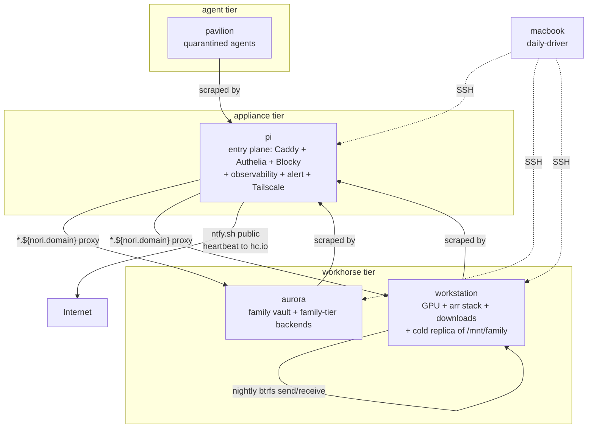

# Topology — generated reference

Auto-derived from `nori.hosts` schema + `identityFor` values
in `modules/machines/default.nix`. Do not hand-edit; the
hand-curated overview lives at `docs/reference/topology.md`
(kept parallel for the generated-vs-handwritten coverage
experiment).

Machine registry + `nixosConfigurations` factory.

Four persistent NixOS hosts on a single residential network plus a
Mac on standalone home-manager. Roles are typed; placement assertions
enforce them (see `modules/infra/backup/default.nix`); cross-host refs
go through `nori.hosts` registry — never IP literals.

## Topology



Failure domain independence: each host shares no storage, no PSU, no
critical boot-path dependency with the others. Any single failure does
not block the rest.

## Service-implicit-until-lan-route'd (the tier principle)

A service has three concerns: registration (it exists), state (it
persists data), location (it runs on host X). For services confined to
one host, **location is implicit from the import site**:

```
modules/machines/aurora/default.nix imports modules/services/vaultwarden.nix
                            ⇒ vaultwarden runs on aurora
```

The service doesn't declare a host. The fact that aurora's module list
pulls it in IS the location declaration. No explicit `runsOn`, no
cross-host wiring.

**Location becomes explicit when a service crosses machines.** That
happens through `nori.lanRoutes.<X>.runsOn`, which names the host
backing a route. `runsOn` lives on lan-route not by convenience — but
because the act of exposing a service via HTTP IS the act of declaring
location-needs-resolving. Pre-exposure, location is implicit; at
exposure, location is the cross-machine answer the proxy needs.

```
  declaration      state      location          cross-machine?
  ─────────────────────────────────────────────────────────────────
  packages         none       anywhere          N/A (stateless)
  services         local      implicit (import) opt-in via lan-route
  distributed      local +    EXPLICIT —        N/A (already is)
  services         binding    runsOn host(s)
```

Today `runsOn` is a single host string. Forward shape (not in tree
yet but pre-named): a list with a semantic tag — `failover` (sum),
`loadbalance` (product), `sequential` (ordered sum). Rule of three:
extract when a second service genuinely needs multi-host routing.

## How this module works

Two explicit maps form the single source of truth:

 - `nixosMachines`     — NixOS hosts the flake builds, name → folder path
 - `standaloneHomes`   — non-NixOS machines (Mac) that ride home-manager
                         standalone, name → home.nix path
 - `identityFor`       — per-host identity facts (tailnet/lan IPs, role,
                         hardware, primaryJob); keys MUST equal those of
                         `nixosMachines`. Asserted eval-time below.

Adding a NixOS host: add the entry to BOTH `nixosMachines` AND
`identityFor`. The key-set assertion fails eval if one is missing,
preserving the "no parallel identifier to keep in sync" property the
old readDir-driven enumeration had — but explicit instead of magic.

Schema: `modules/infra/hosts.nix`.

Consumers (cross-host refs):

 - `modules/infra/networking/default.nix`     — `nori.lanIp` default
 - `modules/infra/backup/default.nix`         — host-aware appliance assertion
 - `modules/infra/observability/beszel/agent.nix` — metrics route backend
 - `modules/infra/observability/ntfy/notify.nix`  — alert route backend
 - `modules/machines/workstation/default.nix` — Pi probe URLs

# Topology — overview {#sec-functions-library-topology}


## Per-host hardware posture

## aurora — Asus N552V · Intel Skylake-H i7-6700HQ · 12 GB DDR4 · NVIDIA GTX 950M

Retired gaming laptop repurposed as the family-vault host. Dead
battery, but otherwise solid: always-on AC, lid closed, runs headless.

 - **119 GB LiteOn SSD (`/dev/sda`)** — root + boot + `/nix`. btrfs
   subvols; no impermanence (immich-ml's CLIP/face weights are ~2 GB
   and worth keeping across reboots).
 - **932 GB Toshiba HDD (`/dev/sdb`)** — `/mnt/family/{photos,home-videos,
   projects,library,archive}`. The family vault.
 - **External Seagate OneTouch USB HDD** — `/mnt/backup/onetouch`,
   restic vault for both pi and workstation backups. SFTP-served via
   the chrooted `restic` user.

Derived from `nixos-generate-config --no-filesystems` on the live
ISO (2026-06-06). UEFI firmware. ~1 GB of the 12 GB is iGPU-pinned
(Intel HD 530); ~11 GB usable for services.

## GPU posture

NVIDIA GTX 950M (Maxwell) handles immich-ml CLIP + face recognition
via the legacy_535 driver branch (`hardware.nvidia.package =
config.boot.kernelPackages.nvidiaPackages.legacy_535`). Not enough
VRAM for LLM inference — that stays on workstation's 5060 Ti.

## Why workhorse role

Has GPU, has compute, hosts state. Classified workhorse — but it's a
*minimal* workhorse. If a second compute-offload host ever appears,
the rule-of-three signal is to extract a dedicated `compute` role
then (see `modules/infra/hosts.nix § role`).
## pavilion — HP Pavilion g6 · AMD Athlon II P360 · 3.6 GB RAM · BIOS+GRUB

Decade-old laptop (Phenom II era, 2010) repurposed as the agent
quarantine host. Headless, lid closed, always-on power.

 - **Single 640 GB SATA rotational HDD** — root + impermanence
   /persist. No discrete GPU.
 - **3.6 GB RAM** — the ceiling that drives the impermanence choice
   in `../default.nix`. tmpfs-root would eat ~half of system RAM;
   btrfs-rollback keeps the "clean every boot" property without
   that cost.
 - **BIOS firmware (not UEFI)** — boot.loader uses GRUB, not systemd-
   boot (see `../default.nix`).

## Agent quarantine posture

Pavilion sits under `tag:agent` in the Tailscale ACL. Can reach
workhorse `:11434` (ollama) only; cannot SSH any privileged-tier
host. `nori.backups.<X>` declarations are a build error — anything
escaping the box sandbox vanishes on reboot via the impermanence
rollback.

Derived from `nixos-generate-config --no-filesystems` on the live
ISO (2026-06-05).
## pi — Raspberry Pi 4 (8 GiB) · aarch64 · USB-boot from Samsung FIT 128 GB

**Anti-write storage posture.** SD-card / flash wear is the #1 Pi failure
mode; this host's filesystem layer is configured to minimize writes:

 - `swapDevices = [ ]` — no physical swap. zramSwap (RAM-backed compressed)
   is the right alternative if memory pressure ever shows up.
 - `services.journald.extraConfig` — `Storage=volatile` (RAM-backed
   journal) + `SystemMaxUse=64M` cap.
 - `boot.kernel.sysctl."vm.mmap_rnd_bits" = 18` — aarch64 fixup (default
   33 from x86_64 systemd fails on aarch64's 39-bit VA).

**Restic-as-target deferred:** Pi can host the workstation restic repo
only when a real disk replaces the FIT — the anti-write posture rules
out daily restic to flash.

**NVMe enumeration warning.** Disko configs target `/dev/disk/by-id/...`
paths because NVMe enumeration is unstable across reboots. Pi itself
doesn't have NVMe today, but the convention is universal in this repo;
see `.claude/skills/gotcha-nvme-enumeration/`.

## Build path

Pi closures build on workstation via aarch64 binfmt emulation
(`boot.binfmt.emulatedSystems` in `modules/machines/workstation/hardware.nix`);
the sd-image-aarch64 module handles partitioning. Flashed once, then
rebuilt in-place via `nh os switch` over tailnet.
## workstation — Ryzen 5600X · 32 GB DDR4 · RTX 5060 Ti 16 GB (Blackwell)

Workhorse-tier compute. Three NVMe-class drives + one USB-attached HDD:

 - **WD SN750 1 TB NVMe** — root + service state (`@`, `@home`,
   `@nix`, `@var-lib`, `@var-log`). disko at `./disko.nix`.
 - **Corsair MP510 960 GB NVMe** — cold replica of `/mnt/family/*`
   (btrbk receive endpoint, P14). disko at `./disko-mp510.nix`.
 - **Seagate IronWolf Pro 4 TB (USB)** — `@downloads` + `@streaming`
   for arr stack throughput. disko at `./disko-media.nix`.

## NVMe enumeration warning

`nvme0n1` was NixOS root at install time; post-reboot the drives
swapped. Disko configs target `/dev/disk/by-id/...` paths because of
this. **Never touch `nvme0n1` without verifying the model string via
`/dev/disk/by-id/`** — full constraint in CLAUDE.md hard rules. See
`.claude/skills/gotcha-nvme-enumeration/`.

## Wake-on-LAN

Pi's `wakeonlan` sender targets this host's MAC (`scripted-networking
→ systemd-network-link` config; P19 Aurora-migration). The combined
shape is: aurora always-on serving family routes; workstation
WoL-woken from pi when media access happens (Jellyfin / Samba /
arr web UI).

## Sleep + GPU constraint

NVIDIA Blackwell + `suspend-then-hibernate` hangs upstream (systemd
#27559). Workstation uses manual `super+P` lock-then-suspend with
the VRAM-preserve kernel param fix; PipeWire-aware idle inhibit
prevents idle-sleep during ambient sound. Full debt note in
`docs/roadmap.md § Architectural debt`.


## Hosts at a glance

| Host | Codename | Role | Tailnet | LAN | Hardware | Primary job |
|---|---|---|---|---|---|---|
| **aurora** | aurora | `workhorse` (always-on family vault) | `100.101.67.111` | — | Asus N552V · Intel Skylake-H i7-6700HQ · 12 GB DDR4 · NVIDIA GTX 950M (legacy_535) · Toshiba HDD + OneTouch USB | Family vault: `/mnt/family/{photos,home-videos,projects,library,archive}` on the Toshiba HDD + family-tier service backends (Vaultwarden, Radicale, Miniflux, Immich full stack + ML, Calibre-web, Komga, Navidrome, Glance, Heim, Filmder, Grafana). Samba shares for `/mnt/family/*`. OneTouch restic vault. Always-on so it survives workstation's sleep / outage. |
| **pavilion** | pavilion | `agent` | `100.93.230.66` | — | HP Pavilion g6 · AMD Athlon II · BIOS+GRUB · btrfs-rollback root (impermanence) | Agent quarantine — hermes / nixpkgs-agent / sandboxed claude work, headless. Planned weekly tertiary replica of `/mnt/family/*` (P16). |
| **pi** | fairy | `appliance` (always-on entry plane) | `100.100.71.3` | `192.168.1.225` | Raspberry Pi 4 8 GB · aarch64 · USB-boot from Samsung FIT 128 GB | HTTP entry plane (Caddy + Authelia + Blocky-authoritative, LE wildcard cert on `*.${nori.domain}`), observability hub, alert plane, Tailscale subnet router + exit node. |
| **workstation** | emperor | `workhorse` (sleep-friendly compute) | `100.81.5.122` | `192.168.1.181` | Ryzen 5600X · 32 GB DDR4 · RTX 5060 Ti 16 GB (Blackwell) · WD SN750 1 TB NVMe + Corsair MP510 960 GB NVMe + Seagate IronWolf Pro 4 TB (USB) | GPU services (Ollama / Jellyfin NVENC), `*arr` stack + qBittorrent, `@downloads` + `@streaming` on the IronWolf, daily-driver desktop. Cold replica of `/mnt/family/*` on MP510 (btrbk receive endpoint). WoL-wake when media access happens. |

## Registry schema (`nori.hosts.<name>.*`)

What an `identityFor` entry must declare to satisfy the schema.
Schema lives in `modules/infra/hosts.nix`; values live in
`modules/machines/default.nix`.

## nori.hosts

Topology registry. Single source of truth for cross-host
references. Populated in flake.nix’s ` identityFor ` (driven by
readDir over ./hosts/).


*Type:*
attribute set of (submodule)


*Default:*

```nix
{ }
```

*Declared by:*
 - [<nixpkgs/modules/infra/hosts.nix>](https://github.com/NixOS/nixpkgs/blob//modules/infra/hosts.nix)


## nori.hosts.<name>.codename


Aesthetic codename for MOTD / dashboards / casual reference.
The hostname (not the codename) stays the identifier that
SSH / Tailscale / nix flakes know — codename is decoration.

Theme: cold / polar / penguin.


*Type:*
string

*Declared by:*
 - [<nixpkgs/modules/infra/hosts.nix>](https://github.com/NixOS/nixpkgs/blob//modules/infra/hosts.nix)


## nori.hosts.<name>.hardware


One-line hardware identification — chassis · CPU · RAM · GPU
· notable storage. Drives the hosts-at-a-glance table in
the generated topology doc; not consumed by evaluation.

Format guidance: model · CPU family · RAM · GPU (if any) ·
storage notes. Keep terse — the field is a table cell, not
a spec sheet. Detailed posture lives in modules/machines/<n>/default.nix
header comments (anti-write posture, impermanence, etc.).


*Type:*
string

*Declared by:*
 - [<nixpkgs/modules/infra/hosts.nix>](https://github.com/NixOS/nixpkgs/blob//modules/infra/hosts.nix)


## nori.hosts.<name>.lanIp


Static-DHCP LAN IP, or null. Used by ops tooling (Justfile
rsync targets) when the tailnet hostname doesn’t resolve —
e.g., ` workstation.saola-matrix.ts.net ` from Mac without
tailnet DNS.


*Type:*
null or string


*Default:*

```nix
null
```

*Declared by:*
 - [<nixpkgs/modules/infra/hosts.nix>](https://github.com/NixOS/nixpkgs/blob//modules/infra/hosts.nix)


## nori.hosts.<name>.primaryJob


Multi-clause prose describing what this host does — the
“Primary job” cell in the topology table. CommonMark
permitted (bullets, inline code, links). Keep to a
paragraph; deeper rationale belongs in modules/machines/<n>/default.nix
or the relevant ADR.

Drift policy: when a host’s job changes materially (gains
or loses a service tier), update this string in the same
commit. The generator surfaces it; the prose-only
topology.md no longer carries it.


*Type:*
string

*Declared by:*
 - [<nixpkgs/modules/infra/hosts.nix>](https://github.com/NixOS/nixpkgs/blob//modules/infra/hosts.nix)


## nori.hosts.<name>.role


Structural role driving placement assertions:

 - ` workhorse ` — heavy compute, state, GPU, large disks.
   Backed up to local restic. Today this covers two
   distinct shapes — workstation (GPU + desktop +
   bulk media) and aurora (always-on family vault +
   family-tier backends) — which still share the
   “owns state, can take paths-based backups” properties
   workhorse implies. **Rule of three**: if a third host
   matches aurora’s always-on-no-desktop shape, extract
   a dedicated ` vault ` (or ` compute `) role then.

 - ` appliance ` — observability + alerting + DNS + network
   plumbing + HTTP entry plane (Caddy + Authelia +
   Blocky-authoritative). Survives workhorse failure.
   Anti-write storage (no swap, volatile journald, flash)
   → paths-based backups are a build error (assertion in
   modules/infra/backup/default.nix).

 - ` agent ` — untrusted-compute quarantine. Stateless by
   design: tmpfs root + impermanence /persist. No GPU
   (inference offloaded to workhorse), no GH credential.
   ` nori.backups.<X> ` declarations are a build error —
   anything escaping the box sandbox vanishes on reboot.

Adding a role = extend the enum, document its constraints,
and add the assertions that key off it.


*Type:*
one of “workhorse”, “appliance”, “agent”

*Declared by:*
 - [<nixpkgs/modules/infra/hosts.nix>](https://github.com/NixOS/nixpkgs/blob//modules/infra/hosts.nix)


## nori.hosts.<name>.roleOneLiner


Short qualifier appended to the ` role ` cell in the topology
table — disambiguates the role for hosts that share a typed
role but differ in shape (e.g. workstation “sleep-friendly
compute” vs aurora “always-on family vault”; both are
` workhorse `). Empty string when the role itself is the
full story (pavilion: ` agent `).


*Type:*
string

*Declared by:*
 - [<nixpkgs/modules/infra/hosts.nix>](https://github.com/NixOS/nixpkgs/blob//modules/infra/hosts.nix)


## nori.hosts.<name>.tailnetIp


Tailnet (100.x.y.z) IP. Stable per device once authed —
survives reboots and re-IPs. The canonical address for
cross-host references in this flake.


*Type:*
string

*Declared by:*
 - [<nixpkgs/modules/infra/hosts.nix>](https://github.com/NixOS/nixpkgs/blob//modules/infra/hosts.nix)


