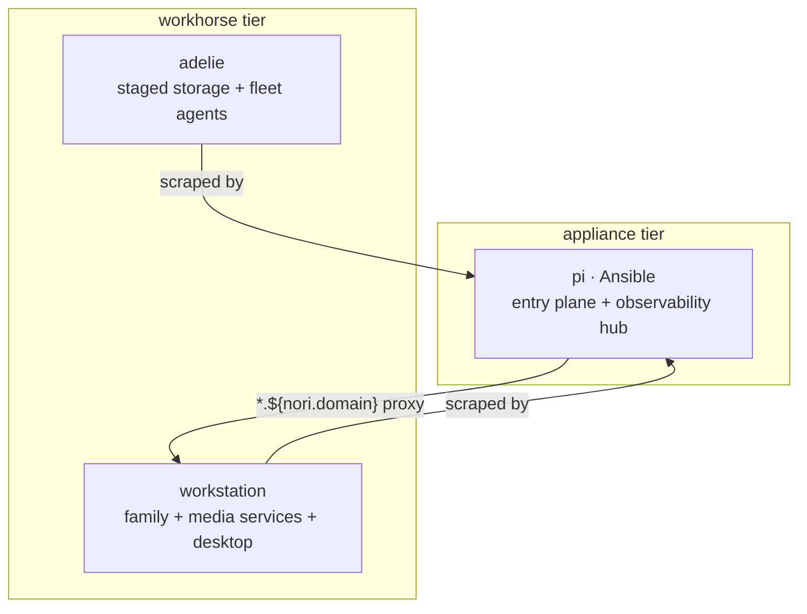

# Topology — generated reference

Auto-derived from the `nori.hosts` schema + values in
`inventory/hosts.nix`. Do not hand-edit; the
hand-curated overview lives at `docs/reference/topology.md`
(kept parallel for the generated-vs-handwritten coverage
experiment).

NixOS configuration factory backed by the pure homelab inventory.

`inventory/default.nix` evaluates before the NixOS module fixed point.
Host inventory owns identity, profiles, and placement tags. Workload
manifests own ordered selectors. The compiler resolves explicit realization
instances, then selects profile and workload modules for each NixOS host.

## Topology


```mermaid
graph TB
  subgraph "appliance tier"
    P[pi · Ansible<br/>entry plane + observability hub]
  end
  subgraph "workhorse tier"
    A[adelie<br/>staged storage + fleet agents]
    W[workstation<br/>family + media services + desktop]
  end
  P -- "*.${nori.domain} proxy" --> W
  A -- "scraped by" --> P
  W -- "scraped by" --> P
```

Cross-host references continue through the compatibility `nori.hosts`
registry. New architecture consumers use the typed, public-safe
`nori.inventory` projection. Both derive from the same pure source; there is
no parallel identity map.

# Topology — overview {#sec-functions-library-topology}


## Per-host hardware posture

## workstation — hardware inventory: `inventory/hosts.nix`

Primary service compute and storage host:

 - **WD SN750 1 TB NVMe** — root + service state (`@`, `@home`,
   `@nix`, `@var-lib`, `@var-log`). disko at `./disko.nix`.
 - **Corsair MP510 960 GB NVMe** — cache and preserved archives at
   `/mnt/backup-local`. disko at `./disko-mp510.nix`.
 - **Seagate IronWolf Pro 4 TB (SATA)** — downloads plus canonical family
   datasets under `/mnt/media/*`. disko at `./disko-media.nix`.

## NVMe enumeration warning

`nvme0n1` was NixOS root at install time; post-reboot the drives
swapped. Disko configs target `/dev/disk/by-id/...` paths because of
this. **Never touch `nvme0n1` without verifying the model string via
`/dev/disk/by-id/`** — full constraint in AGENTS.md. See
`Mnemopi recall: gotcha-nvme-enumeration`.

## Service posture

Family services, media services, research tools, and the operator desktop
are colocated here. Pi remains the always-on entry and observability plane;
SSDs hold hot data and IronWolf Pro holds cold data. OneTouch stores
independent Restic history on a separate disk attached to this host.

## Sleep + GPU constraint

NVIDIA Blackwell + `suspend-then-hibernate` hangs upstream (systemd
#27559). Workstation uses manual `super+P` lock-then-suspend with
the VRAM-preserve kernel param fix; PipeWire-aware idle inhibit
prevents idle-sleep during ambient sound. Full debt note in
`docs/roadmap.md § Architectural debt`.


## Hosts at a glance

| Host | Managed by | Codename | Role | Tailnet | LAN | Hardware | Primary job |
|---|---|---|---|---|---|---|---|
| **adelie** | `nixos` | adelie | `workhorse` (staged storage and media host) | `100.107.90.3` | — | Node 304 · Ryzen 5 5600X · 16 GB DDR4 · RTX 2060 Super · Samsung 990 Pro 1 TB NVMe | Future storage and media workhorse. Phase one is a minimal, bootable NixOS host on its Samsung NVMe; the IronWolf Pro and OneTouch remain undeclared until their physical migration and backup roles are verified. |
| **pi** | `ansible` | fairy | `appliance` (always-on entry plane) | `100.100.71.3` | `192.168.1.225` | Raspberry Pi 4 8 GB · aarch64 · USB-boot from Samsung FIT 128 GB | HTTP entry plane (Caddy + Authelia + Pi-hole, LE wildcard cert on `*.${nori.domain}`), observability hub, alert plane, Tailscale subnet router + exit node. |
| **workstation** | `nixos` | emperor | `workhorse` (always-on converged desktop/server) | `100.81.5.122` | `192.168.1.181` | Ryzen 9 5950X · 64 GB DDR4 · RTX 5060 Ti 16 GB (Blackwell) · WD SN750 1 TB NVMe + Corsair MP510 960 GB NVMe + Seagate IronWolf Pro 4 TB SATA | Always-on graphical workstation and homelab server: GPU services (Ollama / Jellyfin NVENC), `*arr` stack + qBittorrent, family services and Samba shares on the attached IronWolf disk, and the fleet's re-derivable Attic cache. SSDs hold hot data and the IronWolf Pro holds cold archives. OneTouch stores independent Restic history on a separate disk attached to this host; same-disk snapshots provide local rollback. |

## Registry schema (`nori.hosts.<name>.*`)

What an `inventory/hosts.nix` identity entry must declare to
satisfy the schema. Schema lives in `infra/common/nixos/hosts.nix`.

## nori.hosts

Topology registry. Single source of truth for cross-host
references. Projected from ` inventory/hosts.nix ` before NixOS
module evaluation.


*Type:*
attribute set of (submodule)


*Default:*

```nix
{ }
```

*Declared by:*
 - [<nixpkgs/infra/common/nixos/hosts.nix>](https://github.com/NixOS/nixpkgs/blob//infra/common/nixos/hosts.nix)


## nori.hosts.<name>.codename


Aesthetic codename for MOTD / dashboards / casual reference.
The hostname (not the codename) stays the identifier that
SSH / Tailscale / nix flakes know — codename is decoration.

Theme: cold / polar / penguin.


*Type:*
string

*Declared by:*
 - [<nixpkgs/infra/common/nixos/hosts.nix>](https://github.com/NixOS/nixpkgs/blob//infra/common/nixos/hosts.nix)


## nori.hosts.<name>.hardware


One-line hardware identification — chassis · CPU · RAM · GPU
· notable storage. Drives the hosts-at-a-glance table in
the generated topology doc; not consumed by evaluation.

Format guidance: model · CPU family · RAM · GPU (if any) ·
storage notes. Keep terse — the field is a table cell, not
a spec sheet. Detailed posture lives in infra/<n>/default.nix
header comments (anti-write posture, impermanence, etc.).


*Type:*
string

*Declared by:*
 - [<nixpkgs/infra/common/nixos/hosts.nix>](https://github.com/NixOS/nixpkgs/blob//infra/common/nixos/hosts.nix)


## nori.hosts.<name>.lanIp


Static-DHCP LAN IP, or null. Used by ops tooling (Justfile
rsync targets) when the tailnet hostname doesn’t resolve —
e.g., ` workstation.saola-matrix.ts.net ` from Mac without
tailnet DNS.


*Type:*
null or string


*Default:*

```nix
null
```

*Declared by:*
 - [<nixpkgs/infra/common/nixos/hosts.nix>](https://github.com/NixOS/nixpkgs/blob//infra/common/nixos/hosts.nix)


## nori.hosts.<name>.primaryJob


Multi-clause prose describing what this host does — the
“Primary job” cell in the topology table. CommonMark
permitted (bullets, inline code, links). Keep to a
paragraph; deeper rationale belongs in infra/<n>/default.nix
or the relevant ADR.

Drift policy: when a host’s job changes materially (gains
or loses a service tier), update this string in the same
commit. The generator surfaces it; the prose-only
topology.md no longer carries it.


*Type:*
string

*Declared by:*
 - [<nixpkgs/infra/common/nixos/hosts.nix>](https://github.com/NixOS/nixpkgs/blob//infra/common/nixos/hosts.nix)


## nori.hosts.<name>.role


Structural role driving placement assertions:

 - ` workhorse ` — heavy compute, state, GPU, large disks.
   Workstation combines desktop, application backends,
   and attached data disks under this role.

 - ` appliance ` — observability + alerting + DNS + network
   plumbing + HTTP entry plane (Caddy + Authelia +
   DNS). Survives workhorse failure.
   Anti-write storage (no swap, volatile journald, flash)
   → local backup repositories are a build error (assertion in
   infra/common/nixos/backup.nix).

 - ` agent ` — untrusted-compute quarantine. Stateless by
   design: tmpfs root + impermanence /persist. No GPU
   (inference offloaded to workhorse), no GH credential.
   ` nori.backups.<X> ` declarations are a build error —
   anything escaping the box sandbox vanishes on reboot.

Adding a role = extend the enum, document its constraints,
and add the assertions that key off it.


*Type:*
one of “workhorse”, “appliance”, “agent”

*Declared by:*
 - [<nixpkgs/infra/common/nixos/hosts.nix>](https://github.com/NixOS/nixpkgs/blob//infra/common/nixos/hosts.nix)


## nori.hosts.<name>.roleOneLiner


Short qualifier appended to the ` role ` cell in the topology
table — disambiguates the role for hosts that share a typed
role but differ in shape (e.g. desktop and headless servers may
both be ` workhorse `). Empty string when the role itself is the
full story (for example, ` agent `).


*Type:*
string

*Declared by:*
 - [<nixpkgs/infra/common/nixos/hosts.nix>](https://github.com/NixOS/nixpkgs/blob//infra/common/nixos/hosts.nix)


## nori.hosts.<name>.tailnetIp


Tailnet (100.x.y.z) IP. Stable per device once authed —
survives reboots and re-IPs. The canonical address for
cross-host references in this flake.


*Type:*
string

*Declared by:*
 - [<nixpkgs/infra/common/nixos/hosts.nix>](https://github.com/NixOS/nixpkgs/blob//infra/common/nixos/hosts.nix)


