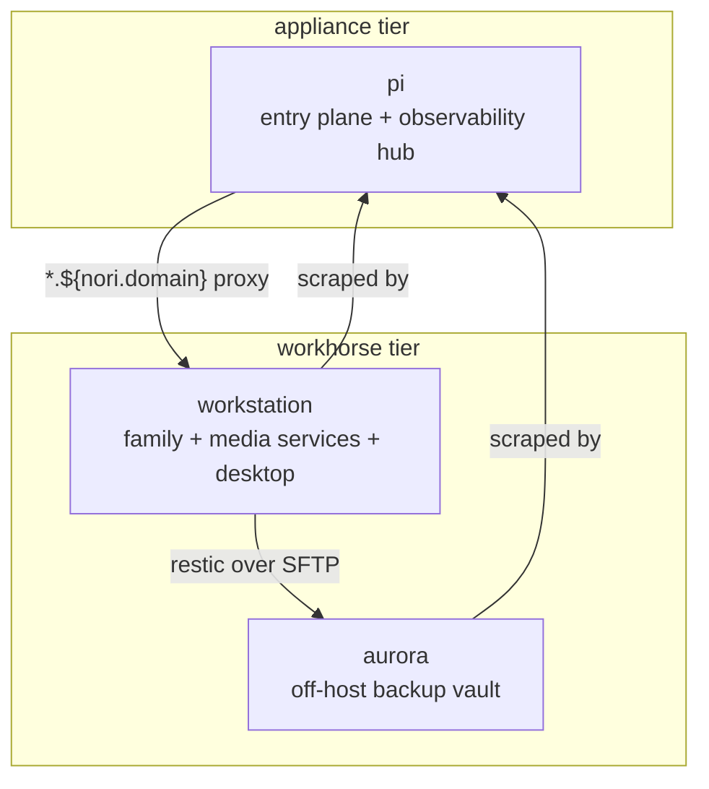

# Topology — generated reference

Auto-derived from the `nori.hosts` schema + values in
`inventory/hosts.nix`. Do not hand-edit; the
hand-curated overview lives at `docs/reference/topology.md`
(kept parallel for the generated-vs-handwritten coverage
experiment).

NixOS configuration factory backed by the pure homelab inventory.

`inventory/default.nix` is evaluated before the NixOS module fixed point and
owns host enumeration, identity, profile selection, intended workload
placement, and reusable system-module composition. Host realizations carry
only hardware/storage and genuine deviations; profiles and workload
manifests select reusable modules before the NixOS fixed point.

## Topology


```mermaid
graph TB
  subgraph "appliance tier"
    P[pi<br/>entry plane + observability hub]
  end
  subgraph "workhorse tier"
    A[aurora<br/>off-host backup vault]
    W[workstation<br/>family + media services + desktop]
  end
  P -- "*.${nori.domain} proxy" --> W
  W -- "restic over SFTP" --> A
  A -- "scraped by" --> P
  W -- "scraped by" --> P
```

Cross-host references continue through the compatibility `nori.hosts`
registry. New architecture consumers use the typed, public-safe
`nori.inventory` projection. Both derive from the same pure source; there is
no parallel identity map.

# Topology — overview {#sec-functions-library-topology}


## Per-host hardware posture

## aurora — Asus N552V · Intel Skylake-H i7-6700HQ · 12 GB DDR4 · NVIDIA GTX 950M

Retired gaming laptop repurposed as an off-host backup appliance. Dead
battery, but otherwise solid: always-on AC, lid closed, runs headless.

 - **119 GB LiteOn SSD (`/dev/sda`)** — root + boot + `/nix`.
 - **External Seagate OneTouch USB HDD** — `/mnt/backup`,
   restic vault for workstation backups. SFTP-served through
   the chrooted `restic` user.

Derived from `nixos-generate-config --no-filesystems` on the live
ISO (2026-06-06). UEFI firmware. ~1 GB of the 12 GB is iGPU-pinned
(Intel HD 530); ~11 GB usable for services.

## GPU posture

The NVIDIA GTX 950M remains available through the legacy_535 driver branch,
but Aurora no longer runs Immich ML or the GPU exporter.

## Why workhorse role

The existing `workhorse` role permits durable backup storage. Aurora's
narrower purpose is explicit in its inventory workload: `restic-target`.
## pi — Raspberry Pi 4 (8 GiB) · aarch64 · USB-boot from Samsung FIT 128 GB

**Anti-write storage posture.** SD-card / flash wear is the #1 Pi failure
mode; this host's filesystem layer is configured to minimize writes:

 - `swapDevices = [ ]` — no physical swap. zramSwap (RAM-backed compressed)
   is the right alternative if memory pressure ever shows up.
 - `services.journald.extraConfig` — `Storage=volatile` (RAM-backed
   journal) + `SystemMaxUse=64M` cap.
 - `boot.kernel.sysctl."vm.mmap_rnd_bits" = 18` — aarch64 fixup (default
   33 from x86_64 systemd fails on aarch64's 39-bit VA).

**Restic-as-target deferred:** Pi can host the workstation restic repo
only when a real disk replaces the FIT — the anti-write posture rules
out daily restic to flash.

**NVMe enumeration warning.** Disko configs target `/dev/disk/by-id/...`
paths because NVMe enumeration is unstable across reboots. Pi itself
doesn't have NVMe today, but the convention is universal in this repo;
see `Mnemopi recall: gotcha-nvme-enumeration`.

## Build path

Pi closures build on workstation via aarch64 binfmt emulation
(`boot.binfmt.emulatedSystems` in `modules/machines/workstation/hardware.nix`);
the sd-image-aarch64 module handles partitioning. Flashed once, then
rebuilt in-place via `nh os switch` over tailnet.
## workstation — Ryzen 5600X · 32 GB DDR4 · RTX 5060 Ti 16 GB (Blackwell)

Primary service compute and storage host:

 - **WD SN750 1 TB NVMe** — root + service state (`@`, `@home`,
   `@nix`, `@var-lib`, `@var-log`). disko at `./disko.nix`.
 - **Corsair MP510 960 GB NVMe** — local restic target at
   `/mnt/backup-local`. disko at `./disko-mp510.nix`.
 - **Seagate IronWolf Pro 4 TB (USB)** — downloads plus canonical family
   datasets under `/mnt/media/*`. disko at `./disko-media.nix`.

## NVMe enumeration warning

`nvme0n1` was NixOS root at install time; post-reboot the drives
swapped. Disko configs target `/dev/disk/by-id/...` paths because of
this. **Never touch `nvme0n1` without verifying the model string via
`/dev/disk/by-id/`** — full constraint in CLAUDE.md hard rules. See
`Mnemopi recall: gotcha-nvme-enumeration`.

## Service posture

Family services, media services, research tools, and the operator desktop
are colocated here. Pi remains the always-on entry and observability plane;
Aurora receives the off-host restic copy.

## Sleep + GPU constraint

NVIDIA Blackwell + `suspend-then-hibernate` hangs upstream (systemd
#27559). Workstation uses manual `super+P` lock-then-suspend with
the VRAM-preserve kernel param fix; PipeWire-aware idle inhibit
prevents idle-sleep during ambient sound. Full debt note in
`docs/roadmap.md § Architectural debt`.


## Hosts at a glance

| Host | Codename | Role | Tailnet | LAN | Hardware | Primary job |
|---|---|---|---|---|---|---|
| **aurora** | aurora | `workhorse` (off-host backup vault) | `100.101.67.111` | — | Asus N552V · Intel Skylake-H i7-6700HQ · 12 GB DDR4 · NVIDIA GTX 950M (legacy_535) · OneTouch USB | Off-host backup appliance. The chrooted restic SFTP target stores workstation backups on the OneTouch HDD, preserving a second chassis and power-failure domain. |
| **pi** | fairy | `appliance` (always-on entry plane) | `100.100.71.3` | `192.168.1.225` | Raspberry Pi 4 8 GB · aarch64 · USB-boot from Samsung FIT 128 GB | HTTP entry plane (Caddy + Authelia + Blocky-authoritative, LE wildcard cert on `*.${nori.domain}`), observability hub, alert plane, Tailscale subnet router + exit node. |
| **workstation** | emperor | `workhorse` (always-on converged desktop/server) | `100.81.5.122` | `192.168.1.181` | Ryzen 5600X · 32 GB DDR4 · RTX 5060 Ti 16 GB (Blackwell) · WD SN750 1 TB NVMe + Corsair MP510 960 GB NVMe + Seagate IronWolf Pro 4 TB USB | Always-on graphical workstation and homelab server: GPU services (Ollama / Jellyfin NVENC), `*arr` stack + qBittorrent, family services and Samba shares on the attached IronWolf disk. Backups write locally to the MP510 and off-host to Aurora's OneTouch restic vault. |

## Registry schema (`nori.hosts.<name>.*`)

What an `inventory/hosts.nix` identity entry must declare to
satisfy the schema. Schema lives in `modules/infra/hosts.nix`.

## nori.hosts

Topology registry. Single source of truth for cross-host
references. Projected from ` inventory/hosts.nix ` before NixOS
module evaluation.


*Type:*
attribute set of (submodule)


*Default:*

```nix
{ }
```

*Declared by:*
 - [<nixpkgs/modules/infra/hosts.nix>](https://github.com/NixOS/nixpkgs/blob//modules/infra/hosts.nix)


## nori.hosts.<name>.codename


Aesthetic codename for MOTD / dashboards / casual reference.
The hostname (not the codename) stays the identifier that
SSH / Tailscale / nix flakes know — codename is decoration.

Theme: cold / polar / penguin.


*Type:*
string

*Declared by:*
 - [<nixpkgs/modules/infra/hosts.nix>](https://github.com/NixOS/nixpkgs/blob//modules/infra/hosts.nix)


## nori.hosts.<name>.hardware


One-line hardware identification — chassis · CPU · RAM · GPU
· notable storage. Drives the hosts-at-a-glance table in
the generated topology doc; not consumed by evaluation.

Format guidance: model · CPU family · RAM · GPU (if any) ·
storage notes. Keep terse — the field is a table cell, not
a spec sheet. Detailed posture lives in modules/machines/<n>/default.nix
header comments (anti-write posture, impermanence, etc.).


*Type:*
string

*Declared by:*
 - [<nixpkgs/modules/infra/hosts.nix>](https://github.com/NixOS/nixpkgs/blob//modules/infra/hosts.nix)


## nori.hosts.<name>.lanIp


Static-DHCP LAN IP, or null. Used by ops tooling (Justfile
rsync targets) when the tailnet hostname doesn’t resolve —
e.g., ` workstation.saola-matrix.ts.net ` from Mac without
tailnet DNS.


*Type:*
null or string


*Default:*

```nix
null
```

*Declared by:*
 - [<nixpkgs/modules/infra/hosts.nix>](https://github.com/NixOS/nixpkgs/blob//modules/infra/hosts.nix)


## nori.hosts.<name>.primaryJob


Multi-clause prose describing what this host does — the
“Primary job” cell in the topology table. CommonMark
permitted (bullets, inline code, links). Keep to a
paragraph; deeper rationale belongs in modules/machines/<n>/default.nix
or the relevant ADR.

Drift policy: when a host’s job changes materially (gains
or loses a service tier), update this string in the same
commit. The generator surfaces it; the prose-only
topology.md no longer carries it.


*Type:*
string

*Declared by:*
 - [<nixpkgs/modules/infra/hosts.nix>](https://github.com/NixOS/nixpkgs/blob//modules/infra/hosts.nix)


## nori.hosts.<name>.role


Structural role driving placement assertions:

 - ` workhorse ` — heavy compute, state, GPU, large disks.
   Backed up to local restic. Today this covers two
   distinct shapes — workstation (GPU + desktop +
   bulk media) and aurora (always-on family vault +
   family-tier backends) — which still share the
   “owns state, can take paths-based backups” properties
   workhorse implies. **Rule of three**: if a third host
   matches aurora’s always-on-no-desktop shape, extract
   a dedicated ` vault ` (or ` compute `) role then.

 - ` appliance ` — observability + alerting + DNS + network
   plumbing + HTTP entry plane (Caddy + Authelia +
   Blocky-authoritative). Survives workhorse failure.
   Anti-write storage (no swap, volatile journald, flash)
   → paths-based backups are a build error (assertion in
   modules/infra/backup/default.nix).

 - ` agent ` — untrusted-compute quarantine. Stateless by
   design: tmpfs root + impermanence /persist. No GPU
   (inference offloaded to workhorse), no GH credential.
   ` nori.backups.<X> ` declarations are a build error —
   anything escaping the box sandbox vanishes on reboot.

Adding a role = extend the enum, document its constraints,
and add the assertions that key off it.


*Type:*
one of “workhorse”, “appliance”, “agent”

*Declared by:*
 - [<nixpkgs/modules/infra/hosts.nix>](https://github.com/NixOS/nixpkgs/blob//modules/infra/hosts.nix)


## nori.hosts.<name>.roleOneLiner


Short qualifier appended to the ` role ` cell in the topology
table — disambiguates the role for hosts that share a typed
role but differ in shape (e.g. workstation “sleep-friendly
compute” vs aurora “always-on family vault”; both are
` workhorse `). Empty string when the role itself is the
full story (for example, ` agent `).


*Type:*
string

*Declared by:*
 - [<nixpkgs/modules/infra/hosts.nix>](https://github.com/NixOS/nixpkgs/blob//modules/infra/hosts.nix)


## nori.hosts.<name>.tailnetIp


Tailnet (100.x.y.z) IP. Stable per device once authed —
survives reboots and re-IPs. The canonical address for
cross-host references in this flake.


*Type:*
string

*Declared by:*
 - [<nixpkgs/modules/infra/hosts.nix>](https://github.com/NixOS/nixpkgs/blob//modules/infra/hosts.nix)


