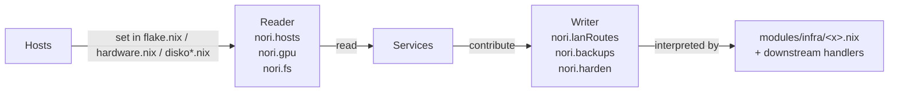

# Glossary

Coined nouns/verbs + mental models that frame the lab. One line per term →
source-of-truth doc. Read here to skip vocabulary-by-osmosis; read the linked
source for the full shape.

**Model vs heuristic** (the type distinction):

| Type | Role | Where |
|---|---|---|
| **Mental model** | Descriptive — how something behaves; predict + explain | this doc |
| **Heuristic / rule** | Prescriptive — what to do (rule of three, iterate-to-stable, declarative over imperative, tailnet-as-perimeter, workhorse-by-default) | `CLAUDE.md § What's the bias` |

Models make the heuristics make sense.

## Glossary — coined nouns + verbs

| Term | Meaning | Source |
|---|---|---|
| **workhorse** | Host role: services land here by default — GPU, state-heavy, the HTTP entry plane. The `role` field on the host. | `modules/infra/hosts.nix` (`role`); set in `flake.nix` `identityFor` |
| **appliance** | Host role: only services that must survive the workhorse's failure (observability, alerting, DNS) or are network-appliance functions (subnet routing, exit node). Drives the placement assertion (appliance hosts can't use `paths`-based backups). | `modules/infra/hosts.nix`; assertion in `modules/infra/backup/default.nix` |
| **`nori.<X>`** | The repo's effect-interface family — one declarative input, many generated outputs. Reader + collected-Writer shape. | `modules/infra/`; see § "Effect interface deep-dive" below |
| **Reader (effect)** | `nori.<X>` flavor that hosts *produce* and services *read*: host-scoped context (`nori.hosts`, `nori.gpu`, `nori.fs`). Set in `flake.nix`/`hardware.nix`/`disko*.nix`. | `modules/infra/{hosts,gpu,fs}.nix` |
| **Writer (effect)** | `nori.<X>` flavor that services *contribute* and generators *interpret*: declarations assembled across modules (`nori.lanRoutes`, `nori.backups`, `nori.harden`). | `modules/infra/{lan-route,backup,harden}.nix` |
| **value tier** | Data-protection level driving snapshot/backup/retention: `re-derivable` (minimal) → `user`/`service` (daily + local) → `irreplaceable` (snapshots + local + off-site). | `modules/infra/storage/default.nix` (tier); STORAGE.md "Value tiers" |
| **audience** | Per-route trust level: `operator` (trusts tailnet, no Authelia) / `family` (needs OIDC for per-user state) / `public` (intentionally open). Decides where Authelia layers on. | `modules/infra/networking/default.nix` (`audience`); CLAUDE.md bias section |
| **split-module pattern** | Cross-host service shipped as two modules: daemon module on the host that runs it, client/proxy module on every host. Live: `beszel`, `ntfy`. | `modules/services/{beszel,ntfy}/`; `/relocate-to-pi` skill |
| **fate-sharing** | The placement test: a service moves to the appliance only when "fate-sharing breaks the function" (it must outlive the workhorse), not because it "feels lightweight." | TOPOLOGY.md "Service placement"; CLAUDE.md "workhorse-by-default" bias |
| **`mkDevShell` / fragment** | Atomic dev-environment fragment (`modules/dev/<n>.nix`: a toolchain/runtime/tool); the composer resolves transitive deps, dedupes inputs, merges Claude allowlists. `nix eval .#lib.fragmentNames` lists them. | `modules/dev/default.nix` (composer); `modules/dev/*.nix` (fragments) |

## Mental models — frameworks for reasoning about the lab

Each row is a *representation* — a picture of how some part of the system
behaves so you can predict, explain, or place new work without re-deriving from
first principles. These aren't rules; they're what makes the rules make sense.

| Model | What it represents | Source |
|---|---|---|
| **Amnesiac team** | Each agent session is a fresh teammate who quits at the end. Predicts which software-team practices transfer (anything that externalizes knowledge or verifies a claim — docs, tests, skills, INVARIANTS) and which don't (anything that assumes persistent humans — feature branches, code review as gate, onboarding meetings). | ADR-0001 |
| **Reader + collected-Writer effect interface** | Cross-cutting concerns assemble in two flavors: hosts *produce* read values (Reader: `nori.hosts`, `nori.gpu`, `nori.fs`), services *contribute* write values (Writer: `nori.lanRoutes`, `nori.backups`, `nori.harden`), generators *interpret* the collected whole. Predicts where any new abstraction lives. | `modules/infra/`; full prose below in § "Effect interface deep-dive" |
| **Audience-driven trust topology** | Trust isn't a property of a service — it's the intersection of *who's reaching it* (operator / family / public) and *what network layer they arrived on* (tailnet / LAN / internet). The auth stack is layered selectively from this intersection. Predicts where Authelia / OIDC layers on without re-litigating per service. | `modules/infra/networking/default.nix` (`audience`); CLAUDE.md "What's the bias" |
| **Workhorse / appliance fate-sharing** | A host's *role* defines what it must survive. A service migrates to the appliance only when "fate-sharing breaks the function" — its purpose requires outliving the workhorse. Predicts placement without taste arguments ("feels lightweight" isn't a reason). | TOPOLOGY.md "Service placement"; CLAUDE.md "workhorse-by-default" |
| **Enforcement ladder** | A claim's truth lives on `prose → comment → test → type / lint / CI rule`; each rung is a different mechanism for staying true. Predicts what protects a claim from drift, and which `[prose: unchecked]` items are worth promoting. | `docs/invariants.md` |
| **Value-tier protection tree** | `re-derivable → user → service → irreplaceable` maps to a specific snapshot + local-backup + off-site-backup shape per tier. Predicts what to do with any new state-bearing service without designing protection per-service. | `modules/infra/storage/default.nix`; STORAGE.md "Value tiers" |

## Effect interface deep-dive

`nori.<X>` = structural Reader + collected-Writer over NixOS module fixed-point. Same merge semantics → one folder. Distinction = *who produces*.

Each `modules/infra/<x>.nix` carries one effect's full surface:

| Layer | What | Mechanism |
|---|---|---|
| **type signature** | option schema, type constraints | `mkOption` |
| **contracts** | port uniqueness, DNS-safe names, appliance-role gating | `assertions` |
| **interpretation** | collected attrset → systemd / Caddy / restic | `config = mkIf …` |

Convention-not-rule (Reader/Writer split isn't structurally prevented). Enforced via:

| Mechanism | Catches |
|---|---|
| Type system | shape inside one option (port range, DNS regex) |
| Module assertions | cross-attribute invariants (paths-XOR-skip, port uniqueness, appliance ≠ `paths`) |
| `forbidden-patterns` flake check | textual: no `100.x.y.z` literals outside `flake.nix:identityFor` — cross-host refs via `config.nori.hosts.<n>.tailnetIp` |

**Adding an effect:**

1. `modules/infra/<n>.nix` — option schema + assertions + (Writer-shaped: consumer logic)
2. Import in `modules/common/default.nix`
3. Header comment names the producer/consumer split (Reader/Writer at a glance)
4. **Ship its test** — adding an effect = committing to `just test-<n>` (see `docs/reference/runtime-tests.md`)
