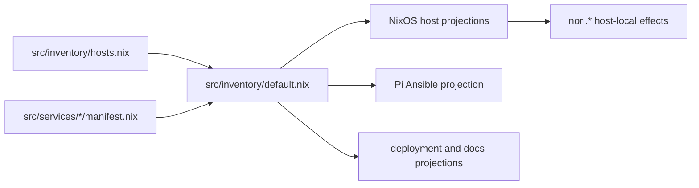

# Glossary

Coined nouns/verbs + mental models that frame the lab. One line per term →
source-of-truth doc. Read here to skip vocabulary-by-osmosis; read the linked
source for the full shape.

**Model vs heuristic** (the type distinction):

| Type | Role | Where |
|---|---|---|
| **Mental model** | Descriptive — how something behaves; predict + explain | this doc |
| **Heuristic / rule** | Prescriptive — what to do (rule of three, iterate-to-stable, declarative over imperative, tailnet-as-perimeter, workhorse-by-default) | `CLAUDE.md § What's the bias` |

Models make the heuristics make sense.

## Glossary — coined nouns + verbs

| Term | Meaning | Source |
|---|---|---|
| **workhorse** | Host role for desktop, GPU, state-heavy, storage, and application workloads. The HTTP entry plane stays on the appliance so workstation failure cannot remove it. | `src/inventory/host-roles.nix`; assigned in `src/inventory/hosts.nix` |
| **appliance** | Host role for failure-independent observability, alerting, DNS, and network functions. | `src/inventory/host-roles.nix`; assigned in `src/inventory/hosts.nix` |
| **inventory compiler** | Pure pre-evaluation function that validates host and workload declarations, resolves placement, and emits projections for each backend. | `src/inventory/default.nix` |
| **projection** | Read-only output derived by the inventory compiler for one consumer, such as a NixOS host, the Pi Ansible inventory, deployment planning, or generated documentation. | `src/inventory/default.nix`; `src/lib/flake-parts/packages/` |
| **`nori.<X>`** | NixOS option family for host-local infrastructure concerns that need module merge semantics, such as identity, storage, backup, hardening, and alerts. | `src/infra/common/nixos/` |
| **workload manifest** | Canonical workload declaration. It owns activation, placement constraints, runtime module, endpoints, and product metadata. | `src/services/<name>/manifest.nix` |
| **workload** | An operator-installed application under `src/services/`. Its manifest is backend-neutral; its NixOS or Ansible adapter consumes a compiler projection. | `src/services/<name>/` |
| **value tier** | Data-protection level driving snapshot, backup, and retention policy: `re-derivable`, `user`, `service`, or `irreplaceable`. | `src/infra/common/nixos/storage/default.nix`; `docs/reference/storage.md` |
| **audience** | Endpoint trust level: `operator`, `family`, or `public`. The compiler combines it with authentication and reachability declarations. | `src/services/<name>/manifest.nix`; `src/inventory/default.nix` |
| **split-module pattern** | Cross-host service with separate daemon and client modules. Live examples are `beszel` and `ntfy`. | `src/services/beszel/`; `src/services/ntfy/` |
| **fate-sharing** | Placement rule: move a service to the appliance only when workstation failure would break the service's purpose. | `src/inventory/host-roles.nix`; `tests/eval/workload-role-placement.nix` |

## Mental models — frameworks for reasoning about the lab

Each row is a *representation* — a picture of how some part of the system
behaves so you can predict, explain, or place new work without re-deriving from
first principles. These aren't rules; they're what makes the rules make sense.

| Model | What it represents | Source |
|---|---|---|
| **Amnesiac team** | Each agent session is a fresh teammate who quits at the end. Predicts which software-team practices transfer (anything that externalizes knowledge or verifies a claim — docs, tests, skills, INVARIANTS) and which don't (anything that assumes persistent humans — feature branches, code review as gate, onboarding meetings). | ADR-0001 |
| **Compiler and projections** | Manifests and host declarations contain intent once. The pure inventory compiler validates the complete graph, resolves placement, and emits narrow backend projections. This predicts where a new cross-host fact belongs. | `src/inventory/`; `docs/reference/services.md` |
| **Audience-driven trust topology** | Trust is the intersection of caller audience, network reachability, and endpoint authentication. The compiler rejects unsafe combinations before any backend adapter runs. | `src/inventory/default.nix`; `docs/reference/network.md` |
| **Workhorse / appliance fate-sharing** | A host's *role* defines what it must survive. A service migrates to the appliance only when "fate-sharing breaks the function" — its purpose requires outliving the workhorse. Predicts placement without taste arguments ("feels lightweight" isn't a reason). | TOPOLOGY.md "Service placement"; CLAUDE.md "workhorse-by-default" |
| **Enforcement ladder** | A claim's truth lives on `prose → comment → test → type / lint / CI rule`; each rung is a different mechanism for staying true. Predicts what protects a claim from drift, and which `[prose: unchecked]` items are worth promoting. | `docs/invariants.md` |
| **Value-tier protection tree** | `re-derivable → user → service → irreplaceable` maps to a specific snapshot + local-backup + off-site-backup shape per tier. Predicts what to do with any new state-bearing service without designing protection per-service. | `src/infra/common/nixos/storage/default.nix`; STORAGE.md "Value tiers" |

## Compiler and host-local concerns

Cross-host intent is compiled before NixOS or Ansible evaluates a backend.
Host-local effects still use NixOS module options when merge semantics are
needed.

```mermaid
flowchart LR
  H["src/inventory/hosts.nix"] --> C["src/inventory/default.nix"]
  M["src/services/*/manifest.nix"] --> C
  C --> N["NixOS host projections"]
  C --> P["Pi Ansible projection"]
  C --> D["deployment and docs projections"]
  N --> E["nori.* host-local effects"]
```

| Layer | Owns | Mechanism |
|---|---|---|
| **declaration** | host identity, workload placement, endpoints, product metadata | typed Nix attrsets |
| **compiler** | graph validation, placement resolution, public-safe filtering | assertions in `src/inventory/default.nix` |
| **projection** | exact data for one backend or document | `lib.noriInventory.*` |
| **host adapter** | systemd, firewall, storage, backup, and process configuration | NixOS modules or Ansible roles |

**Add a workload or endpoint:**

1. Update its `src/services/<name>/manifest.nix`.
2. Add or update its runtime adapter only when execution changes.
3. Extend the compiler only for a new shared invariant or projection field.
4. Add a behavioral check for the new invariant or effect.
