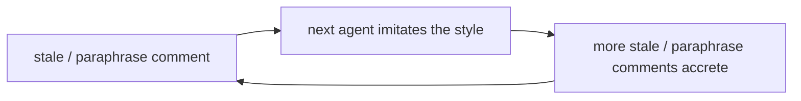

# Documentation writing — comments and prose

Reference for *how* comments and docs are written in this repo. Pairs
with `docs/reference/module-authoring.md` (code shape) and
`docs/invariants.md` (how to promote a claim from prose → comment →
test → type).

For the deep, project-agnostic doc-writing framework, see the
`userSettings:writing-docs` skill — this file is the homelab-specific
overlay + the load-bearing meta-rule that makes the framework matter
*here*.

## Core principle

> **Code describes behavior. Comments encode intent.**
>
> A useful comment is a semantic test: it fires when a reader's eyeball
> spots the mismatch between what the code does and what it should do.
> If the next reader would figure out the intent without the comment,
> delete the comment.

## Co-locate documentation with code (SoT applied to docs)

```
Hand-written meta docs ←→ extracted code-doc strings
   (the WHY — workflow,     (the WHAT — every option,
    glossary, invariants,    every lib function,
    ADRs, plans, specs)      every binding)
```

**The rule:** documentation that describes code lives **with the code**. Hand-written prose is for meta content — workflow, glossary, mental models, ADRs, multi-phase plans, runbooks. Everything else gets extracted from co-located doc strings at build time.

Why: documentation that *paraphrases* code drifts the second the code changes. With agents producing code at velocity, hand-maintained option / function tables become a perpetual cleanup tax. Per [Sprint 6 prototype findings](../specs/2026-06-16-generated-docs-and-okf.md), the `nixosOptionsDoc` generator surfaced 3 real doc gaps on its first pass — the SoT axiom pays dividends immediately.

### Two extraction surfaces (the dual mechanism)

Nix carries two distinct documentation surfaces. Both extract to markdown automatically; both stay co-located with what they describe.

| Surface | Applies to | Extracted by | Canonical example |
|---|---|---|---|
| `mkOption { description = ''...''; }` | NixOS module **options** (every `nori.<X>` schema field) | [`nixosOptionsDoc`](https://github.com/NixOS/nixpkgs/blob/master/nixos/lib/make-options-doc/default.nix) | `modules/infra/networking/default.nix` → `nori.lanRoutes.<name>.audience` |
| `/** ... */` doc-comments ([RFC 145](https://github.com/NixOS/rfcs/blob/master/rfcs/0145-doc-strings.md)) | **Non-option** code: lib functions, let bindings, attrset entries, lambda formals | [`nixdoc`](https://github.com/nix-community/nixdoc) | [`nixpkgs/lib/attrsets.nix`](https://github.com/NixOS/nixpkgs/blob/master/lib/attrsets.nix) → `lib.attrByPath` |

### mkOption description shape

```nix
options.nori.lanRoutes = mkOption {
  type = types.attrsOf (types.submodule {
    options.audience = mkOption {
      type = types.enum [ "operator" "family" "public" ];
      default = "operator";
      description = ''
        Who this route is for. Documents intent + drives the
        auth-stacking principle:

        - operator — admin-only management UIs. Tailnet membership
          IS the auth; layering Authelia duplicates the perimeter
          guarantee for no per-user-state value.
        - family — services with per-user state inside the app.
          Native OIDC propagates user identity into the app.
        - public — intentionally open dashboards + the SSO portal.
      '';
    };
  });
};
```

Multi-paragraph CommonMark in the indented-string `''...''` works as-is. Lists, code blocks, links, and headings (after `#`) all survive intact through `nixosOptionsDoc`.

### RFC 145 doc-comment shape

Canonical reference: `nixpkgs/lib/attrsets.nix`. The convention:

```nix
/**
  One-line summary as the opening sentence.

  Optional prose paragraphs (CommonMark) elaborating rationale,
  trade-offs, or context the next reader needs.

  # Inputs

  `paramName`

  : Description of the parameter (term-definition list syntax;
    the colon-prefix indents under the term).

  # Type

  ```
  funcName :: ParamType -> ReturnType
  ```

  # Examples
  :::{.example}
  ## `lib.namespace.funcName` usage example

  ```nix
  funcName arg1 arg2
  => result
  ```

  :::
*/
funcName = arg1: arg2: ...
```

Placement: the doc-comment appears **before** the documentable node, with only whitespace between them. For attribute paths, document the body. When ambiguous, the doc-comment closer to the body takes precedence.

Format precedence (lifted from RFC 145):
- `/** */` distinguishes doc-comments from regular `#` comments
- CommonMark per [RFC 72](https://github.com/NixOS/rfcs/blob/master/rfcs/0072-commonmark.md)
- Section headings via `#`, `##` markdown
- Code blocks via triple-backtick fences

### When to reach for which

| Context | Mechanism |
|---|---|
| `mkOption { ... }` declaration | `description = ''...''` |
| Lib function in `modules/`, `flake.nix`, or `lint/default.nix` | `/** ... */` |
| Let-binding with non-obvious purpose (e.g. our `lintLib`, `lintRules`, `baseNonServicePatterns`) | `/** ... */` |
| Attribute set entry that's effectively a function or registry (e.g. `nori.lanRoutes.<X>`, bundle headers under `modules/services/<group>/default.nix`) | `/** ... */` |
| Rationale, runbook, or intent narrative (bootstrap procedures, "why we chose Pattern A", "reapply this UI state if X gets stomped", config-line trade-offs) | `/* ... */` |
| Inline implementation detail not part of the public surface | standard `#` comment |
| Cross-cutting prose (mental models, why-this-shape, multi-module rationale) | hand-written `docs/reference/<topic>.md` |

The test that distinguishes `/** */` from `/* */`: **would I want this block surfaced in generated docs as code-API reference?** YES → `/** */`. NO → `/* */`. Operator runbooks, "click X then Y" steps, rationale for a specific config value, and service-behavior narrative all fail the test — they're operator-intent content, not consumer-facing API. The 2026-06-17 sweep reclassified 51 such blocks across `modules/services/` after the Stage 4 bulk migration over-promoted them; calibration examples land at `modules/services/{jellyfin,ollama,vaultwarden}.nix` head-comments.

### Path-coherence skip annotations

The `path-coherence` script (one-off via `just check-migration`) verifies that file-path strings in code comments and selected docs resolve to real files. Three scopes of skip:

| Scope | Annotation | When |
|---|---|---|
| **Line** | `path-coherence: skip` anywhere on the line | One specific ref that is intentionally historical (e.g. a removed file the comment narrates) OR a relative-path import where the path-coherence regex captures a misleading substring. Most fine-grained — preserves coverage on every other line in the file. |
| **Block** | `<!-- path-coherence: skip-block — <reason> -->` opens, `<!-- path-coherence: end-skip -->` closes | A fenced code block in markdown that shows illustrative SHAPE (relative imports from another file's perspective, "this is what your new host's default.nix should look like"). HTML-comment form so it disappears on render. |
| **File** | `<!-- path-coherence: skip-file — <reason> -->` anywhere in the file | A whole file that is illustrative end-to-end (tutorial / skill SOP). The file's premise IS "these paths are shape, not refs." |

Prefer the narrowest scope that fits. File-level skip on a file that has SOME real refs and SOME illustrative ones loses coverage on the real refs forever — use block-level around just the illustrative sections instead. The 2026-06-17 PR review caught a `skip-block` that papered over a wrong-by-the-spec example: skip-annotations are not a license to leave content stale.

Annotation discipline:
- Always include a `— <reason>` after the verb. "What is being skipped, and why" earns rent the same way other comments do; bare `path-coherence: skip` doesn't.
- A `skip-file` whose body has any real (resolvable) path refs is a signal to demote to `skip-block`.
- When you add a skip annotation, the path-coherence regex stops checking that ref forever. Add a future-you reminder if the file should eventually move out of skip — e.g. `skip-file — historical; delete this file when X lands`.

### What stays hand-written

These survive any docs-co-location sweep because their content isn't extractable from a single code site:

```
docs/glossary.md                       vocabulary, cross-cutting framing
docs/invariants.md                     enforcement ladder + claims catalog
docs/reference/agentic-workflow.md     per-PR ceremony
docs/reference/documentation-writing.md  this file
docs/decisions/*                       ADRs (durable why)
docs/plans/* docs/specs/* docs/reports/*  multi-phase narrative
docs/runbooks/*                        incident procedures
docs/installs/*                        bring-up procedures
CLAUDE.md                              the routing root
```

These shrink dramatically as doctrine moves into co-located doc-strings:

```
docs/reference/topology.md             routing + cross-host patterns;
                                       per-host details from machines/*
docs/reference/storage.md              value-tier framing + routing;
                                       subvol details from disko
docs/reference/network.md              routing + DNS arch + audience
                                       model; option details
                                       from `docs/generated/lan-route.md`
                                       (generated)
docs/reference/services.md             backup pattern doctrine + routing;
                                       per-service from each module
```

### Adoption status (2026-06-17)

| Stage | Status |
|---|---|
| **1. Convention codified** | ✓ this section |
| **2. Pressure test** — densest doc (`topology.md`) | ✓ Stage 2 |
| **2.5. Modules-as-root restructure** — PaaS lens; infra/<concern>/ + services/ split | ✓ Phases 0-3f landed; spec at `docs/specs/2026-06-17-modules-as-root-restructure.md` |
| **3. Generator extended** to extract RFC 145 doc-strings via nixdoc | □ |
| **4. Content migration** — doctrine from `docs/reference/*.md` into co-located doc-strings | □ multi-sprint |
| **5. `docs-fresh` flake check** — committed-generated vs on-the-fly | □ closes drift surface by construction |

Stage 2 verdict (per `docs/reports/2026-06-17-topology-cohort-audit.md`): **keep the convention, commit to structure-by-tier restructure as the follow-on**. The pressure test on `topology.md` landed three signals:

```
SIGNAL                                              READS AS
──────────────────────────────────────────────────────────────────
Config-dump dominant sections (hosts table,         CONVENTION SCALES
schema) cleanly co-locate via nixosOptionsDoc       (Stage 2 ✓)
+ small hand-rolled value walks.

Code-already-has-it sections (Pi posture, NVMe      ALREADY WORKING —
by-id) prove the convention isn't novel; the gap   topology.md was the
was that topology.md duplicated what code already   dupe, not the source
said.

Cross-effect sections (service placement, drives,   CONVENTION INSUFFICIENT
GPU, caps) RESIST co-location at module-as-shipped  ALONE — restructure
because no single module owns the cross-effect      needed (R3 spec)
question.
```

Stage 2 deliverables:

```
K2  modules/infra/hosts.nix      — schema extended (hardware,
                                     primaryJob, roleOneLiner)
K3  flake.nix                      — packages.docs-topology
    docs/reference/topology-       — generated artifact
    generated.md
K4  flake.nix                      — RFC 145 style precedent on
                                     mkHost (let-binding;
                                     non-extracted)
    [historical] modules/dev/      — RFC 145 pilot site;
                                     modules/dev/ deleted in
                                     Phase 5b (dev environments
                                     moved to per-project concern)
K5  docs/reference/topology.md     — trimmed to meta + curated;
                                     tier principle codified
K6  docs/reports/2026-06-17-       — side-by-side audit; NVMe
    topology-cohort-audit.md         warning restored to topology.md
R1  docs/reports/2026-06-17-       — diagrams-from-code
    diagram-generation-              feasibility; D2 vs mermaid;
    feasibility.md                   hybrid recommendation
R2  docs/reports/2026-06-17-       — runsOn coupling analysis;
    runson-coupling-analysis.md      tier insight; algebraic
                                     forward-extension named
R3  docs/specs/2026-06-17-         — structure-by-tier restructure
    structure-by-tier.md             spec; phase sequencing
```

Sprint 6 (`feat(docs-gen): Sprint 6 prototype`) landed Stage 0 — proof-of-concept for the mkOption surface via `nixosOptionsDoc` on `nori.lanRoutes`. Stages 3+ are their own sprints with their own Prologues; Stage 2.5 (structure-by-tier) is a multi-PR restructure arc preceding Stages 3-5.

## Why this lives in docs (the amnesiac-teammate loop)

This codebase is shaped by agents with no memory; they imitate the code
in proximity. Bad nearby conventions become a self-reinforcing negative
feedback loop:



The counter is to seed the repo with rent-paying examples so imitation
pulls in the right direction. The 2026-06-07 audit sweep
(`git log --grep "chore(comments):" --oneline`) is the seeding; this
file is the rule that keeps the next agent on the same axis. Rules
without examples drift; examples without rules don't generalise.

## Comments — the earn-its-keep test

> "Would the next reader figure out the intent without this comment?"

| Earns rent (KEEP)                          | Doesn't (CUT)                          |
|--------------------------------------------|----------------------------------------|
| Why the obvious approach didn't work       | What-paraphrase of the code            |
| Incident anchor (date + symptom + fix)     | How-step-by-step (the code is steps)   |
| Silent-breakage / sharp-edge warning       | Author / date / "added for X"          |
| Counter-intuitive constraint               | Status banners on dead code            |
| Deliberate absence (intentional omission)  | Transcribed framework / man-page docs  |
| Cross-ref to spec / skill / ADR / runbook  | List-of-derived-things                 |

## Docs — the four levers

(deep version: `userSettings:writing-docs`)

| Lever                  | Means                              | Failure smell                                |
|------------------------|------------------------------------|----------------------------------------------|
| Progressive disclosure | tiered docs; an index routes       | one fat doc; deep detail injected every turn |
| Concise                | reference, not story               | wall of text; "in session X..." narrative    |
| Visual                 | shape matches content              | enumerable facts buried in paragraphs        |
| Precise                | claims bound to evidence           | "is enforced" with nothing enforcing it      |

## Hard rules

- **Prefer visual structure over prose** when the content is
  enumerable. A set of distinct things (services that cross-couple,
  options with distinct purposes, hosts with distinct roles) belongs
  in a table, bullet list, or mermaid diagram — even if the prose
  version would be shorter. The scannability the visual carries IS
  the value. Distinguish from "derived list" below: visual structure
  earns rent when each row has distinct content; it doesn't earn rent
  when each row paraphrases a literal that appears verbatim in the
  code nearby.
- **Lists derived from code → derive from code, never duplicate in
  prose.** Lists of services / hosts / subvolumes / skills / lanRoutes /
  modules drift the second code changes. Generate them (`nix eval`),
  link the live registry (`nix flake show`, `just --list`,
  `ls .claude/skills/`), or eliminate the doc.
- **If a doc is purely derivative, eliminate the doc.** Code is the
  canonical source.
- **Cross-reference, never duplicate.** Two copies drift; pick one home
  (usually the abstraction site) and link from call sites.
- **Bind load-bearing claims to evidence.** "X is enforced" / "Y lives
  at Z" names the test, path, or type that makes it true.
  `docs/invariants.md` tags each claim by enforcement rung.
- **Borderline → KEEP.** A comment whose value is unclear in 30 seconds
  of inspection probably encodes operator judgment that would be missed
  without it. Cost of keeping a borderline-redundant comment is one
  screen of vertical space; cost of cutting a borderline-load-bearing
  one is operator knowledge lost.
- **What stays in docs.** WHY (decisions, ADRs, rationales), HOW
  (procedures, runbooks), mental models, frameworks, constraints —
  things code can't carry.

## Anti-patterns (caught during the 2026-06-07 sweep)

| Pattern                                  | Example                                                  | Fix                                                       |
|------------------------------------------|----------------------------------------------------------|-----------------------------------------------------------|
| Overshooting "Why this exists" headers   | 30-line essay once the abstraction has stuck             | compress to 2-5 lines of intent                           |
| Taxonomy duplicated 2-3 times            | header prose + option description + enum literal        | keep at the option description; cut header copies         |
| Inline assertion preamble                | *"the constraint is the documentation"*                  | drop; the assertion message IS the documentation          |
| Dead code with comment explaining why    | unused `context_color` var + "preserved from operator"   | delete the code; `git log` carries the option             |
| Misplaced comment block                  | shared-memory rationale 80 lines from its activation     | move comment adjacent to its code                         |
| Stale TODOs / "Open items"               | "Open items (post-deploy)" 6 weeks after deploy          | drop when the task closes (or `grep`-clean it then)       |
| Cross-referenced rationale at both ends  | role-enum docs restated in machine config                | pick one home (usually the abstraction), link             |
| Per-section paraphrase in a list literal | `# in-repo skills`, `# user-level CLAUDE.md` on attrs   | drop; the attribute name carries the meaning              |
| Transcribed framework docs               | per-flag systemd.exec glossary inline                    | drop; `man` is authoritative                              |
| Per-subvol layout enumeration            | layout diagram repeating disko's literals                | drop; the declaration carries the layout                  |
| Sibling meta-narration ("same shape as X") | `# Pattern A — same shape as sonarr` on every consumer  | drop; the pattern tag earns rent only if paired with a why |
| Attribute-literal parade                 | prose listing `[Preferences]` keys 30 lines above the dict that sets them | drop; the dict is the canonical list |
| Downstream-of-canonical-home paraphrase  | shared.nix carries the `media` group rationale; every *arr restates it | drop from consumers; the canonical home keeps it |

## Style for prose (the doc-refresh prompt)

> Be extremely precise. Sacrifice grammar for conciseness. Prefer visual
> explanations when possible, prose as complementary. Docs benefit from
> mermaid diagrams. Otherwise tables, lists, arrows and other visual
> shortcuts enhance understanding at a glance.

## Cross-references

- `userSettings:writing-docs` — deep doc-writing framework: tiers,
  bind-claims-to-evidence, mermaid legends, doc-drift guards.
- `docs/reference/module-authoring.md` — code shape (this file is its
  prose-side companion).
- `docs/invariants.md` — load-bearing claims tagged by enforcement tier
  + the prose → comment → test → type ladder for promoting one a rung.
- [RFC 145 — Doc Strings](https://github.com/NixOS/rfcs/blob/master/rfcs/0145-doc-strings.md)
  — the `/** ... */` convention for non-option Nix code.
- [RFC 72 — CommonMark](https://github.com/NixOS/rfcs/blob/master/rfcs/0072-commonmark.md)
  — the markdown dialect RFC 145 doc-strings (and `mkOption description`
  fields) use.
- [nixpkgs/lib/attrsets.nix](https://github.com/NixOS/nixpkgs/blob/master/lib/attrsets.nix)
  — canonical reference for how nixpkgs uses RFC 145 (also at
  `/srv/share/projects/nixpkgs/lib/`).
- [`nixosOptionsDoc`](https://github.com/NixOS/nixpkgs/blob/master/nixos/lib/make-options-doc/default.nix)
  — the extractor for mkOption descriptions; consumed by the
  `docs-lan-route` flake package output.
- `docs/specs/2026-06-16-generated-docs-and-okf.md` — Sprint 6 research
  seed; combines generated-docs + Open Knowledge Format (OKF v0.1)
  compliance.
- `git log --grep "chore(comments):"` — the audit-sweep commits;
  worked examples seeded throughout `modules/`, `home/`, `machines/`.
