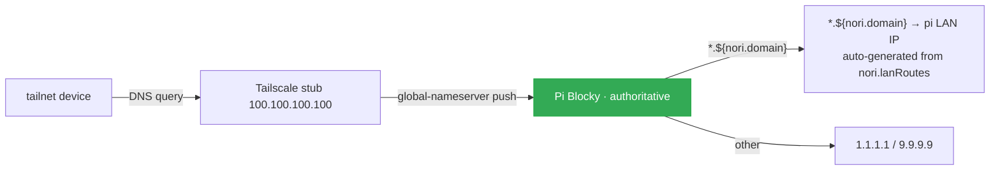

# Network

Three zones, default-deny everywhere. Services opt into specific access; nothing is wildcard-exposed.

## Zones

| Zone | What's there | Default posture |
|---|---|---|
| **localhost** | Services bind here unless explicitly exposed | Closed to outside |
| **tailnet** | Personal devices + family. SSH, Samba, `*.${nori.domain}` HTTPS, direct service ports | Closed by default; Caddy on 80+443 + Samba on 445 are the only globally-open tailnet ports |
| **public internet** | Personal apps that need public exposure live at Cloudflare edge (Pages for static, Workers + D1 for stateful) | **Homelab serves nothing publicly** by default. Tailscale Funnel is the prototyped path if a future service ever needs to land public traffic on workstation |

The Cloudflare edge apps (phibkro.org apex, filmder, drinks-app, finnbydel-app, heim) live as `Pages` for static + `Workers + D1` for stateful. The homelab keeps tailnet-only copies of `filmder` + `heim` via `nori.lanRoutes` for fast internal access. A `cloudflared` Tunnel approach was decommissioned 2026-05-08.

## `nori.lanRoutes` — the single declarative input

One declaration → three things generated automatically:

1. **Caddy vhost** at `<name>.${nori.domain}` reverse-proxying to the backend
2. **Blocky DNS** mapping `<name>.${nori.domain}` → pi LAN IP (Caddy host)
3. **Gatus monitor** (if `monitor` is set) probing the backend, alerting via ntfy on failure

```nix
nori.lanRoutes.<name> = {
  port = 8080;                      # required, types.port
  scheme = "http";                  # default
  exposeOnTailnet = false;          # default; opt in for direct backend access
  audience = "operator";            # default; or "family" / "public"
  monitor = {                       # null = skip; { } = defaults
    path = "/health";               # default "/"
    interval = "60s";
    failureThreshold = 3;
  };
};
```

Schema + assertions in `modules/infra/networking/default.nix`. Adding a service is one declaration in its own module — no edits scattered across `caddy.nix` + `blocky.nix` + `gatus.nix`.

### Naming: function over brand

`chat.${nori.domain}` not `open-webui.${nori.domain}`. `media` not `jellyfin`. The brand changes (Uptime Kuma → Gatus); the function doesn't. Brand names only when the brand IS the identity (`auth` for Authelia, `samba`).

### Dashboard enrollment

`nori.lanRoutes.<n>.dashboard = { ... }` enrolls the route in the family-facing Glance dashboard at `home.${nori.domain}`. URL derives from the route name; metadata (title/icon/group/description) lives next to the rest of the service's route config. `glance.nix` is a pure transformer over `config.nori.lanRoutes`.

## Audience-driven trust model

Every route declares an audience. The auth stack is layered selectively from there:

| Audience | What it gates | Why |
|---|---|---|
| **operator** | admin UIs | Tailnet membership IS the auth. No Authelia overlay — layering it would duplicate the network-perimeter guarantee and make Authelia uptime load-bearing for operator workflows. qBittorrent's `LocalHostAuth = false` is a *deliberate design choice*: Caddy is the only HTTP entry, and Caddy is reachable only via tailnet. |
| **family** | per-user state (Jellyfin, Immich, Vaultwarden) | Native OIDC where the app supports it; forward-auth at Caddy where it doesn't (Komga, calibre-web). The auth layer carries identity *into* the app. |
| **public** | intentionally open dashboards + the SSO portal itself | Home dashboard (Glance), status (Gatus), auth (Authelia portal) — meant to be the unauthenticated entry surface |

Full rationale in the `audience` option description in `modules/infra/networking/default.nix`. The conceptual model: see `docs/glossary.md` § audience-driven trust topology.

## Caddy + TLS + naming

Caddy terminates TLS for every `<name>.home.phibkro.org` with a **Let's Encrypt** wildcard cert (`*.home.phibkro.org`) obtained via ACME DNS-01 against Cloudflare. The wildcard avoids per-vhost issuance + the LE rate-limit storm that would follow. ISRG roots ship pre-trusted on every modern device — no per-device CA install, no Mac keychain dance, no Node `NODE_EXTRA_CA_CERTS` env var. See ADR-0004 for the rationale.

The Cloudflare API token lives in sops (`cloudflare_acme_token`); Caddy's `withPlugins` bakes in `caddy-dns/cloudflare`. The `nori.domain` option (`modules/infra/networking/default.nix`) is the single source of truth — every vhost name, Authelia cookie domain + issuer URL, and OIDC redirect URI reads from it.

Transitional `*.nori.lan` redirect: pi's Caddy still serves `*.nori.lan` (Caddy internal CA) and 301-redirects to the same path under `home.phibkro.org`. Drop this block from `modules/infra/networking/caddy.nix` + the parallel entries in `modules/infra/networking/default.nix § blocky customDNS` once family bookmarks have migrated.

**Python services** with `certifi`-based clients (open-webui's `httpx`/`requests`/`urllib3`) historically needed `SSL_CERT_FILE = "/etc/ssl/certs/ca-bundle.crt"` to see the local CA. With LE, certifi's Mozilla bundle already includes ISRG roots — the override is no longer load-bearing but harmless.

## Authelia OIDC (overview)

Authelia provides OIDC. Services that opt in get a one-click login flow (visit service → redirect to `auth.${nori.domain}` → log in once → returned authenticated). Per-service setup is auto-generated from the `nori.lanRoutes.<n>.oidc` block in each service module.

Hash material lives **only in sops** — Authelia's `template` config-filter reads the PBKDF2 hash from `/run/secrets/...` at startup. Zero hash material in committed Nix; the `forbidden-patterns` flake check fails if a `$pbkdf2-` string lands.

Bootstrap a new OIDC client via `/add-oidc-client`. The skill walks the secret generation + sops paste + route-block declaration + systemd wiring. Bootstrap script: `just generate-oidc-key <name>`.

## Default-deny firewall

```nix
# Don't do this anymore — direct port exposure:
# networking.firewall.interfaces."tailscale0".allowedTCPPorts = [ 8096 ];

# Do this — single declaration generates Caddy vhost + DNS + monitor:
nori.lanRoutes.media = { port = 8096; monitor = { }; };
```

The only globally-open tailnet ports today are **80, 443** (Caddy) and **445** (Samba — not HTTP, can't go through Caddy). Backend ports stay closed on tailnet by default; opt in via `exposeOnTailnet = true` only when truly needed.

## DNS architecture



**Current state (post-ADR-0003):** Pi runs Blocky in **self-hosted mode** — auto-generates the `*.${nori.domain}` customDNS map from `nori.lanRoutes` (every route name resolves to pi's LAN IP, since pi is the Caddy host). Tailscale's global-nameserver push points tailnet devices at pi. LAN-only devices (smart TV, guest phones) are NOT covered — they keep using whatever the router pushes. Workstation's Blocky is also self-hosted as a fallback secondary (resolves the same map; LAN-side resilience for if pi is down).

**Why Tailscale push, not router DHCP:** the ISP-shipped Genexis EG400 locks DHCP DNS settings out of the user-facing admin UI. Router-side DNS replacement requires either (a) Altibox bridge-mode activation by phone request + a second router we control, or (b) double-NAT with a downstream router. Neither set up; Tailscale push is the zero-hardware-cost workaround.

**Future state:** Pi primary + workstation secondary via router DHCP, after bridge-mode or a second router lands. The transitional `*.nori.lan` aliases still resolve (auto-generated alongside `*.${nori.domain}`) until family devices have all migrated bookmarks.

**Bootstrap loop hazard:** workstation's `/etc/resolv.conf` points at Tailscale's stub (`100.100.100.100`); Tailscale forwards back to workstation's Blocky; Blocky can't resolve its own outbound URLs (blocklist sources, DoH endpoints) before serving DNS. `services.blocky.settings.bootstrapDns` MUST be set to direct upstream IPs. Without it, blocklist downloads silently fail on every restart. Codified in `.claude/skills/gotcha-blocky-bootstrap-loop/`.

Both Blocky instances forward to a public resolver (1.1.1.1 / Quad9) for non-blocked queries. Tailnet hostnames resolved via Tailscale MagicDNS independently of Blocky.

## Tailscale

| Host | Tailscale role | Advertises |
|---|---|---|
| pi | router | `--advertise-routes=192.168.1.0/24` (subnet) + `--advertise-exit-node` (opt-in) |
| workstation | regular node | — |
| pavilion / aurora | regular node | — |
| macbook | regular node | — |

Subnet route + exit node require one-time approval in the Tailscale admin console. MagicDNS gives every host a stable `<host>.saola-matrix.ts.net` name.

**SSH ACL: `action: accept`** (since 2026-06-07). Eliminates the periodic browser reauth dance for cross-host SSH automation. Tailnet membership IS the gate. Edited in admin UI JSON, not in this repo. See [[just-remote-tailnet-hostnames]].

**SPOF mitigation for pi:** heartbeat to healthchecks.io every 60s via `modules/infra/observability/heartbeat.nix`. Pi dies → hc.io alerts off-host. Pre-fix, pi outage would have taken its own alert delivery (ntfy server) with it.

## Access summary

| Path | SSH (user) | SSH (root) | Samba | Snapshot |
|---|---|---|---|---|
| `/home/nori` | Yes | Yes | No | Hourly |
| `/srv/share` | Yes | Yes | Yes (auth) | Daily |
| `/mnt/media/streaming` | Yes | Yes | Yes (auth, RW) | Weekly |
| `/mnt/media/photos` | Yes | Yes | No | Daily |
| `/mnt/media/home-videos` | Yes | Yes | No | Weekly |
| `/mnt/media/projects` | Yes | Yes | Yes (auth) | Weekly |
| `/var/lib/<service>` | No | Yes | No | Daily |
| `/etc`, `/nix`, `/root` | No | Yes | No | Per rebuild (`@`) |

OS has one user (Philip). Family members get per-service accounts in Jellyfin, Immich, Open WebUI, Vaultwarden; their devices get Tailscale invites.
