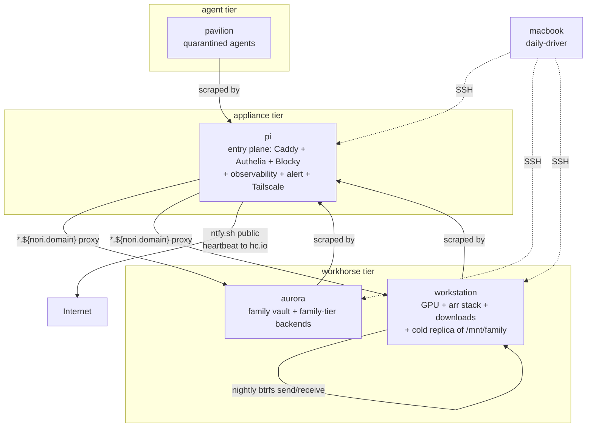

# Topology

Four persistent NixOS hosts on a single residential network plus a Mac on standalone home-manager. Roles are typed; placement assertions enforce them; cross-host refs go through `nori.hosts` registry — never IP literals.

**Tables move to generated** — the hosts-at-a-glance table and `nori.hosts.<name>.*` schema reference live in [`topology-generated.md`](./topology-generated.md), regenerated via `nix build .#docs-topology` from `flake.nix:identityFor` + `modules/infra/hosts.nix`. This file keeps the curated overview, the diagram, the placement reasoning, the invariants — anything the schema can't express.



Failure domain independence: each host shares no storage, no PSU, no critical boot-path dependency with the others. Any single failure does not block the rest.

## Service-implicit until lan-route'd (the tier principle)

A service has three concerns: registration (it exists), state (it persists data), location (it runs on host X). For services confined to one host, **location is implicit from the import site**:

```
machines/aurora/default.nix imports modules/services/vaultwarden.nix
                            ⇒ vaultwarden runs on aurora
```

The service doesn't declare a host. The fact that aurora's module list pulls it in IS the location declaration. No explicit `runsOn`, no cross-host wiring.

**Location becomes explicit when a service crosses machines.** That happens through `nori.lanRoutes.<X>.runsOn`, which names the host backing a route:

```nix
# pi's Caddy proxies metrics.${nori.domain} → workstation:8090
nori.lanRoutes.metrics = {
  port = 8090;
  runsOn = "workstation";
};
```

`runsOn` lives on lan-route not by convenience — but because the act of exposing a service via HTTP IS the act of declaring location-needs-resolving. Pre-exposure, location is implicit; at exposure, location is the cross-machine answer the proxy needs.

```
  declaration      state      location          cross-machine?
  ─────────────────────────────────────────────────────────────────
  packages         none       anywhere          N/A (stateless)
  services         local      implicit (import) opt-in via lan-route
  distributed      local +    EXPLICIT —        N/A (already is)
  services         binding    runsOn host(s)
```

Today `runsOn` is a single host string. Forward-shape (not in tree yet but pre-named): a list with a semantic tag — `failover` (sum), `loadbalance` (product), `sequential` (ordered sum). Rule of three: extract when a second service genuinely needs multi-host routing.

## Pi posture

Anti-write storage — declared in `machines/pi/hardware.nix`:

- `swapDevices = [ ]` — no swap on flash; zramSwap if pressure shows up.
- `services.journald.extraConfig = Storage=volatile` — RAM-backed journal, no writes to the FIT.
- `boot.kernel.sysctl."vm.mmap_rnd_bits" = 18` — aarch64 fixup (default 33 from x86_64 systemd fails on aarch64 39-bit VA).

SD-card / flash wear is the #1 Pi failure mode. **Restic-as-target deferred:** Pi can host the workstation restic repo only when a real disk replaces the FIT — the anti-write posture rules out daily restic to flash.

**NVMe enumeration is unstable across reboots.** Disko configs target `/dev/disk/by-id/...` paths; never touch `nvme0n1` without verifying the model string. Workstation's WD SN750 was `nvme0n1` at install time; post-reboot the drives swapped. Load-bearing rationale lives at `machines/workstation/disko.nix:46-51`. See `.claude/skills/gotcha-nvme-enumeration/`.

## Topology registry (`nori.hosts`)

Cross-host references go through the registry, **never IP literals**. The `forbidden-patterns` flake check fails the build on a stray `100.x.y.z` literal anywhere outside `flake.nix`'s `identityFor`.

Schema lives in `modules/infra/hosts.nix`; values in `flake.nix:identityFor`. A `readDir` over `./machines/` drives both `nixosConfigurations` enumeration and the registry — adding a host is "create the folder + add identity"; either omission fails eval. Schema details in [`topology-generated.md`](./topology-generated.md).

**Consumer-side lookup** (this is how cross-host wiring stays IP-literal-free):

```nix
# In a service module on workstation that reverse-proxies to pi:
nori.lanRoutes.metrics = {
  port = 8090;
  host = config.nori.hosts.pi.tailnetIp;   # ← never "100.100.71.3"
  monitor = { };
};
```

The `role` field on each host drives the placement assertion in `modules/infra/backup/default.nix`: appliance hosts cannot use `paths`-based backups (they're observers, not state holders); agent hosts cannot use `nori.backups.<X>` at all (impermanence root erases anything escaping the box sandbox).

## Service placement

| Cluster | Where | Why |
|---|---|---|
| HTTP entry plane (Caddy + Authelia) | pi | ADR-0003 — entry plane on the always-on appliance so workstation can sleep. Pi's Caddy serves the LE wildcard cert on `*.${nori.domain}` (ADR-0004); Authelia provides OIDC; backends proxy to whatever host actually runs the service via the lan-route module's `runsOn` resolver |
| GPU-bound (Ollama, Jellyfin NVENC, `*arr` stack, qBittorrent, Open WebUI) | workstation | RTX 5060 Ti — primary GPU |
| ML inference (Immich machine-learning / PyTorch) | aurora | Co-located with immich-server; GTX 950M is sufficient. `IMMICH_MACHINE_LEARNING_URL` resolves to aurora's tailnet IP |
| Family-tier services (Vaultwarden, Radicale, Miniflux, Immich, Calibre-web, Komga, Glance, Heim, Filmder, Grafana) | aurora | Always-on so they survive workstation sleep / outage; ADR-0002 |
| Family-tier file storage (`/mnt/family/{photos,home-videos,projects,library,archive}`) | aurora | Family vault — Toshiba HDD, btrfs label `family-vault` |
| Family Samba shares | aurora | Follows the drive — per-fs `samba = { }` blocks in `machines/aurora/disko-family.nix` |
| Workstation Samba shares (`media`, `share`, `nori`) | workstation | Whole-drive `media` share scoped to `/mnt/media` (IronWolf root) stays workstation-only; per-fs `share` + `nori` shares stay workstation-only via the gated workstation-shape check in `samba.nix` |
| Observability + alert plane (Beszel hub, Gatus, VictoriaMetrics, VictoriaLogs, ntfy server) | pi | Must survive workstation outage — that's *when* they fire |
| Heartbeat / dead-man-switch (healthchecks.io ping) | pi | SPOF mitigation — see `modules/infra/observability/heartbeat.nix` |
| DNS authoritative for `*.${nori.domain}` (Blocky self-hosted) | pi | ADR-0003 prerequisite for the LE wildcard issuance (ADR-0004). Workstation's Blocky stays as a secondary self-hosted forwarder for LAN-side resilience if pi is down |
| Network plumbing (subnet router + exit node) | pi | Appliance role; opt-in per device for exit node |
| Agent quarantine (hermes-agent CLI + dashboard) | pavilion | Sandboxed; pavilion's impermanence root makes pollution self-healing |
| Process metrics (`node-exporter` + `process-exporter`) | workstation + pavilion + aurora | Pi VM scrapes each; per-process RSS for leak hunts |
| Host-level high-level metrics (`beszel-agent`) | workstation + pavilion + aurora | Pi's Beszel hub aggregates per-host. Aurora added 2026-06-11 alongside its family-tier service standup |
| OnFailure → ntfy notifier (`ntfy-notify`) | workstation + pi + aurora | Per-host so the alert source is unambiguous and aurora-side unit failures (restic, btrbk, postgres dumps) page the operator without depending on workstation being awake |

Placement test = **fate-sharing breaks the function** (not "feels lightweight"). See `docs/glossary.md § fate-sharing`. This table is a cross-effect view — placement reasoning crosses module, lan-route, and observability surfaces. Restructure candidate: a `location-policy` module concern (see `docs/specs/2026-06-17-structure-by-tier.md`).

## Cross-host services (split-module pattern)

Daemon on one host, client/proxy on every consumer. Cross-host Caddy lanRoute gated `lib.mkIf config.services.caddy.enable` so daemon-host's Blocky stays pure-forwarder.

| Service | Daemon | Routed at | Client module |
|---|---|---|---|
| Beszel | pi | `metrics.${nori.domain}` | `modules/infra/observability/beszel/agent.nix` everywhere |
| ntfy | pi | `alert.${nori.domain}` | `modules/infra/observability/ntfy/notify.nix` everywhere |
| VictoriaLogs | pi | `logs.${nori.domain}` | `modules/infra/observability/vector.nix` ships journald |
| VictoriaMetrics | pi | `tsdb.${nori.domain}` (Grafana datasource) | `modules/infra/observability/node-exporter.nix` scraped from pi |
| immich-ml | aurora | n/a (RPC only) | `modules/services/immich.nix` (workstation) — `IMMICH_MACHINE_LEARNING_URL` |
| hermes-agent | pavilion (planned) → currently workstation | `hermes.${nori.domain}` | `home/hermes/default.nix` (PCs) |

Add another via `/relocate-to-pi`. Precedents above.

## GPU access pattern

Services that need the GPU set `accelerationDevices` (or systemd `DeviceAllow`) from `config.nori.gpu.nvidiaDevices` — single source of truth in `modules/infra/capabilities/gpu.nix`.

| Service | Status | Resource |
|---|---|---|
| Ollama (CUDA) | live | 14+ GiB VRAM at idle with model loaded |
| Immich (CUDA ML + NVENC) | live | NVENC encode, ML inference |
| Jellyfin (NVENC) | OS-level live | Web-UI flag still off (ROADMAP item) |

`hardware.nvidia.package = config.boot.kernelPackages.nvidiaPackages.production` — 595.58.03 on 26.05, Blackwell support landed. Fallback ladder if production breaks: `production` → `beta` → `latest` → explicit `mkDriver` pin.

## Resource caps (where it matters)

| Service / system | Cap | Reason |
|---|---|---|
| `immich-machine-learning.serviceConfig` (aurora) | (moved to aurora; cap deprecated on workstation) | Original cap guarded the userspace-CPU-starvation pattern that wedged workstation 2026-04-28 (rtkit canary starved 4+ minutes; commit `c0a557d`). Aurora-offload removed the host-wedge risk |
| `zramSwap` on workstation | 16 GiB compressed | Required for nvcc/CUDA builds; previously OOM'd + hard-hung the host |
| `swapDevices` on workstation | 8 GiB disk swapfile (`/swapfile` on `@` btrfs subvol, NoCoW) | Overflow tier behind zram — landed 2026-06-06 after the memory-pressure freeze. Priority -2 (zram is 5) |
| `swapDevices` on pi | `[ ]` (no swap) | Anti-write posture for flash storage |
| `MemoryHigh` per heavy service | (deferred — ROADMAP) | Waiting on 7+ days of `process-exporter` data before sizing caps |

## Operator facts

- Single user `nori`, passwordless wheel sudo, SSH key-only.
- CPU cooler repasted 2026-04-29 — sustained 12-thread load ~72°C (was 95°C TJ_max throttling pre-repaste).

## Workstation drives

(Workstation drives table deferred to `structure-by-tier` restructure — disko schema carries the SoT; surfacing it requires the storage-policy concern shape. See `docs/specs/2026-06-17-structure-by-tier.md`.)

**NVMe enumeration is unstable across reboots.** `nvme0n1` was NixOS root at install time; post-reboot the drives swapped. Disko configs target `/dev/disk/by-id/...` paths for this reason. See `.claude/skills/gotcha-nvme-enumeration/`.

## Adding a host

See `/add-host`. Short version:

1. Create `machines/<name>/` (folder name = `networking.hostName` — injected, don't redeclare).
2. Add an `identityFor` entry in `flake.nix` with `role`, `tailnetIp`, `lanIp`, `hardware`, `primaryJob`, `roleOneLiner`. Eval fails if folder or registry is missing.
3. **Add the new host's age public key** (derived from its SSH host key via `ssh-to-age`) to `.sops.yaml` and run `sops updatekeys secrets/secrets.yaml` to re-encrypt existing secrets so the new host can decrypt them. Without this, sops secrets are unreachable on first boot.
4. First boot → `tailscale up` → approve in admin console for subnet route / exit node if applicable.
