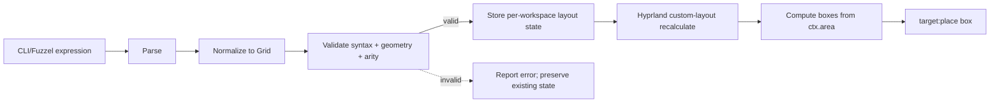

# Hyprland rice extraction + layout shorthand

## Context

The workstation rice is split between the system desktop bundle, shared Home Manager desktop modules, `modules/machines/workstation/home.nix`, `modules/machines/workstation/hyprland.lua`, and `tests/tests.just`. The coherent Hyprland implementation is still embedded in the workstation caller: bind data, helper commands, layer state, Lua templating, and the current focused-window `tile-ratio` command.

The immediate layout need is smaller than CSS, Tailwind, TSX, or window selectors. The operator wants one shortcut that accepts either:

```text
1 1 1
1 2 1
repeat(1,5)
a b; a .; c c
```

and applies that shape to the current workspace's native tiled layout targets. Hyprland 0.55 provides the correct runtime seam: a Lua custom layout registered with `hl.layout.register`, work-area-aware recalculation through `ctx.area`, and placement through `target:place(...)`.

## Goal

After activation:

1. The reusable rice implementation lives under `modules/home/desktop/hypr-rice/`; workstation Home Manager is composition and host/personal policy.
2. `SUPER+R` opens a Fuzzel prompt for a weighted-row or area-grid expression.
3. A valid expression becomes the current workspace's native Hyprland custom layout.
4. Invalid syntax, geometry, or target arity changes no layout state and reports a direct error.
5. Lua configuration, helpers, cheatsheet expectations, and runtime verification are derived from colocated rice declarations rather than copied across workstation files and Just recipes.

## Constraints

| Constraint | Consequence |
|---|---|
| Hyprland 0.55+ Lua mode is authoritative | Keep `configType = "lua"`; every shell dispatch uses Lua builder/eval syntax. |
| Tiled geometry belongs to the compositor layout | Use `hl.layout.register` + `target:place(...)`; do not manage tiled windows through repeated external pixel moves. |
| Current branch may have concurrent writers | Implement on branch `hypr-rice-layout` in `/srv/share/projects/homelab-hypr-rice-layout`. |
| `nori.<X>` names infra Reader/Writer concerns | Use `programs.hypr-rice`, not `nori.desktop` or `nori.rice`. |
| v1 has no window selectors | Map declared slots to `ctx.targets` in native target order. |
| Failure must not partially mutate the workspace | Parse and validate the complete expression and target arity before replacing the workspace layout state. |
| Empty space is intentional geometry | `.` occupies a cell but maps to no target. Track sizing, not the empty cell, determines its dimensions. |
| Existing rice behavior is already live | Extract first without behavior changes; add the layout language in a later atomic commit. |

## Scope

### Included

- Home Manager rice extraction.
- Existing Lua template, bind/layer declarations, helper commands, and direct runtime dependencies.
- Native Lua custom layout.
- Weighted horizontal rows.
- Grid-template-area-like layouts.
- Positive fractional track weights.
- `repeat(weight,count)` for weighted rows and track flags.
- Empty grid cells.
- Strict syntax, shape, rectangle, and arity validation.
- Fuzzel prompt and CLI helper.
- Pure parser/geometry tests and live Hyprland runtime verification.

### Deferred

- Window class/title selectors.
- Launching or moving applications into slots.
- Optional or variadic slots.
- Full CSS parsing, cascade, intrinsic sizing, or Tailwind compatibility.
- Flex wrapping, alignment variants, overlays, absolute positioning, or animation.
- Per-window visual CSS. Hyprland appearance capabilities remain separate from layout geometry.
- Publication as an independent flake; the internal module must merely be publication-ready.

## Module seam

Keep the repository's scope-aligned top-level layout:

```text
modules/
├── machines/
│   ├── desktop/                         # NixOS system/session adapter
│   └── workstation/
│       └── home.nix                     # caller: personal + host policy
└── home/
    └── desktop/
        ├── default.nix
        └── hypr-rice/
            ├── default.nix              # Home Manager interface + composition
            ├── hyprland.lua             # custom layout + compositor config
            ├── layout.lua               # pure parser, validation, geometry model
            └── helpers.nix              # packaged commands + generated artifacts
```

`modules/machines/desktop/hyprland.nix` remains the system adapter owning Hyprland, UWSM, portals, polkit, and RTKit. The Home Manager rice keeps `package = null` and `portalPackage = null`, preserving one system-owned Hyprland package.

### Home Manager interface

```nix
programs.hypr-rice = {
  enable = true;

  monitor = {
    output = "DP-3";
    mode = "3440x1440@75";
    position = "0x0";
    scale = 1.0;
  };

  keyboardLayout = "no";
  startupCommands = [ "zeditor" "zen-beta" ];
  extraLua = ./hyprland-host.lua;
};
```

Only true host facts cross the interface. Bindings, layers, helper names, parser implementation, layout state, generated manifests, and modifier masks remain private.

## Layout domain

The layout language normalizes to one grid representation:

```text
Grid
├── columns: positive fractional weights
├── rows: positive fractional weights
├── cells: rectangular area names or empty
└── areas: first-appearance-ordered target slots
```

A weighted row is sugar for a one-row grid.



Legend: solid arrows are the successful state transition; the dotted arrow is the no-mutation failure exit.

## Syntax

### Weighted row

```text
hypr-layout '1 1 1'
hypr-layout '1 2 1'
hypr-layout 'repeat(1,5)'
```

Semantics:

- Each expanded number is a positive `fr`-like column weight.
- There is one row with weight `1`.
- Slots map left-to-right to native layout targets.
- Expanded track count must equal target count.

Initial grammar:

```text
weighted-row := weight-expression (WS weight-expression)*
weight-expression := positive-number | repeat
repeat := "repeat(" positive-number "," positive-integer ")"
```

`repeat` may appear with other weights, for example `1 repeat(2,3) 1`.

### Area grid

```text
hypr-layout 'a b; a .; c c'
```

Semantics:

```text
┌───────┬───────┐
│       │   b   │
│   a   ├───────┤
│       │   .   │
├───────┴───────┤
│       c       │
└───────────────┘
```

- `;` separates explicit rows.
- Whitespace separates cells.
- `.` is an intentionally empty cell.
- Repeated names form one spanning area.
- Distinct names map to targets in first-appearance row-major order.
- Every named area must form one complete rectangle.

Initial grammar:

```text
area-grid := area-row (WS? ";" WS? area-row)+
area-row := cell (WS cell)*
cell := identifier | "."
identifier := [A-Za-z][A-Za-z0-9_-]*
```

Numeric cells are intentionally reserved for weighted-row syntax.

### Track sizing

Area grids default to equal rows and columns. Optional flags override the inferred tracks:

```text
hypr-layout \
  --columns '1 1' \
  --rows '2 1 1' \
  'a b; a .; c c'
```

Both flags use the weighted-row grammar, including `repeat(...)`. Track counts must match the area's inferred dimensions.

An empty cell does not own a size. Its row and column tracks size it. A hole therefore consumes its allocated grid area by default.

## Validation invariants

| ID | Invariant | Enforcement |
|---|---|---|
| L1 | Every weight is finite and greater than zero. | Pure Lua parser test + runtime validation. |
| L2 | Every area row has the same column count. | Pure Lua validator. |
| L3 | Every named area is rectangular and contiguous. | Pure Lua validator. |
| L4 | Column/row track counts equal inferred grid dimensions. | Pure Lua validator. |
| L5 | Weighted-row slot count equals current native target count. | Runtime validation before state update. |
| L6 | Distinct area count equals current native target count. | Runtime validation before state update. |
| L7 | Invalid input leaves the previous workspace layout and geometry unchanged. | Runtime integration test. |
| L8 | Computed boxes are non-overlapping and remain inside `ctx.area`. | Pure geometry test + runtime introspection. |
| L9 | Lua template substitution leaves no unresolved `@...@` markers. | Flake/build check. |
| L10 | Grouped Hyprland targets count as one opaque target. | Adapter contract; runtime fixture covers a normal target set first. |

When window count changes after activation and no longer matches the expression, the adapter reports the mismatch and restores the workspace layout that was active before `lua:rice`; it never partially assigns the new target set. Optional/rest semantics require explicit future syntax.

## Runtime integration

### Native custom layout

Register one layout:

```lua
hl.layout.register("rice", {
    recalculate = function(ctx)
        -- lookup valid state for this workspace
        -- compute boxes within ctx.area
        -- target:place(box)
    end,
    layout_msg = function(ctx, msg)
        -- optional internal control/debug entry point
    end,
})
```

The helper applies a validated expression to the active workspace and sets that workspace's layout to `lua:rice` using the current Lua workspace-rule API. Existing workspaces without a rice expression retain their prior layout.

State is keyed by stable workspace identity and records the prior workspace layout for mismatch recovery. Monitor/workspace changes trigger native Hyprland recalculation; geometry always starts from `ctx.area`, not raw monitor mode dimensions.

### Commands

```text
hypr-layout [--columns EXPR] [--rows EXPR] LAYOUT
hypr-layout-menu
```

- `hypr-layout` strictly quotes the accepted grammar before calling the persistent Lua runtime.
- `hypr-layout-menu` offers presets through Fuzzel and accepts typed custom input.
- `SUPER+R` launches `hypr-layout-menu`, replacing the current focused-window ratio picker.
- Existing ratio presets are translated to whole-workspace forms where meaningful; `tile-ratio` remains available during the migration commit and is removed only after runtime verification.

## Extraction map

### Move into `modules/home/desktop/hypr-rice/`

From `modules/machines/workstation/home.nix`:

- bind constructors and declarations;
- cheatsheet generation;
- `cmd-menu`, `popup-term`, layer helpers, and current `tile-ratio` implementation;
- layer registry and spacer class;
- Home Manager Hyprland ownership and Lua template generation.

Move `modules/machines/workstation/hyprland.lua` beside the module, splitting only true host-specific monitor/startup/window-geometry facts into the caller or `extraLua`.

### Keep workstation-owned

- `/srv/nori` links;
- personal/operator packages;
- NVIDIA-only tools;
- Deno/Bubblewrap and agent tooling;
- personal application package selection;
- host-specific monitor and floating-window geometry.

### Package implementation dependencies

Helpers must not rely accidentally on the broad personal package list. Package or pin the direct dependencies they invoke, including Fuzzel, jq, socat, libnotify, screenshot/clipboard tools, and shell utilities. System-owned `hyprctl` remains an explicit runtime prerequisite checked by the helper.

## Verification

### Baseline

The isolated worktree starts at `f830b17`; `just check` passes before changes.

### Pure/build-time

Add tests for:

- weighted rows and mixed `repeat(...)` expansion;
- area parsing and inferred dimensions;
- rectangular span validation;
- malformed rows, identifiers, weights, and track counts;
- slot/area arity mismatch;
- box calculation and deterministic integer rounding;
- no overlap and work-area containment;
- generated Lua without unresolved template markers.

Run:

```text
nix fmt
just check
```

### Live Hyprland journey

Extend `just test-hypr` or delegate to a colocated `hypr-rice-check` that:

1. Verifies config reload and existing layer/bind behavior.
2. Creates a dedicated disposable workspace with three controlled test windows.
3. Applies `1 2 1`; reads runtime target/window boxes; verifies the 1:2:1 allocation within tolerance.
4. Applies `a b; a .; c c`; verifies `a` spans two rows, `c` spans two columns, and the empty cell remains unassigned.
5. Submits an arity mismatch and malformed/non-rectangular grid; verifies geometry and active workspace layout state remain unchanged.
6. Closes test windows and restores the prior workspace/layout in an `EXIT` cleanup path.

Then run the full live suite:

```text
just preview
just test-hypr
just test
```

Persist only after the live journey passes:

```text
just rebuild
```

## Delivery sequence

1. **Spec commit** — this document only.
2. **Mechanical extraction** — create the Home Manager rice module; preserve current behavior and keep `test-hypr` green.
3. **Single-source cleanup** — generate Lua bind sections, cheatsheet expectations, and runtime manifest from colocated declarations.
4. **Pure layout core** — parser, normalizer, validation, geometry tests.
5. **Native adapter** — custom Lua layout, per-workspace state, helper commands, and `SUPER+R` menu.
6. **Runtime verifier** — controlled-window end-to-end test and cleanup guarantees.
7. **Documentation refresh** — update module-authoring/runtime-test references and remove stale Hypridle/Hyprlang fallback claims.

Each behavioral stage is an atomic commit with `just check` green. No push occurs without the repository push gate and explicit operator approval.

## Sources

- [Hyprland 0.55 announcement](https://hypr.land/news/update55/)
- [Hyprland custom Lua layouts](https://wiki.hypr.land/Configuring/Layouts/Custom-Layouts/)
- [Official grid layout example](https://github.com/hyprwm/Hyprland/blob/main/example/layouts/grid.lua)
- [Official stateful manual layout example](https://github.com/hyprwm/Hyprland/blob/main/example/layouts/manual.lua)
- [Hyprland Lua expansion APIs and events](https://wiki.hypr.land/Configuring/Advanced-and-Cool/Expanding-functionality/)
- [Hyprland workspace-layout tips](https://wiki.hypr.land/Configuring/Advanced-and-Cool/Uncommon-tips-and-tricks/)
