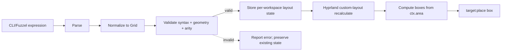

# Hyprland rice extraction + layout shorthand

## Context

The workstation rice is split between the system desktop bundle, shared Home Manager desktop modules, `modules/machines/workstation/home.nix`, `modules/machines/workstation/hyprland.lua`, and `tests/tests.just`. The coherent Hyprland implementation is still embedded in the workstation caller: bind data, helper commands, layer state, Lua templating, and the current focused-window `tile-ratio` command.

The immediate layout need is smaller than CSS, Tailwind, TSX, or window selectors. The operator wants one shortcut that accepts either:

```text
1 1 1
1 2 1
repeat(1,5)
a b; a .; c c
```

and applies that shape to the current workspace's native tiled layout targets. Hyprland 0.55 provides the correct runtime seam: a Lua custom layout registered with `hl.layout.register`, work-area-aware recalculation through `ctx.area`, and placement through `target:place(...)`.

## Goal

After activation:

1. The internal opinionated rice implementation lives under `modules/home/desktop/hypr-rice/`; workstation Home Manager retains unrelated personal and host policy.
2. `SUPER+R` opens a Fuzzel prompt for a weighted-row or area-grid expression.
3. A valid expression becomes the current workspace's native Hyprland custom layout.
4. Invalid syntax, geometry, grouped-window state, limits, or initial arity changes no rice state or workspace rule and reports a direct error.
5. Post-activation target-count drift uses a deterministic equal-column fallback and resumes the requested expression when arity matches again.
6. Lua configuration, helpers, cheatsheet expectations, and runtime verification are derived from colocated rice declarations rather than copied across workstation files and Just recipes.

## Constraints

| Constraint | Consequence |
|---|---|
| Hyprland 0.55+ Lua mode is authoritative | Keep `configType = "lua"`; every shell dispatch uses Lua builder/eval syntax. |
| Tiled geometry belongs to the compositor layout | Use `hl.layout.register` + `target:place(...)`; do not manage tiled windows through repeated external pixel moves. |
| Current branch may have concurrent writers | Implement on branch `hypr-rice-layout` in `/srv/share/projects/homelab-hypr-rice-layout`. |
| `nori.<X>` names infra Reader/Writer concerns | Do not introduce `nori.desktop` or `nori.rice`; this delivery exposes no generic public option interface. |
| v1 has no window selectors | Map declared slots to the current one-based `ipairs(ctx.targets)` order on each recalculation. |
| Initial failure must not mutate rice state | Parse, bound, validate, reject grouped workspaces, and preflight mapped non-floating-window arity before adding the workspace rule. |
| Native target count is observable only after activation | Defensively re-check `#ctx.targets`; target drift enters equal-column fallback rather than claiming rollback. |
| Empty space is intentional geometry | `.` occupies a cell but maps to no target. Track sizing, not the empty cell, determines its dimensions. |
| Existing rice behavior is already live | Extract first without behavior changes; add the layout language in a later atomic commit. |

## Scope

### Included

- Home Manager rice extraction.
- Existing Lua template, bind/layer declarations, helper commands, and direct runtime dependencies.
- Native Lua custom layout.
- Weighted horizontal rows.
- Grid-template-area-like layouts.
- Positive fractional track weights.
- `repeat(weight,count)` for weighted rows and track flags.
- Empty grid cells.
- Strict syntax, shape, rectangle, and arity validation.
- Fuzzel prompt and CLI helper.
- Pure parser/geometry tests and live Hyprland runtime verification.

### Deferred

- Window class/title selectors.
- Launching or moving applications into slots.
- Optional or variadic slots.
- Full CSS parsing, cascade, intrinsic sizing, or Tailwind compatibility.
- Flex wrapping, alignment variants, overlays, absolute positioning, or animation.
- Per-window visual CSS. Hyprland appearance capabilities remain separate from layout geometry.
- Publication or a generic reusable application/class/geometry interface. This delivery moves the current Ghostty/Zen/Zed/Snappy policy intact.

## Module seam

Keep the repository's scope-aligned top-level layout:

```text
modules/
├── machines/
│   ├── desktop/                         # NixOS system/session adapter
│   └── workstation/
│       └── home.nix                     # caller: personal + host policy
└── home/
    └── desktop/
        ├── default.nix
        └── hypr-rice/
            ├── default.nix              # Home Manager interface + composition
            ├── hyprland.lua             # custom layout + compositor config
            ├── layout.lua               # pure parser, validation, geometry model
            └── helpers.nix              # packaged commands + generated artifacts
```

`modules/machines/desktop/hyprland.nix` remains the system adapter owning Hyprland, UWSM, portals, polkit, and RTKit. The Home Manager rice keeps `package = null` and `portalPackage = null`, preserving one system-owned Hyprland package.

### Home Manager interface

This delivery is an internal opinionated extraction. `modules/home/desktop/default.nix` imports `./hypr-rice`; the import is the interface. The module moves the current Ghostty, Zen, Zed, Snappy Switcher, monitor, startup, and floating-window policy intact rather than introducing a shallow option mirror during a behavior-preserving extraction.

Bindings, layers, helper names, parser implementation, layout state, generated manifests, modifier masks, application commands/classes, and window geometry remain private. A generic public interface is a separate design task after a second real desktop consumer exists.

## Layout domain

The layout language normalizes to one grid representation:

```text
Grid
├── columns: positive fractional weights
├── rows: positive fractional weights
├── cells: rectangular area names or empty
└── areas: first-appearance-ordered target slots
```

A weighted row is sugar for a one-row grid.



Legend: solid arrows are the successful state transition; the dotted arrow is the no-mutation failure exit.

## Syntax

### Weighted row

```text
hypr-layout '1 1 1'
hypr-layout '1 2 1'
hypr-layout 'repeat(1,5)'
```

Semantics:

- Each expanded number is a positive `fr`-like column weight.
- There is one row with weight `1`.
- Slots map left-to-right to native layout targets.
- Expanded track count must equal target count.

Initial grammar and limits:

```text
DIGIT            := "0".."9"
integer          := DIGIT+
decimal          := DIGIT+ ("." DIGIT+)?
positive-number  := decimal whose value is > 0 and <= 1000000
positive-integer := integer whose value is in 1..64
WS               := one or more ASCII spaces or tabs
weighted-row     := weight-expression (WS weight-expression)*
weight-expression := positive-number | repeat
repeat            := "repeat(" positive-number "," positive-integer ")"
```

`repeat` may appear with other weights, for example `1 repeat(2,3) 1`. Whitespace inside `repeat(...)`, signs, exponent notation, `.5`, and `1.` are rejected in v1. Raw input is limited to 4096 bytes; expansion is limited to 64 weights.

### Area grid

```text
hypr-layout 'a b; a .; c c'
```

Semantics:

```text
┌───────┬───────┐
│       │   b   │
│   a   ├───────┤
│       │   .   │
├───────┴───────┤
│       c       │
└───────────────┘
```

- `;` separates explicit rows.
- Whitespace separates cells.
- `.` is an intentionally empty cell.
- Repeated names form one spanning area.
- Distinct names map to targets in first-appearance row-major order.
- “Native target order” means the current one-based `ipairs(ctx.targets)` order on every recalculation; swaps or target moves may change which target occupies a named area. v1 does not preserve target-to-area identity.
- Every named area must form one complete rectangle.

Initial grammar:

```text
area-grid := area-row (WS? ";" WS? area-row)+
area-row := cell (WS cell)*
cell := identifier | "."
identifier := [A-Za-z][A-Za-z0-9_-]*
```

Numeric cells are intentionally reserved for weighted-row syntax. Area grids are limited to 64 rows, 64 columns, 4096 cells, and 64 distinct named areas. Menu cancellation is a successful no-op; an explicitly submitted empty expression is an error.

### Track sizing

Area grids default to equal rows and columns. Optional flags override the inferred tracks:

```text
hypr-layout \
  --columns '1 1' \
  --rows '2 1 1' \
  'a b; a .; c c'
```

Both flags use the weighted-row grammar, including `repeat(...)`. Track counts must match the area's inferred dimensions.

An empty cell does not own a size. Its row and column tracks size it. A hole therefore consumes its allocated grid area by default.

## Validation invariants

| ID | Invariant | Enforcement |
|---|---|---|
| L1 | Every weight is finite and greater than zero. | Pure Lua parser test + runtime validation. |
| L2 | Every area row has the same column count. | Pure Lua validator. |
| L3 | Every named area is rectangular and contiguous. | Pure Lua validator. |
| L4 | Column/row track counts equal inferred grid dimensions. | Pure Lua validator. |
| L5 | Before activation, slot/area count equals the mapped non-floating-window count and `workspace.groups == 0`. | Lua bridge preflight before state/rule mutation. |
| L6 | During recalculation, slot/area count equals `#ctx.targets`. | Defensive native-adapter check. |
| L7 | Pre-activation validation failure leaves rice state and workspace rules unchanged. | Runtime integration test. |
| L8 | Target drift after activation uses equal-column fallback, not partial assignment, and resumes the expression when arity matches. | Native-adapter test + explicit live test. |
| L9 | Logical boxes are non-overlapping and remain inside `ctx.area`; cumulative floating-point edges share boundaries exactly. | Pure geometry test. |
| L10 | Lua template substitution leaves no unresolved `@...@` markers. | Flake/build check. |
| L11 | Grouped workspaces are rejected in v1. | Lua bridge preflight. |

After activation, target-count drift keeps the workspace on `lua:rice`, places all current targets in equal columns, emits one throttled notification, and preserves the requested expression so it resumes automatically when arity matches. `hypr-layout reset` removes the rice workspace rule and returns to the configured native layout; Hyprland reflows a new native tree rather than restoring prior geometry. Optional/rest and group semantics require explicit future syntax.

## Runtime integration

### Native custom layout

Register one layout:

```lua
hl.layout.register("rice", {
    recalculate = function(ctx)
        -- lookup valid state for this workspace
        -- compute boxes within ctx.area
        -- target:place(box)
    end,
    layout_msg = function(ctx, msg)
        -- optional internal control/debug entry point
    end,
})
```

The helper calls one intentionally global Lua bridge through `hyprctl -r eval`; `hyprctl dispatch` is only for `hl.dispatch(...)` actions and is not the configuration-mutation path. The shell helper hex-encodes each raw argument before interpolation, so user input never becomes Lua source. `_G.hypr_rice_apply_hex(...)` decodes, parses, bounds, validates, selects the target workspace, stores private state, adds/replaces the exact workspace rule with `layout = "lua:rice"`, and requests the scheduled workspace-rule refresh.

Workspace selection is precise: active window workspace first; otherwise active special workspace; otherwise active regular workspace. The bridge rejects grouped workspaces and preflights mapped non-floating-window arity before mutating state or rules.

The apply bridge records a composite regular/special discriminator plus workspace ID and name before activation. During recalculation, the adapter derives the workspace from the first target with a window and verifies it against the stored record; zero targets require no placement. Workspace-destroy events clear stale state. Geometry always starts from `ctx.area`, not raw monitor mode dimensions.

### Commands

```text
hypr-layout [--columns EXPR] [--rows EXPR] LAYOUT
hypr-layout reset
hypr-layout-menu
```

- `hypr-layout` hex-encodes raw arguments and calls the global bridge through `hyprctl -r eval`; it never interpolates raw Fuzzel input into Lua source.
- `hypr-layout reset` removes the rice rule for the selected workspace and returns it to the configured native layout, accepting native reflow.
- `hypr-layout-menu` offers presets through Fuzzel and accepts typed custom input.
- `SUPER+R` launches `hypr-layout-menu`, replacing the current focused-window ratio picker.
- Existing ratio presets are translated to whole-workspace forms where meaningful; `tile-ratio` remains available during the migration commit and is removed only after runtime verification.

## Extraction map

### Move into `modules/home/desktop/hypr-rice/`

From `modules/machines/workstation/home.nix`:

- bind constructors and declarations;
- cheatsheet generation;
- `cmd-menu`, `popup-term`, layer helpers, and current `tile-ratio` implementation;
- layer registry and spacer class;
- Home Manager Hyprland ownership and Lua template generation.

Move `modules/machines/workstation/hyprland.lua` beside the module intact for this internal opinionated delivery. Parameterizing monitor, startup, application classes, and floating geometry is deferred.

### Keep workstation-owned

- `/srv/nori` links;
- personal/operator packages;
- NVIDIA-only tools;
- Deno/Bubblewrap and agent tooling;
- personal application package selection outside the commands already hardcoded by the current rice.

### Package implementation dependencies

Helpers must not rely accidentally on the broad personal package list. Package or pin the direct dependencies they invoke, including Fuzzel, jq, socat, libnotify, screenshot/clipboard tools, and shell utilities. System-owned `hyprctl` remains an explicit runtime prerequisite checked by the helper.

## Verification

### Baseline

The isolated worktree starts at `f830b17`; `just check` passes before changes.

### Pure/build-time

Add tests for:

- weighted rows and mixed `repeat(...)` expansion;
- area parsing and inferred dimensions;
- rectangular span validation;
- malformed rows, identifiers, weights, and track counts;
- slot/area arity mismatch;
- cumulative floating-point track boundaries and box calculation;
- no overlap, shared edges, and work-area containment;
- generated Lua without unresolved template markers.

Run:

```text
nix fmt
just check
```

### Runtime introspection

Keep non-destructive checks in `just test-hypr`: config reload, registration, rule activation, parser failures, bind presence, and confirmation that pre-activation failures leave rice state/workspace rules unchanged.

The geometry journey is a separate explicit recipe, never part of `just test`:

```text
HYPR_RICE_LIVE_TEST=1 just test-hypr-layout-live
```

It requires a preview generation already active and:

1. Generates a unique disposable workspace name and unique Ghostty class per run.
2. Captures the active regular/special workspace plus matching client addresses and PIDs before mutation.
3. Launches controlled clients with close confirmation disabled and installs `EXIT`, `INT`, and `TERM` cleanup traps.
4. Applies `1 2 1` in a zero-gap, zero-border fixture workspace. It verifies observed boxes against the logical 1:2:1 boundaries with only downstream integer-rounding tolerance.
5. Applies `a b; a .; c c`; verifies `a` spans two rows, `c` spans two columns, and the empty cell remains unassigned.
6. Submits malformed, non-rectangular, grouped-workspace, and initial arity failures; verifies no rice state/rule mutation.
7. Changes target count after activation; verifies equal-column fallback and automatic resumption when arity matches again.
8. Cleans up by exact address/PID and returns focus to the captured workspace. A documented recovery command removes remnants after untrappable failure; it does not promise restoration of a destroyed native layout tree.

Verification sequence:

```text
nix fmt
just check
just preview
just test-hypr
HYPR_RICE_LIVE_TEST=1 just test-hypr-layout-live
just test
```

Persist only after the explicit live journey passes:

```text
just rebuild
```

## Delivery sequence

1. **Spec commit** — this document only.
2. **Mechanical extraction** — create the Home Manager rice module; preserve current behavior and keep `test-hypr` green.
3. **Single-source cleanup** — generate Lua bind sections, cheatsheet expectations, and runtime manifest from colocated declarations.
4. **Pure layout core** — parser, normalizer, validation, geometry tests.
5. **Native adapter** — custom Lua layout, per-workspace state, helper commands, and `SUPER+R` menu.
6. **Runtime verifier** — controlled-window end-to-end test and cleanup guarantees.
7. **Documentation refresh** — update module-authoring/runtime-test references and remove stale Hypridle/Hyprlang fallback claims.

Each behavioral stage is an atomic commit with `just check` green. No push occurs without the repository push gate and explicit operator approval.

## Sources

- [Hyprland 0.55 announcement](https://hypr.land/news/update55/)
- [Hyprland custom Lua layouts](https://wiki.hypr.land/Configuring/Layouts/Custom-Layouts/)
- [Official grid layout example, Hyprland 0.55.4](https://github.com/hyprwm/Hyprland/blob/v0.55.4/example/layouts/grid.lua)
- [Official stateful manual layout example, Hyprland 0.55.4](https://github.com/hyprwm/Hyprland/blob/v0.55.4/example/layouts/manual.lua)
- [Hyprland 0.55.4 Lua layout provider](https://github.com/hyprwm/Hyprland/blob/v0.55.4/src/config/lua/layout/LuaLayoutProvider.cpp)
- [Hyprland 0.55.4 Lua layout context](https://github.com/hyprwm/Hyprland/blob/v0.55.4/src/config/lua/layout/LuaLayoutContext.cpp)
- [Hyprland 0.55.4 Lua layout targets](https://github.com/hyprwm/Hyprland/blob/v0.55.4/src/config/lua/layout/LuaLayoutTarget.cpp)
- [Hyprland Lua expansion APIs and events](https://wiki.hypr.land/Configuring/Advanced-and-Cool/Expanding-functionality/)
- [Hyprland workspace-layout tips](https://wiki.hypr.land/Configuring/Advanced-and-Cool/Uncommon-tips-and-tricks/)
