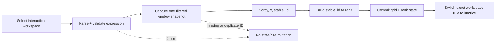

# Hyprland rice layout follow-up

## Context

The first native-layout delivery proved the shorthand and runtime adapter, then exposed four incorrect assumptions at the real compositor boundary:

| Observed behavior | Required correction |
|---|---|
| `SUPER+R` replaced focused-window sizing | Restore focused sizing on `SUPER+R`; move workspace layout to `SUPER+SHIFT+R`. |
| `ctx.targets` order did not match visual order | Capture pre-switch row-major window order and preserve it by `stable_id`. |
| A visible special workspace could lose to an active window underneath it | Select the visible special workspace before active-window and regular-workspace fallbacks. |
| Structural `.` holes duplicated the existing glass spacer | Every area maps to a real target; `SUPER+G` provides empty-looking spacer targets. |

The special-workspace bug left regular workspace `1` on `lua:rice` and caused repeated drift notifications while `special:term` was visible. The stale runtime rule was reset to Dwindle before this follow-up was specified.

The operator also wants transactional mouse editing, saved app-aware layouts, and mutable space labels. Hyprland 0.55.4 does not expose the required mouse lifecycle to Lua, and workspace labels need a stable identity model beyond this corrective slice. Those capabilities form one deferred `hypr-space` manager rather than more independent helpers.

## Goal

After activation:

1. `SUPER+R` opens absolute focused-window sizing.
2. `SUPER+SHIFT+R` opens the whole-workspace layout shorthand.
3. A successful workspace-layout apply maps current windows in visual row-major order and preserves that assignment by stable window identity.
4. A visible special workspace is always the apply/reset target on the focused monitor.
5. Drift notifications are silent for background workspace state.
6. Runtime workspace state survives regular workspace renaming because mutable names are not part of its key.
7. Every area name maps to one real tiled target, including glass spacer windows; `.` is invalid.

## Scope

### Included

- Restore `tile-ratio [RATIO]` with absolute-only semantics.
- Accept fractions, decimals, and percentages.
- Split the two shortcuts and generated cheatsheet/runtime expectations.
- Capture pre-activation visual order using `window.at` and `window.stable_id`.
- Preserve stable-ID rank through recalculation, target-vector reorder, fallback, and resumption.
- Prefer a visible special workspace during apply/reset.
- Silence mismatch notifications for non-interaction workspaces.
- Key active rice state by typed workspace kind and compositor ID.
- Remove structural `.` cells and use real `SUPER+G` spacer targets.
- Pure adapter/parser tests plus an explicit disposable-workspace runtime journey.

### Deferred to `hypr-space`

- Transactional mouse preview, release-to-commit, and Escape-to-cancel.
- Named saved layouts and application-aware slot selectors.
- Mutable visible labels for regular and special spaces.
- Waybar label rendering and Fuzzel workspace management.
- Launching applications, creating spaces, or creating missing spacers.
- Per-window semantic roles beyond application ID plus occurrence.
- AGS masking/ID overlays.

## Controls

| Input | Command | Meaning |
|---|---|---|
| `SUPER+R` | `tile-ratio` | Resize the focused Dwindle window to an absolute monitor-width ratio. |
| `SUPER+SHIFT+R` | `hypr-layout-menu` | Apply/reset a whole-workspace rice layout. |
| CLI | `tile-ratio 2/5` | Apply an absolute focused-window ratio without Fuzzel. |
| CLI | `hypr-layout '1 2 1'` | Apply a weighted row to the selected workspace. |
| CLI | `hypr-layout 'a b; a d; c c'` | Apply a four-target area grid; `d` may be the glass spacer. |
| CLI | `hypr-layout reset` | Return the selected workspace to the configured native layout. |

## Focused-window ratio

### Interface

```text
tile-ratio [RATIO]
```

- No argument opens the existing Fuzzel preset list and accepts typed input.
- One argument applies directly.
- Any other arity fails before querying or mutating geometry.
- Fuzzel cancellation is a successful no-op.

Presets remain:

```text
1/2
1/3
2/3
1/4
3/4
1/5
2/5
```

### Grammar

```text
DIGIT       := "0".."9"
integer     := DIGIT+
decimal     := "0." DIGIT+
fraction    := integer "/" integer
percentage  := integer ("." DIGIT+)? "%"
ratio       := decimal | fraction | percentage
```

Every accepted form normalizes to a finite value satisfying:

```text
0 < ratio < 1
```

Examples:

| Input | Result |
|---|---:|
| `2/5` | `0.4` |
| `0.4` | `0.4` |
| `40%` | `0.4` |

Reject bare integers such as `2`, signs, exponent notation, embedded whitespace, zero denominators, trailing input, and normalized values at or outside the open interval.

### Geometry and guard

Reuse the historical measured split-ratio algorithm:

1. Read focused monitor and window geometry.
2. Compute the absolute target width against usable monitor width.
3. Apply the known probe delta.
4. Measure local pixel response.
5. Correct for at most five passes, stopping within the existing three-pixel tolerance.

Before opening Fuzzel or probing, inspect the focused workspace's tiled layout. If it is `lua:rice`:

- exit non-zero;
- dispatch no `splitratio` and no reset;
- send the same actionable reset hint to stderr and Mako.

## Workspace identity and selection

### Typed runtime identity

Active rice state uses:

```text
WorkspaceIdentity = (kind, compositor_id)
kind              = regular | special
```

`workspace.name` remains selector/diagnostic metadata but is not part of equality or the state-table key. This preserves live layout state when a regular workspace is renamed and prevents regular/special ID collisions.

The future manager will use a separate stable logical key for cross-restart persistence. This delivery stores no workspace layout state across Hyprland restarts.

### Interaction workspace

Apply, reset, and foreground notification decisions use this precedence on the focused monitor:

```text
visible special workspace
→ active window workspace
→ active regular workspace
```

A regular workspace remains visible underneath a special overlay, but it is not the interaction target. Recalculation may still apply deterministic fallback geometry to background state; it must not emit mismatch notifications unless its identity equals the current interaction workspace.

## Apply-time visual ordering

### Capture transaction

A successful explicit apply is one transaction:



Legend: solid arrows commit a valid apply; dotted arrows are atomic failure exits.

The snapshot includes only windows on the selected workspace that are:

- mapped;
- tiled, not floating;
- ungrouped;
- backed by a unique usable `stable_id`.

Use this same snapshot for arity validation and rank construction; two independent queries could disagree at the mutation boundary.

### Row-major order

Sort ascending by:

1. `window.at.y`;
2. `window.at.x`;
3. `window.stable_id`.

Each explicit apply, including reapplying the same expression, replaces the previous rank map from current pre-switch geometry.

### Recalculation order

When requested arity equals `#ctx.targets`:

1. Known targets sort by captured rank.
2. Unknown/replacement targets append after known targets.
3. Unknowns sort by normalized stable ID; original `ctx.targets` index is only the final defensive tie-break.
4. `layout.boxes(...)` is assigned in that derived order.

Recalculation never learns or rewrites ranks. A compositor target-vector reorder therefore cannot silently change area ownership.

When arity differs:

- retain equal-column fallback;
- retain notification throttling;
- retain the rank map unchanged;
- resume the requested grid when arity matches again.

## Area grids and spacers

The area grid now contains names only:

```text
hypr-layout 'a b; a d; c c'
```

```text
┌───────┬───────┐
│       │   b   │
│   a   ├───────┤
│       │   d   │
├───────┴───────┤
│       c       │
└───────────────┘
```

- `a`, `b`, `c`, and `d` are four real target slots.
- `d` can map to the existing blank glass spacer spawned with `SUPER+G`.
- The spacer is ordered and identified exactly like another tiled window.
- `.` is rejected rather than treated as an empty cell.
- Rectangular-area and track-count validation remain unchanged.

This removes two representations of empty space: presentation belongs to the spacer window; geometry contains only target areas.

## Invariants

| ID | Invariant | Enforcement |
|---|---|---|
| F1 | Focused sizing is absolute; no relative multiplier interpretation remains. | `tile-ratio_test.sh` through the command interface. |
| F2 | Focused sizing never mutates a `lua:rice` workspace. | Shell test + live notification/geometry observation. |
| O1 | Initial window snapshot is captured before the workspace switches layout algorithm. | Adapter test whose rule-switch stub changes geometry. |
| O2 | One snapshot supplies both arity and rank. | Adapter structure + missing/duplicate-ID failure tests. |
| O3 | Known stable IDs retain captured rank through recalculation and drift. | `rice_test.lua` identity-sensitive fallback/resumption cases. |
| O4 | Explicit reapply recaptures current visual order. | Adapter test + controlled live journey. |
| W1 | Visible special workspace wins over an active regular window underneath it. | Adapter regression + disposable special-workspace journey. |
| W2 | Background workspace mismatch emits no notification. | Adapter notification-spy regression. |
| W3 | Runtime state equality ignores mutable workspace name and separates regular/special IDs. | Adapter identity tests. |
| A1 | Every area name maps to one real target; `.` is invalid. | `layout_test.lua` + live four-target spacer journey. |
| A2 | Validation failure mutates neither state nor workspace rule. | Existing atomicity tests extended to the new grammar/identity snapshot. |

## Verification

### Pure/build-time

Use vertical RED→GREEN slices:

1. Absolute ratio parser and `lua:rice` guard.
2. Visual-order capture before algorithm switch.
3. Stable-ID target ordering and deterministic unknown append.
4. Drift fallback/resumption without rank mutation.
5. Visible-special selection and background notification suppression.
6. Rename-stable typed workspace identity.
7. `.` rejection and four-target spacer arity.

Wire the shell test and `bash -n` checks into the existing `hypr-rice-layout` flake check. Keep ordering in `rice.lua`; the pure `layout.lua` geometry model does not know window identity.

### Runtime introspection

`just test-hypr` verifies:

- `SUPER+R` has modmask `64` and executes `tile-ratio`;
- `SUPER+SHIFT+R` has modmask `65` and executes `hypr-layout-menu`;
- config reload is clean;
- invalid input leaves active layout/rules unchanged.

### Explicit live journey

Run only with:

```text
HYPR_RICE_LIVE_TEST=1 just test-hypr-layout-live
```

The controlled journey:

1. Creates three content windows plus one glass-spacer equivalent.
2. Captures their visual order and unique stable IDs.
3. Applies `a b; a d; c c` and verifies identity-to-area placement.
4. Forces tiled target removal/reinsertion and verifies mapping survives fallback/resumption.
5. Resets, changes native visual order, reapplies, and verifies recapture.
6. Replaces a target and verifies known-rank-first deterministic append.
7. Opens a disposable special overlay and verifies apply/reset targeting plus background notification silence.
8. On Dwindle, verifies `2/5`, `0.4`, and `40%` converge to equivalent focused widths.
9. On `lua:rice`, verifies focused sizing fails visibly without geometry/rule mutation.
10. Cleans up by exact address/PID and restores prior regular/special focus state.

Persist only after the live journey passes.

## Deferred `hypr-space` manager boundary

This follow-up intentionally leaves one high-level seam:

```text
hypr-space / Fuzzel
        │
        ├─ space metadata + labels
        ├─ named reusable layout templates
        ├─ app-aware slot selectors
        └─ transactional mouse editing
        │
        ▼
hypr-layout               # low-level geometry executor
        │
        ▼
Hyprland + pinned plugin   # runtime authority + input lifecycle
```

### Manager command surface

```text
hypr-space label [SPACE] NAME
hypr-space layout save NAME
hypr-space layout apply NAME
hypr-space layout delete NAME
hypr-space export
```

`SPACE` defaults to the current visible space. Layout templates belong to the high-level manager; `hypr-layout` remains the low-level geometry executor and does not own persistence.

### Space identity and labels

- Nix owns stable typed keys/selectors/binds.
- Runtime user data owns only mutable label overrides and saved templates.
- Regular numeric, regular named, and special selectors remain distinct types.
- Actual Hyprland identity is not renamed.
  - Regular rename preserves object/ID but does not rewrite string references.
  - Hyprland 0.55.4 rejects special-workspace rename.
- Labels are unique across regular and special spaces.
- Waybar shows labels; tooltip and Fuzzel secondary text retain stable-key context.
- Rename targets the current visible space by default with an optional explicit selector.
- `export` prints/copies canonical Nix and never edits the homelab source.
- Promoting an override to Nix removes its runtime copy.
- The manager operates on existing Hyprland spaces; it does not own create/delete lifecycle.

### Saved app-aware layouts

A persisted slot uses application identity plus occurrence, not session stable IDs:

```text
a = zen-browser[1]
b = zen-browser[2]
c = ghostty[1]
d = spacer[1]
```

Apply resolves selectors only among windows already in the target space:

```text
initial class / Wayland app ID + row-major occurrence
                     ↓
             current stable_id
```

Missing, extra, or ambiguous matches fail atomically. Applying never launches an application or creates a missing spacer. Stable IDs remain the live post-resolution identity.

### Transactional mouse editing

Hyprland 0.55.4's Lua custom-layout provider discards tiled resize deltas/corners, ignores the tiled-drag focal point, exposes no pointer/button lifecycle event, and omits recalculation provenance. Geometry polling cannot provide a reliable transaction contract.

The future pinned plugin/API patch must expose:

```text
mouse press   → clone committed state into draft
mouse motion  → preview swap or adjacent-track diff
mouse release → commit draft
Escape        → discard draft and restore committed geometry
```

Until then, mouse editing on `lua:rice` is unsupported. The explicit workaround is reset → arrange under Dwindle → reapply.

## Delivery

1. Commit this reviewed follow-up spec.
2. Harden it against the current code and pinned Hyprland 0.55.4 API.
3. Implement one behavior per RED→GREEN slice.
4. Keep pure/build checks green at each atomic commit.
5. Run the real Hyprland journey on a preview generation.
6. Persist only after runtime verification passes.
7. Do not push without the repository push gate and explicit operator approval.

## Sources

- [Hyprland 0.55.4 Lua layout provider](https://github.com/hyprwm/Hyprland/blob/v0.55.4/src/config/lua/layout/LuaLayoutProvider.cpp)
- [Hyprland 0.55.4 Lua layout context](https://github.com/hyprwm/Hyprland/blob/v0.55.4/src/config/lua/layout/LuaLayoutContext.cpp)
- [Hyprland 0.55.4 Lua layout target](https://github.com/hyprwm/Hyprland/blob/v0.55.4/src/config/lua/layout/LuaLayoutTarget.cpp)
- [Hyprland 0.55.4 drag controller](https://github.com/hyprwm/Hyprland/blob/v0.55.4/src/layout/supplementary/DragController.cpp)
- [Hyprland 0.55.4 workspace implementation](https://github.com/hyprwm/Hyprland/blob/v0.55.4/src/desktop/Workspace.cpp)
- [Hyprland 0.55.4 official manual layout](https://github.com/hyprwm/Hyprland/blob/v0.55.4/example/layouts/manual.lua)
- [Original rice layout design](./2026-07-15-hypr-rice-layout-design.md)
