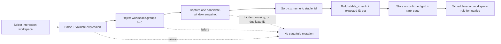

# Hyprland rice layout follow-up

## Context

The first native-layout delivery proved the shorthand and runtime adapter, then exposed four incorrect assumptions at the real compositor boundary:

| Observed behavior | Required correction |
|---|---|
| `SUPER+R` replaced focused-window sizing | Restore focused sizing on `SUPER+R`; move workspace layout to `SUPER+SHIFT+R`. |
| `ctx.targets` order did not match visual order | Capture pre-switch row-major window order and preserve it by `stable_id`. |
| A visible special workspace could lose to an active window underneath it | Select the visible special workspace before active-window and regular-workspace fallbacks. |
| Structural `.` holes duplicated the existing glass spacer | Every area maps to a real target; `SUPER+G` provides empty-looking spacer targets. |

The special-workspace bug left regular workspace `1` on `lua:rice` and caused repeated drift notifications while `special:term` was visible. The stale runtime rule was reset to Dwindle before this follow-up was specified.

The operator also wants transactional mouse editing, saved app-aware layouts, and mutable space labels. Hyprland 0.55.4 does not expose the required mouse lifecycle to Lua, and workspace labels need a stable identity model beyond this corrective slice. Those capabilities form one deferred `hypr-space` manager rather than more independent helpers.

## Goal

After activation:

1. `SUPER+R` opens absolute focused-window sizing.
2. `SUPER+SHIFT+R` opens the whole-workspace layout shorthand.
3. A successful workspace-layout apply maps current windows in visual row-major order and preserves that assignment by stable window identity.
4. A visible special workspace is always the apply/reset target on the focused monitor.
5. Drift notifications are silent for background workspace state.
6. Runtime workspace state uses typed `(kind, compositor_id)` tables. Positive-ID regular workspaces survive display-name changes because their numeric rule selector is stable; named regular workspace rename stability is deferred.
7. Every area name maps to one real tiled target, including glass spacer windows; `.` is invalid.

## Scope

### Included

- Restore `tile-ratio [RATIO]` with absolute-only semantics.
- Accept fractions, decimals, and percentages.
- Split the two shortcuts and generated cheatsheet/runtime expectations.
- Capture pre-activation visual order using `window.at` and `window.stable_id`.
- Preserve stable-ID rank through recalculation, target-vector reorder, fallback, and resumption.
- Prefer a visible special workspace during apply/reset.
- Silence mismatch notifications for non-interaction workspaces.
- Key active rice state structurally as `workspace_state.regular[id]` / `.special[id]`.
- Preserve name-change continuity only for positive-ID regular workspaces whose rule selector remains numeric.
- Remove structural `.` cells and use real `SUPER+G` spacer targets.
- Pure adapter/parser tests plus an explicit disposable-workspace runtime journey.

### Deferred to `hypr-space`

- Transactional mouse preview, release-to-commit, and Escape-to-cancel.
- Named saved layouts and application-aware slot selectors.
- Named-regular-workspace rename stability and mutable visible labels for regular and special spaces.
- Waybar label rendering and Fuzzel workspace management.
- Launching applications, creating spaces, or creating missing spacers.
- Per-window semantic roles beyond application ID plus occurrence.
- AGS masking/ID overlays.

## Controls

| Input | Command | Meaning |
|---|---|---|
| `SUPER+R` | `tile-ratio` | Resize the focused Dwindle window to an absolute monitor-width ratio. |
| `SUPER+SHIFT+R` | `hypr-layout-menu` | Apply/reset a whole-workspace rice layout. |
| CLI | `tile-ratio 2/5` | Apply an absolute focused-window ratio without Fuzzel. |
| CLI | `hypr-layout '1 2 1'` | Apply a weighted row to the selected workspace. |
| CLI | `hypr-layout 'a b; a d; c c'` | Apply a four-target area grid; `d` may be the glass spacer. |
| CLI | `hypr-layout reset` | Return the selected workspace to the configured native layout. |

## Focused-window ratio

### Interface

```text
tile-ratio [RATIO]
```

- No argument opens the existing Fuzzel preset list and accepts typed input.
- One argument applies directly.
- Any other arity fails before querying or mutating geometry.
- Fuzzel exit status `1` is a successful no-op; any other nonzero status propagates.
- Fuzzel status `0` with empty input is also a successful no-op.
- The script captures cancellation explicitly rather than relying on command substitution under `set -e`.

Presets remain:

```text
1/2
1/3
2/3
1/4
3/4
1/5
2/5
```

### Grammar

```text
DIGIT       := "0".."9"
integer     := DIGIT+
decimal     := "0." DIGIT+
fraction    := integer "/" integer
percentage  := integer ("." DIGIT+)? "%"
ratio       := decimal | fraction | percentage
```

Every accepted form normalizes to a finite value satisfying:

```text
0 < ratio < 1
```

Examples:

| Input | Result |
|---|---:|
| `2/5` | `0.4` |
| `0.4` | `0.4` |
| `40%` | `0.4` |

Reject bare integers such as `2`, signs, exponent notation, embedded whitespace, zero denominators, trailing input, and normalized values at or outside the open interval. Validate the complete token under `LC_ALL=C` before arithmetic; pass values into `awk` with `-v`, never by interpolating input into an awk program.

### Geometry and guard

Restore the historical measured split-ratio algorithm with explicit constants:

1. Resolve the mapped, tiled focused window and its exact workspace ID.
2. Require that workspace's `tiledLayout` to be the supported native `dwindle` layout.
3. Compute usable width as monitor width minus `2 * gapsOut`; one Nix-owned `gapsOut = 8` value generates both Hyprland config and this calculation.
4. Compute the absolute target width.
5. Dispatch probe delta `0.2`, wait `0.05s`, and measure the focused-window pixel response.
6. Require a finite nonzero measured slope.
7. Run at most five measured correction passes, waiting `0.05s` after each dispatch.
8. Succeed only when the final absolute width error is strictly less than `3px`.

Failure to measure a slope or converge exits nonzero and reports that the probe may already have changed geometry; the script must not silently substitute slope `1` or claim success.

Before opening Fuzzel or probing, fail visibly when there is no mapped tiled focused window, when its exact workspace is `lua:rice`, or when its layout is anything other than `dwindle`. The guard queries the focused window's workspace ID and then that exact workspace—not `activeworkspace`, which can refer to the regular workspace underneath a special overlay. Every guard failure dispatches no `splitratio` and reports the actionable error to stderr plus Mako; notification failure does not hide the stderr failure.

Package `tile-ratio.sh` with `writeShellApplication` and explicit runtime inputs for Hyprland/hyprctl, Fuzzel, jq, gawk, coreutils, and libnotify. The source defaults to those PATH commands but honors injected `HYPRCTL_BIN`, `FUZZEL_BIN`, and `NOTIFY_SEND_BIN` in its shell test; this makes cancellation, both error channels, exact command sequencing, and no-dispatch guards observable without mocking internal functions.

## Workspace identity and selection

### Typed runtime identity

Active rice state is structural rather than a serialized composite key:

```text
workspace_state.regular[compositor_id]
workspace_state.special[compositor_id]
```

`workspace.name` remains selector/diagnostic metadata but is not part of state lookup. This makes regular/special collisions unrepresentable. Positive-ID regular workspaces use numeric workspace-rule selectors, so a display-name change preserves both state and rule targeting. Named regular workspaces have negative runtime IDs but only mutable `name:` rule selectors in Hyprland 0.55.4; rename stability for them is explicitly deferred to `hypr-space`. Special workspace names are immutable in Hyprland 0.55.4.

State is process-local. Activation/reload intentionally starts with empty rice state; previously active rice workspaces must be reset/reapplied rather than migrated. The future manager will own a separate stable logical key for cross-restart persistence.

### Interaction workspace

One `interaction_workspace()` helper drives apply, reset, and foreground notification decisions:

```text
focused monitor
→ visible special workspace on that monitor
→ active window workspace only when that window is on the focused monitor
→ active regular workspace on the focused monitor
```

A regular workspace remains visible underneath a special overlay, but it is not the interaction target. Recalculation may still apply deterministic fallback geometry to background state. A background mismatch neither emits nor updates `last_notice_at`; successful requested-layout placement clears that state's throttle. This ensures background activity cannot suppress the next foreground warning.

## Apply-time visual ordering

### Pre-activation capture

The adapter guarantees that parsing, workspace-state validation, snapshot capture, and arity validation complete before any rice state or workspace rule is mutated:



Legend: dotted exits are pre-mutation failures. `hl.workspace_rule(...)` schedules refresh and returns no success result, so this is not a state-plus-rule transaction and promises no rollback after rule scheduling.

`workspace.groups == 0` is a separate workspace-wide precondition because `hl.get_windows` cannot query group membership. The single candidate snapshot then queries mapped, non-floating windows on the selected workspace and manually rejects any window whose readable `hidden` field is true. Under the accepted ungrouped/non-hidden workspace state, these candidates are the native tiled-target set.

A usable Lua `window.stable_id` is an integer greater than zero and unique within the snapshot. Use this same snapshot for arity, rank, and the expected-ID set; two independent queries could disagree at the mutation boundary.

### Row-major order

Sort ascending by:

1. `window.at.y`;
2. `window.at.x`;
3. `window.stable_id`.

Each explicit apply, including reapplying the same expression, replaces the previous rank map from current pre-switch geometry.

Representation is boundary-specific:

| Surface | Stable ID | Position |
|---|---|---|
| Hyprland Lua | positive integer `window.stable_id` | object `{ x, y }` |
| `hyprctl -j clients` | lowercase hexadecimal string `stableId` | array `[x, y]` |

Lua ordering is numeric; converting IDs to strings is allowed only for table keys, never lexical sorting. The live shell journey treats JSON `stableId` as an opaque identity and verifies placement by client address/geometry rather than comparing it directly to Lua integers.

### Recalculation order

The first matching-arity recalculation after apply is a confirmation boundary: the stable-ID set from `ctx.targets` must equal the captured expected-ID set before requested boxes are assigned. A same-count mismatch uses equal-column fallback and requires the original set to return or an explicit reapply; equal counts alone cannot prove the switch targeted the captured windows.

After one exact set match marks the state confirmed, later matching-arity recalculations order targets as follows:

1. Known targets sort by captured rank.
2. Unknown/replacement targets append after known targets.
3. Unknowns sort by numeric stable ID; original `ctx.targets` index is only the final defensive tie-break.
4. `layout.boxes(...)` is assigned in that derived order.

Recalculation never learns or rewrites ranks. A compositor target-vector reorder therefore cannot silently change area ownership.

When arity differs:

- retain equal-column fallback;
- retain notification throttling;
- retain the rank map unchanged;
- resume the requested grid when arity matches again.

## Area grids and spacers

The area grid now contains names only:

```text
hypr-layout 'a b; a d; c c'
```

```text
┌───────┬───────┐
│       │   b   │
│   a   ├───────┤
│       │   d   │
├───────┴───────┤
│       c       │
└───────────────┘
```

- `a`, `b`, `c`, and `d` are four real target slots.
- `d` can map to the existing blank glass spacer spawned with `SUPER+G`.
- The spacer is ordered and identified exactly like another tiled window.
- `.` is rejected rather than treated as an empty cell.
- Area names remain `[A-Za-z][A-Za-z0-9_-]*`; each unique name defines one target, and repeated cells must form one complete rectangle.
- Rectangular-area and track-count validation remain unchanged.
- Remove dot semantics from parser, parser tests, transport test, Fuzzel preset, live journey, and geometry assertions as one vertical slice.

This removes two representations of empty space: presentation belongs to the spacer window; geometry contains only target areas.

## Invariants

| ID | Invariant | Enforcement |
|---|---|---|
| F1 | Focused sizing is absolute; no relative multiplier interpretation remains. | `tile-ratio_test.sh` through the command interface. |
| F2 | Unsupported/no-window/rice guards dispatch neither Fuzzel nor `splitratio`; stderr remains authoritative if notification fails. | Shell test with injected `HYPRCTL_BIN`, `FUZZEL_BIN`, and `NOTIFY_SEND_BIN`. |
| F3 | Success means measured convergence `< 3px`; zero/nonfinite slope or non-convergence fails explicitly. | Deterministic shell geometry fixture. |
| O1 | Initial window snapshot is captured before the workspace switches layout algorithm. | Adapter test whose rule-switch stub changes geometry. |
| O2 | One snapshot supplies arity, rank, and expected-ID set; usable IDs are unique positive integers. | Adapter structure + hidden/missing/duplicate-ID failure tests. |
| O3 | First requested placement requires target-ID set equivalence, not count equality alone. | Same-count/different-ID adapter regression. |
| O4 | Known stable IDs retain captured rank through confirmed recalculation and drift. | `rice_test.lua` identity-sensitive fallback/resumption cases. |
| O5 | Explicit reapply recaptures current visual order. | Adapter test + controlled live journey. |
| W1 | Visible special workspace wins over an active regular window underneath it. | Adapter regression + disposable special-workspace journey. |
| W2 | Background mismatch emits no notification and does not consume the foreground throttle. | Adapter notification-spy regression. |
| W3 | Structural state maps separate regular/special IDs; name continuity is guaranteed only for positive-ID numeric regular workspaces. | Adapter identity tests. |
| A1 | Every area name maps to one real target; `.` is invalid. | `layout_test.lua` + live actual-spacer journey. |
| A2 | Validation/snapshot failure occurs before state or rule mutation; post-schedule rollback is not promised. | Existing no-pre-mutation tests extended to the new snapshot contract. |

## Verification

### Pure/build-time

Use vertical RED→GREEN slices:

1. Absolute ratio parser, exact-workspace guard, and measured convergence/failure.
2. Visual-order capture before algorithm switch with positive integer IDs and hidden-window rejection.
3. First-recalculation ID-set confirmation, stable ordering, and deterministic unknown append after confirmation.
4. Drift fallback/resumption without rank mutation.
5. Focused-monitor special selection plus background notification/throttle suppression.
6. Structural regular/special state maps and positive-ID numeric rename continuity.
7. `.` rejection and four-target actual-spacer arity.
8. R-bind single-source generation.

The `hypr-rice-layout` flake check runs `tile-ratio_test.sh`, `hypr-layout_test.sh`, Lua tests, `bash -n` for all helper/test scripts, and `luac -p` for Lua sources. Its build inputs include Bash, Lua, jq, gawk, and coreutils required by the deterministic shell harness. Keep ordering in `rice.lua`; the pure `layout.lua` geometry model does not know window identity.

### Runtime introspection

`hyprctl binds -j` exposes Lua binds as opaque `__lua` dispatchers, so `just test-hypr` verifies only the observable registration:

- `SUPER+R`: modmask `64`, key `R`;
- `SUPER+SHIFT+R`: modmask `65`, key `R`;
- config reload is clean;
- invalid input leaves active layout/rules unchanged.

Command-to-key correctness is structural: one Nix binding declaration supplies the key/modifier/command facts to the cheatsheet and Hyprland Lua substitutions. The flake check inspects the generated Lua for `tile-ratio` and `hypr-layout-menu` and rejects unresolved placeholders. Full runtime command execution would require uinput and is outside this slice.

### Explicit live journey

Run only with:

```text
HYPR_RICE_LIVE_TEST=1 just test-hypr-layout-live
```

The controlled journey:

1. Creates three content windows plus the actual packaged `SUPER+G` spacer command/class generated from the same Nix declaration as its window rule.
2. Captures visual order by JSON `[y,x]`; records client address plus opaque hexadecimal `stableId` and asserts IDs are unique/nonempty.
3. Applies `a b; a d; c c` and verifies identity-to-area placement by client address and geometry.
4. Toggles one target floating then tiled, proving the same JSON stable ID returns and mapping survives fallback/resumption despite reinsertion order.
5. Resets, changes native visual order, reapplies, and verifies recapture.
6. Kills one captured target, launches a replacement with a new stable ID, and verifies known-rank-first deterministic append.
7. Opens a disposable special overlay and verifies apply/reset target that special workspace. Notification suppression remains a pure spy assertion because Hyprland exposes no notification history.
8. On Dwindle, invokes direct `2/5`, `0.4`, and `40%` values and verifies equivalent focused widths within `< 3px`.
9. On `lua:rice`, verifies direct focused sizing exits nonzero with a reset hint and leaves geometry/rules unchanged; notification delivery itself is covered by the injected shell test.
10. Cleanup hides the disposable special regardless of initial state, restores the exact prior special only when one existed, kills controlled clients by exact address/PID, and restores the prior regular workspace.
11. All workspace selectors embedded in Lua dispatch strings use a strict encoder/hex bridge, never raw interpolation.
12. Cleanup reloads Hyprland after controlled workspaces disappear, checks `configerrors`, and verifies no disposable regular/special selector remains in `hyprctl -j workspacerules`.

Persist only after the live journey passes.

## Deferred `hypr-space` manager boundary

This follow-up intentionally leaves one high-level seam:

```text
hypr-space / Fuzzel
        │
        ├─ space metadata + labels
        ├─ named reusable layout templates
        ├─ app-aware slot selectors
        └─ transactional mouse editing
        │
        ▼
hypr-layout               # low-level geometry executor
        │
        ▼
Hyprland + pinned plugin   # runtime authority + input lifecycle
```

### Manager command surface

```text
hypr-space label [SPACE] NAME
hypr-space layout save NAME
hypr-space layout apply NAME
hypr-space layout delete NAME
hypr-space export
```

`SPACE` defaults to the current visible space. Layout templates belong to the high-level manager; `hypr-layout` remains the low-level geometry executor and does not own persistence.

### Space identity and labels

- Nix owns stable typed keys/selectors/binds.
- Runtime user data owns only mutable label overrides and saved templates.
- Regular numeric, regular named, and special selectors remain distinct types.
- Actual Hyprland identity is not renamed.
  - Regular rename preserves object/ID but does not rewrite string references.
  - Hyprland 0.55.4 rejects special-workspace rename.
- Labels are unique across regular and special spaces.
- Waybar shows labels; tooltip and Fuzzel secondary text retain stable-key context.
- Rename targets the current visible space by default with an optional explicit selector.
- `export` prints/copies canonical Nix and never edits the homelab source.
- Promoting an override to Nix removes its runtime copy.
- The manager operates on existing Hyprland spaces; it does not own create/delete lifecycle.

### Saved app-aware layouts

A persisted slot uses application identity plus occurrence, not session stable IDs:

```text
a = zen-browser[1]
b = zen-browser[2]
c = ghostty[1]
d = spacer[1]
```

Apply resolves selectors only among windows already in the target space:

```text
initial class / Wayland app ID + row-major occurrence
                     ↓
             current stable_id
```

Missing, extra, or ambiguous matches fail atomically. Applying never launches an application or creates a missing spacer. Stable IDs remain the live post-resolution identity.

### Transactional mouse editing

Hyprland 0.55.4's Lua custom-layout provider discards tiled resize deltas/corners, ignores the tiled-drag focal point, exposes no pointer/button lifecycle event, and omits recalculation provenance. Geometry polling cannot provide a reliable transaction contract.

The future pinned plugin/API patch must expose:

```text
mouse press   → clone committed state into draft
mouse motion  → preview swap or adjacent-track diff
mouse release → commit draft
Escape        → discard draft and restore committed geometry
```

Until then, mouse editing on `lua:rice` is unsupported. The explicit workaround is reset → arrange under Dwindle → reapply.

## Delivery

1. Commit this reviewed follow-up spec.
2. Harden it against the current code and pinned Hyprland 0.55.4 API.
3. Implement one behavior per RED→GREEN slice.
4. Keep pure/build checks green at each atomic commit.
5. Run the real Hyprland journey on a preview generation.
6. Persist only after runtime verification passes.
7. Do not push without the repository push gate and explicit operator approval.

## Sources

- [Hyprland 0.55.4 Lua layout provider](https://github.com/hyprwm/Hyprland/blob/v0.55.4/src/config/lua/layout/LuaLayoutProvider.cpp)
- [Hyprland 0.55.4 Lua layout context](https://github.com/hyprwm/Hyprland/blob/v0.55.4/src/config/lua/layout/LuaLayoutContext.cpp)
- [Hyprland 0.55.4 Lua layout target](https://github.com/hyprwm/Hyprland/blob/v0.55.4/src/config/lua/layout/LuaLayoutTarget.cpp)
- [Hyprland 0.55.4 drag controller](https://github.com/hyprwm/Hyprland/blob/v0.55.4/src/layout/supplementary/DragController.cpp)
- [Hyprland 0.55.4 workspace implementation](https://github.com/hyprwm/Hyprland/blob/v0.55.4/src/desktop/Workspace.cpp)
- [Hyprland 0.55.4 official manual layout](https://github.com/hyprwm/Hyprland/blob/v0.55.4/example/layouts/manual.lua)
- [Original rice layout design](./2026-07-15-hypr-rice-layout-design.md)
