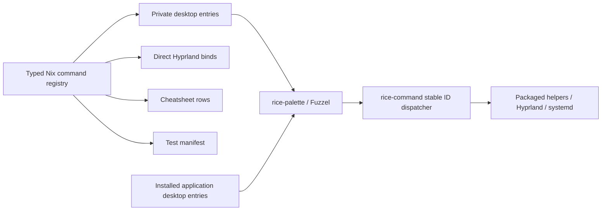

# Unified Fuzzel command palette

## Claim

`SUPER+SPACE` becomes one searchable surface for installed applications and rice commands. A typed Nix registry generates private desktop entries, direct Hyprland bindings, cheatsheet rows, and test metadata. Fuzzel remains the application engine; the rice adds commands without reimplementing application discovery.

## Context

The rice currently has four independent Fuzzel surfaces:

| Surface | Current entry | Source |
|---|---|---|
| Applications | `SUPER+SPACE` → raw `fuzzel` | `modules/home/desktop/hypr-rice/hyprland.lua` |
| System actions | `SUPER+P` → `cmd-menu` | `modules/home/desktop/hypr-rice/default.nix` |
| Keyboard help | `SUPER+H` → `hypr-cheatsheet` | `modules/home/desktop/hypr-rice/default.nix` |
| Workspace layout | `SUPER+SHIFT+R` → `hypr-layout-menu` | `modules/home/desktop/hypr-rice/hypr-layout-menu.sh` |
| Focused ratio | `SUPER+R` → `tile-ratio` | `modules/home/desktop/hypr-rice/tile-ratio.sh` |

The menus repeat command labels, bindings, action semantics, dependencies, and cancellation behavior in different shapes. `SUPER+SHIFT+E` also exits Hyprland immediately and sits one key away from `SUPER+SHIFT+R`; an accidental press terminated the desktop session. Exit must become palette-only and confirmation-gated.

Snappy is not part of this unification. It switches existing windows through a modifier-held lifecycle; Fuzzel launches applications and commands through search/submit.

## Goal

After activation:

1. `SUPER+SPACE` searches normal installed applications and generated rice commands together.
2. Command labels are category-prefixed and searchable by aliases.
3. Fuzzel history/relevance remains the default ranking.
4. One-shot category, alphabetical, and frequent views are themselves palette commands.
5. Commands needing input open focused secondary Fuzzel prompts.
6. Reboot, power off, and Hyprland exit require explicit `No`/`Yes` confirmation.
7. `SUPER+P`, `SUPER+H`, and `SUPER+SHIFT+E` are removed.
8. High-frequency direct actions remain available.
9. Custom command entries are private to the palette and do not pollute unrelated desktop menus.
10. GUI verification never drives the operator's active TTY.

## Scope

### Included

- Typed command registry in the internal rice module.
- Private generated XDG desktop entries.
- Unified Fuzzel wrapper and one-shot views.
- Stable command-ID dispatcher.
- Shared confirmation and failure reporting.
- Registry projections for direct bindings, cheatsheet, palette, and test manifest.
- Existing layout, ratio, special-space, system, help, and utility commands.
- Removal of obsolete/dangerous bindings and `cmd-menu`.
- Non-interactive tests plus an isolated GUI journey.

### Deferred

- `hypr-space` labels, saved layouts, and app-aware slot restoration.
- Transactional mouse editing and the pinned Hyprland plugin.
- Arbitrary third-party palette extensions.
- Persistent palette view/sort state.
- Replacing Snappy.
- Launching missing applications as part of a workspace template.

## Architecture



Legend: the registry owns custom commands; Fuzzel and the XDG database remain authoritative for normal applications.

### Why private desktop entries

The rejected alternative is a custom dmenu database that parses application desktop files and implements launching itself. That would duplicate Fuzzel's XDG discovery, field-code handling, icons, desktop actions, caching, and execution semantics.

Instead, each palette command is generated with `pkgs.makeDesktopItem` into one store directory. `rice-palette` prepends only that directory to `XDG_DATA_DIRS` for its own Fuzzel invocation:

```text
private command desktop entries + normal XDG application entries
                              ↓
                    Fuzzel application mode
```

The private directory is referenced by the wrapper but is not installed through `xdg.dataFile` or another global application-directory projection. Other launchers therefore do not see these command entries.

## Command registry

### Record shape

```text
Command
├─ id              stable unique ID
├─ label           visible category-prefixed name
├─ category        layout | space | system | session | help | view | utility
├─ description     cheatsheet/reference text
├─ keywords        hidden search aliases
├─ icon            freedesktop icon name
├─ invocation      typed fixed command ID + fixed arguments
├─ effect          launch | query | toggle | layout | window | session | destructive
├─ confirmation    none | yes-no
├─ palette         visible in unified search
└─ directBinding   optional modifier/key
```

The registry is data, not executable display text. Dynamic families such as special-space toggles are generated from the existing `layerTags` source.

### Structural constraints

| ID | Constraint | Planned enforcement |
|---|---|---|
| C1 | Command IDs and desktop filenames are unique. | Nix assertion + manifest test. |
| C2 | Category, effect, and confirmation use closed enums. | Nix enum validation. |
| C3 | Every destructive command uses `yes-no`. | Nix assertion. |
| C4 | `session.exit` has no direct binding. | Nix assertion + generated-Lua check. |
| C5 | Palette invocation references a known stable command ID. | Dispatcher generation from registry. |
| C6 | Fixed arguments are generated data, never parsed from labels. | Desktop-entry/dispatcher tests. |
| C7 | Direct bindings and cheatsheet rows derive from the same record. | Projection tests. |
| C8 | Private desktop entries are absent from global Home Manager application files. | Closure/path test. |

## Initial command set

Normal applications are discovered by Fuzzel and do not appear in this table.

| Category | Palette commands | Direct binding after migration |
|---|---|---|
| Layout | `Layout: Presets…`, `Layout: Custom…`, `Layout: Reset`, `Layout: Focused Window Ratio…` | Ratio and workspace-layout shortcuts remain. |
| Space | One toggle per `layerTags`, cycle next/previous, popup terminal | Existing high-frequency tag and popup bindings remain. |
| System | `System: Lock`, `System: Toggle Night Mode`, `System: Reboot…`, `System: Power Off…` | Lock remains; old system-menu binding is removed. |
| Session | `Session: Exit Hyprland…` | **No direct binding.** |
| Help | `Help: Keyboard Shortcuts` | Old standalone help binding is removed. |
| Utility | `Utility: Glass Spacer`, `Utility: Screenshot Region` | Existing direct bindings remain. |
| View | `View: Frequent`, `View: Alphabetical`, `View: Browse Categories…` | None. |

`cmd-menu` is deleted after its actions move into registry entries. Focused helpers remain reusable command boundaries: `hypr-layout-menu`, `hypr-layout`, `tile-ratio`, `hypr-cheatsheet`, `layer-toggle`, and `layer-cycle`.

## Palette interaction

### Default view

```text
SUPER+SPACE
└─ applications + commands, ranked by Fuzzel history/relevance
```

Category prefixes compensate for Fuzzel's lack of Raycast-style subtitles:

```text
Layout: Custom…
Space: Toggle Music
System: Lock
Session: Exit Hyprland…
Help: Keyboard Shortcuts
```

Keywords add aliases without changing the displayed name, for example `shutdown`, `quit`, `grid`, `ratio`, and special-space names.

### One-shot views

Fuzzel cannot change sort order inside an open window. A view command closes the current palette and opens another invocation:

| View | Invocation behavior |
|---|---|
| Frequent | Default application mode with Fuzzel cache/relevance. |
| Alphabetical | Same private XDG overlay with `--no-sort`. |
| Browse Categories | Focused category picker. |
| Applications category | Reopen Fuzzel without the private command overlay. |
| Command category | Reopen unified Fuzzel with initial `--search 'Category:'`. |

Views are not persisted. The next `SUPER+SPACE` always returns to Frequent/default.

### Focused secondary prompts

Fuzzel has no native nested-menu abstraction. Input commands chain a second constrained invocation:

```text
Layout: Presets…       → --only-match preset picker
Layout: Custom…        → --prompt-only expression
Layout: Focused Ratio… → existing preset/input helper
View: Browse Categories… → --only-match category picker
Destructive action     → --only-match No/Yes confirmation
```

Cancellation status `1` and empty submitted input are successful no-ops. Other Fuzzel failures propagate nonzero.

## Execution model

### Stable dispatcher

Every generated desktop entry calls one packaged dispatcher:

```text
Exec=/nix/store/.../bin/rice-command layout.custom
Exec=/nix/store/.../bin/rice-command space.toggle music
Exec=/nix/store/.../bin/rice-command session.exit
```

`rice-command` is generated from registry IDs and fixed arguments. Unknown IDs fail before execution.

### Confirmation

One helper owns all destructive confirmations:

```text
select command → Fuzzel No/Yes → execute only exact Yes
```

Required confirmation commands:

- `system.reboot`
- `system.poweroff`
- `session.exit`

`session.exit` invokes the Hyprland Lua dispatcher only after confirmation. The current `SUPER+SHIFT+E` binding is removed in the first behavioral commit.

### Failure contract

| Event | Behavior |
|---|---|
| Palette/prompt/confirmation cancelled | Exit 0; no mutation. |
| Fuzzel fails with status other than 0/1 | Fail nonzero. |
| Unknown command ID or invalid fixed argument | Fail before invocation. |
| Runtime dependency unavailable | Fail before invocation. |
| Command execution fails | Write stderr and send a Mako notification. |
| User layout/ratio input invalid | Existing validated helper reports the error. |

Display labels, keywords, and user queries are never evaluated as shell commands. Runtime dependencies are explicit package inputs.

## Binding migration

### Keep

- Focused-window ratio.
- Workspace-layout menu.
- Popup terminal.
- Glass spacer.
- Lock.
- Window management and focus.
- Special-space toggles and cycle.
- Screenshot.
- Snappy window-switching bindings.

### Remove

```text
SUPER+P         cmd-menu
SUPER+H         standalone cheatsheet
SUPER+SHIFT+E   immediate Hyprland exit
```

### Replace

```text
SUPER+SPACE     raw fuzzel → rice-palette
```

Generated Lua and bind-manifest checks enforce these facts because `hyprctl binds -j` exposes Lua dispatcher arguments as opaque values.

## Verification

### Pure/build-time

Add behavior tests for:

1. Registry validation and unique IDs.
2. Desktop-entry generation and `desktop-file-validate`.
3. Private `XDG_DATA_DIRS` overlay construction.
4. Frequent vs alphabetical Fuzzel arguments.
5. Category-picker and initial-search behavior.
6. Cancellation and empty-input no-op semantics.
7. Confirmation policy and exact `Yes` requirement.
8. Unknown command IDs and invalid fixed arguments.
9. Notification plus stderr on execution failure.
10. Generated bind/cheatsheet/manifest completeness.
11. Absence of `SUPER+P`, `SUPER+H`, and `SUPER+SHIFT+E`.
12. Presence of `SUPER+SPACE → rice-palette`.

The flake check runs shell syntax, behavior tests, generated-desktop validation, and generated-Lua checks. Tests inject Fuzzel, Hyprland, systemd, notification, and command binaries; they never open UI.

### Isolated GUI journey

No verifier may open Fuzzel, move focus, or switch spaces in the operator's active session.

Hardening must prove one isolation route before implementation is declared complete:

1. **Preferred:** nested/headless Hyprland with its own display/socket and disposable XDG/cache directories.
2. **Fallback:** separate TTY/login session explicitly authorized by the operator.

The opt-in journey verifies:

- normal applications and generated commands appear together;
- category prefixes and keyword search find the intended command;
- Frequent and Alphabetical launch with the intended sort arguments;
- one harmless command executes through its stable ID;
- cancellation leaves no effect;
- nested/session processes, cache, and temporary XDG data are removed.

If the nested compositor cannot reproduce Fuzzel's application and input behavior, verification is blocked pending a separate-TTY run; it is not silently redirected to the active desktop.

## Delivery sequence

1. Commit this reviewed design.
2. Harden command schema, private XDG visibility, Fuzzel sorting semantics, and isolated GUI feasibility.
3. Add registry assertions and generated test manifest.
4. Remove direct exit and move session control behind confirmation.
5. Add stable dispatcher and shared confirmation/error helpers.
6. Generate private desktop entries and `rice-palette` views.
7. Migrate `SUPER+SPACE`, remove obsolete menu/help bindings, and delete `cmd-menu`.
8. Add pure/build checks.
9. Run the isolated GUI journey.
10. Persist only after the isolated journey passes.
11. Do not push without the repository push gate and explicit operator approval.

## Related designs

- [`2026-07-15-hypr-rice-layout-follow-up-design.md`](./2026-07-15-hypr-rice-layout-follow-up-design.md) — layout identity and deferred `hypr-space` boundary.
- [`2026-07-15-hypr-rice-layout-design.md`](./2026-07-15-hypr-rice-layout-design.md) — rice extraction and native layout foundation.
