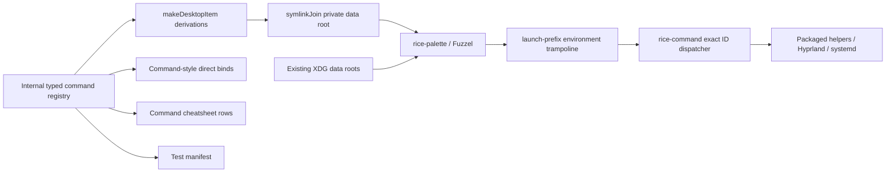

# Unified Fuzzel command palette

## Claim

`SUPER+SPACE` becomes one searchable surface for installed applications and rice commands. An internally evaluated Nix submodule registry generates private desktop entries, command-style direct bindings, cheatsheet rows, dispatcher cases, and test metadata. Fuzzel remains the application engine; the rice adds commands without reimplementing application discovery.

## Context

The rice currently has four independent Fuzzel surfaces:

| Surface | Current entry | Source |
|---|---|---|
| Applications | `SUPER+SPACE` → raw `fuzzel` | `modules/home/desktop/hypr-rice/hyprland.lua` |
| System actions | `SUPER+P` → `cmd-menu` | `modules/home/desktop/hypr-rice/default.nix` |
| Keyboard help | `SUPER+H` → `hypr-cheatsheet` | `modules/home/desktop/hypr-rice/default.nix` |
| Workspace layout | `SUPER+SHIFT+R` → `hypr-layout-menu` | `modules/home/desktop/hypr-rice/hypr-layout-menu.sh` |
| Focused ratio | `SUPER+R` → `tile-ratio` | `modules/home/desktop/hypr-rice/tile-ratio.sh` |

The menus repeat command labels, bindings, action semantics, dependencies, and cancellation behavior in different shapes. `SUPER+SHIFT+E` also exits Hyprland immediately and sits one key away from `SUPER+SHIFT+R`; an accidental press terminated the desktop session. Exit must become palette-only and confirmation-gated.

Snappy is not part of this unification. It switches existing windows through a modifier-held lifecycle; Fuzzel launches applications and commands through search/submit.

## Goal

After activation:

1. `SUPER+SPACE` searches normal installed applications and generated rice commands together.
2. Command labels are category-prefixed and searchable by aliases.
3. Fuzzel history/relevance remains the default ranking.
4. One-shot category, alphabetical, and frequent views are themselves palette commands.
5. Commands needing input open focused secondary Fuzzel prompts.
6. Reboot, power off, and Hyprland exit require explicit `No`/`Yes` confirmation.
7. `SUPER+P`, `SUPER+H`, and `SUPER+SHIFT+E` are removed.
8. High-frequency direct actions remain available.
9. Custom command entries are private to the palette and do not pollute unrelated desktop menus.
10. GUI verification never drives the operator's active TTY.

## Scope

### Included

- Internally evaluated `attrsOf (submodule …)` command registry in the rice module.
- Private generated XDG desktop-entry aggregate plus launch-environment trampoline.
- Unified Fuzzel wrapper and one-shot command-category views.
- Stable exact command-ID dispatcher.
- Shared confirmation and failure reporting.
- Registry projections for direct bindings, cheatsheet, palette, and test manifest.
- Existing layout, ratio, special-space, system, session, help, utility, and discoverable window commands.
- Removal of obsolete/dangerous bindings and `cmd-menu`.
- Non-interactive tests plus an isolated GUI journey.

### Deferred

- `hypr-space` labels, saved layouts, and app-aware slot restoration.
- Transactional mouse editing and the pinned Hyprland plugin.
- Arbitrary third-party palette extensions.
- Persistent palette view/sort state.
- Replacing Snappy.
- Launching missing applications as part of a workspace template.

## Architecture



Legend: native compositor binds remain a separate registry; this registry owns palette commands and command-style direct binds. Fuzzel and XDG remain authoritative for normal applications.

### Why private desktop entries

The rejected alternative is a custom dmenu database that parses application desktop files and implements launching itself. That would duplicate Fuzzel's XDG discovery, field-code handling, icons, desktop actions, caching, and execution semantics.

Each command is one `pkgs.makeDesktopItem` derivation. `pkgs.symlinkJoin` aggregates their outputs into the exact XDG shape Fuzzel expects:

```text
/nix/store/...-rice-private-applications/share
└── applications/
    ├── nori-rice-layout.custom.desktop
    └── nori-rice-session.exit.desktop
```

`rice-palette` prepends the aggregate's **`share` data root** to the prior `XDG_DATA_DIRS`; it never replaces the existing profile/system roots. If the variable was originally unset, the preserved suffix is `/usr/local/share:/usr/share`.

Fuzzel launches selected desktop entries with its own environment. Therefore every invocation also uses `--launch-prefix` with a packaged argv trampoline that restores the original `XDG_DATA_DIRS`, removes palette bookkeeping variables, and `exec`s the selected argv without `eval` or `sh -c`.

The aggregate is referenced by the wrapper's closure but is not installed through `home.packages`, `xdg.dataFile`, or `xdg.desktopEntries`. Other launchers do not discover it, and applications launched from the palette do not inherit it.

## Command registry

### Record shape

```text
commands : attrsOf Command

attrset key          stable exact ID
Command
├─ label             visible category-prefixed name
├─ category          layout | space | window | system | session | help | view | utility
├─ description       cheatsheet/reference text
├─ keywords          hidden search aliases
├─ icon              freedesktop icon name
├─ executable        package/path plus fixed argv owned by the record
├─ effect            launch | query | toggle | layout | window | session | destructive
├─ palette           visible in unified search
└─ directBinding     optional modifier/key for command-style binds
```

The registry is evaluated internally with `lib.evalModules` and `types.attrsOf (types.submodule …)`; it does not expose a generic Home Manager option. The attrset key makes duplicate IDs unrepresentable. IDs satisfy `^[a-z0-9]+([.-][a-z0-9]+)*$`; each fully specified action has one ID, for example `space.toggle.music`, never `space.toggle` plus a desktop-file argument.

`effect = destructive` derives confirmation and forbids `directBinding`; confirmation is not a second independently maintained fact. Dynamic `space.toggle.<name>` records derive from the existing `layerTags` source rather than copying tag names.

### Structural constraints

| ID | Constraint | Planned enforcement |
|---|---|---|
| C1 | Attrset keys are valid namespaced IDs; desktop filenames derive as `nori-rice-<id>.desktop`. | Submodule assertion + manifest test. |
| C2 | Category and effect use closed enums. | Submodule types. |
| C3 | Destructive effect derives `yes-no` confirmation and forbids direct bindings. | Construction rule. |
| C4 | Every desktop `Exec` is absolute `rice-command <exact-id>` with exactly one safe ID argument. | Generated desktop validation + dispatcher arity test. |
| C5 | Palette invocation references a known registry key. | Dispatcher generation from keyed registry. |
| C6 | Executable package/argv is registry data, never parsed from labels or duplicated in a dependency list. | Dispatcher/manifest projection tests. |
| C7 | Command-style direct bindings and command cheatsheet rows derive from the same record. | Projection tests. |
| C8 | Private entries are in the wrapper closure but absent from activated profile `share/applications`, `xdg.dataFile`, and `xdg.desktopEntries`. | Profile projection test. |
| C9 | Normal apps inherit the original XDG environment, not the private overlay. | Launch-prefix trampoline test. |
| C10 | Native compositor binds remain separately owned; palette window adapters do not force them through shell dispatch. | Registry boundary test/documented split. |

### Projection graph

```text
layerTags
└─ generated space command records

commands : attrsOf Command
├─ palette = true        → private desktop items
├─ every record          → dispatcher cases
├─ directBinding != null → generated Lua command binds
├─ directBinding != null → command cheatsheet rows
└─ every record          → generated test manifest

native compositor-bind registry
├─ generated/direct Lua native binds
└─ native cheatsheet rows
```

The manifest is a projection, never a copied expected-command list. Native and command rows may render into one cheatsheet, but retain separate owners.

## Initial command set

Normal applications are discovered by Fuzzel and do not appear in this table.

| Category | Palette commands | Direct binding after migration |
|---|---|---|
| Layout | `Layout: Presets…`, `Layout: Custom…`, `Layout: Reset`, `Layout: Focused Window Ratio…` | Ratio and workspace-layout shortcuts remain. |
| Space | One toggle per `layerTags`, cycle next/previous, popup terminal | Existing high-frequency tag and popup bindings remain native. |
| Window | Close focused, fullscreen, toggle floating, toggle split, focus left/right/up/down | Existing low-latency native bindings remain; palette entries are dispatcher adapters verified against the same Hyprland action semantics. |
| System | `System: Lock`, `System: Toggle Night Mode`, `System: Reboot…`, `System: Power Off…` | Lock remains as a command-style direct binding; old system-menu binding is removed. |
| Session | `Session: Exit Hyprland…` | **No direct binding.** |
| Help | `Help: Keyboard Shortcuts` | Old standalone help binding is removed. |
| Utility | `Utility: Glass Spacer`, `Utility: Screenshot Region` | Existing direct bindings remain. |
| View | `View: Frequent`, `View: Alphabetical`, `View: Browse Categories…` | None. |

`cmd-menu` is deleted after its actions move into registry entries. Focused helpers remain reusable command boundaries, but participating helpers migrate to `writeShellApplication` with complete runtime inputs or absolute paths.

The layout menu gains an explicit public interface so palette entries reach their named interaction directly:

```text
hypr-layout-menu presets
hypr-layout-menu custom
```

`hypr-layout reset`, `tile-ratio`, `hypr-cheatsheet`, `layer-toggle`, and `layer-cycle` remain focused helpers. `tile-ratio` stops sending its own notification; helpers return stderr/status and the central dispatcher owns palette/direct-command failure notifications.

## Palette interaction

### Default view

```text
SUPER+SPACE
└─ applications + commands, ranked by Fuzzel history/relevance
```

Category prefixes compensate for Fuzzel's lack of Raycast-style subtitles:

```text
Layout: Custom…
Space: Toggle Music
System: Lock
Session: Exit Hyprland…
Help: Keyboard Shortcuts
```

Keywords add aliases without changing the displayed name, for example `shutdown`, `quit`, `grid`, `ratio`, and special-space names. Every application-mode invocation explicitly sets `--fields=filename,name,generic,keywords`; Fuzzel 1.14.1 does not search `Keywords` by default. Internal categories stay in visible names and keywords, not the freedesktop `Categories=` field.

### One-shot views

Fuzzel cannot change sort order inside an open window. A view command closes the current palette and opens another invocation:

| View | Invocation behavior |
|---|---|
| Frequent | Reopen default application mode with Fuzzel cache/relevance. This intentionally increments the view entry's own history count. |
| Alphabetical | Same overlay with `--no-sort --match-workers=0`: Fuzzel's title-ordered source with relevance sorting disabled. |
| Browse Categories | Focused picker containing `Layout`, `Space`, `Window`, `System`, `Session`, `Help`, and `Utility`; `View` is excluded to prevent recursive navigation. |
| Command category | Reopen unified Fuzzel with initial `--search 'Category:'`. |

There is no Applications-only view: loading without private command IDs and writing the shared cache would erase command history. Applications remain available in every default/alphabetical unified view. Views are not persisted; the next `SUPER+SPACE` returns to Frequent/default.

### Focused secondary prompts

Fuzzel has no native nested-menu abstraction. Input commands chain a second constrained invocation:

```text
Layout: Presets…       → --only-match preset picker
Layout: Custom…        → --prompt-only expression
Layout: Focused Ratio… → existing preset/input helper
View: Browse Categories… → --only-match category picker
Destructive action     → --only-match No/Yes confirmation
```

Cancellation status `1` and empty submitted input are successful no-ops. Other Fuzzel failures propagate nonzero.

## Execution model

### Stable dispatcher

Every generated desktop entry calls one packaged dispatcher:

```text
Exec=/nix/store/.../bin/rice-command layout.custom
Exec=/nix/store/.../bin/rice-command space.toggle.music
Exec=/nix/store/.../bin/rice-command session.exit
```

`rice-command` accepts exactly one safe namespaced ID. It rejects any other arity or unknown ID before execution. Each generated case maps to one Nix-owned executable package and fixed argv; desktop entries carry no generic arguments, shell fragments, or `%` field-code risk.

### Confirmation

One helper owns all destructive confirmations:

The shared helper invokes `No` then `Yes` with `--dmenu --only-match --index` and fails closed:

| Result | Meaning |
|---|---|
| status `1` | Cancel; exit `0`. |
| other nonzero | Propagate failure. |
| status `0`, index `1` | Execute the allowlisted destructive ID. |
| any other output | No mutation. |

Required confirmation commands:

- `system.reboot`
- `system.poweroff`
- `session.exit`

`session.exit` invokes the Hyprland Lua dispatcher only after confirmation. The first **activated generation** atomically includes the confirmed dispatcher case, private desktop entry, working palette, `SUPER+SPACE` migration, and removal of `SUPER+SHIFT+E`; no tested generation temporarily loses all designed exit access.

### Failure contract

| Event | Behavior |
|---|---|
| Palette/prompt/confirmation cancelled | Exit 0; no mutation. |
| Fuzzel fails with status other than 0/1 | Fail nonzero. |
| Unknown command ID or invalid dispatcher arity | Fail before invocation. |
| Runtime dependency unavailable | Fail before invocation. |
| Command execution fails | Dispatcher writes stderr and sends one Mako notification. |
| User layout/ratio input invalid | Helper returns stderr/status; dispatcher owns notification. |

Cancellation exits `0` and never notifies. Display labels, keywords, and user queries are never evaluated as shell commands. Runtime dependencies derive from executable package/argv records rather than a parallel dependency list. Participating PATH-dependent helpers are converted to `writeShellApplication` or absolute store references.

### Dependency ownership

| Boundary | Owned references |
|---|---|
| `rice-palette` | Fuzzel, private aggregate, launch trampoline |
| Confirmation / failure | Fuzzel / libnotify |
| Hyprland IPC actions | Hyprland (`hyprctl`) |
| Power and night mode | systemd (`systemctl`) |
| Lock | procps (`pidof`), Hyprlock |
| Popup terminal | Hyprland, Ghostty, grep or a replacement query implementation |
| Layer query | Hyprland, jq, sed |
| Screenshot | grim, slurp, wl-clipboard |
| Ratio helper | coreutils, Fuzzel, gawk, Hyprland, jq; no libnotify |
| Layout helper | coreutils, Hyprland |
| Cheatsheet | Fuzzel, generated text derivation |

Global installation elsewhere in the desktop module is not dependency ownership.

## Binding migration

### Keep

- Focused-window ratio.
- Workspace-layout menu.
- Popup terminal.
- Glass spacer.
- Lock.
- Window management and focus.
- Special-space toggles and cycle.
- Screenshot.
- Snappy window-switching bindings.

### Remove

```text
SUPER+P         cmd-menu
SUPER+H         standalone cheatsheet
SUPER+SHIFT+E   immediate Hyprland exit
```

### Replace

```text
SUPER+SPACE     raw fuzzel → rice-palette
```

Generated Lua and bind-manifest checks enforce these facts because `hyprctl binds -j` exposes Lua dispatcher arguments as opaque values.

## Verification

### Pure/build-time

Add behavior tests for:

1. Internal submodule validation, namespaced IDs, and derived filenames.
2. `makeDesktopItem` generation, `symlinkJoin` data-root shape, and `desktop-file-validate`.
3. Private overlay prepends while preserving set/unset original `XDG_DATA_DIRS`.
4. Launch-prefix trampoline restores environment and executes argv without shell evaluation.
5. Explicit Fuzzel fields, Frequent, and strict Alphabetical arguments.
6. Command-category picker and initial prefix search; no Applications-only path.
7. Cancellation, empty-input, and Fuzzel status propagation.
8. Confirmation status/index protocol and destructive direct-bind prohibition.
9. Exact one-ID dispatcher arity, unknown IDs, and layer-tag-derived IDs.
10. One central notification plus stderr on execution failure.
11. Direct layout-menu `presets`/`custom` helper routing.
12. Command bind/cheatsheet/manifest completeness and native-bind boundary.
13. Private entries present in closure but absent from activated profile application projections.
14. Absence of `SUPER+P`, `SUPER+H`, and `SUPER+SHIFT+E`.
15. Presence of `SUPER+SPACE → rice-palette`.
16. Window palette adapters target the intended focused window after Fuzzel exits.

The flake check runs shell syntax, behavior tests, generated-desktop validation, and generated-Lua checks. Tests inject Fuzzel, Hyprland, systemd, notification, and command binaries; they never open UI.

### Isolated GUI journey

No verifier may open Fuzzel, move focus, or switch spaces in the operator's active session.

The implemented `hypr-palette-live-test` launches Fuzzel under a private headless Sway socket with disposable HOME/XDG/cache roots and Wayland-scoped `wtype` input. It verifies normal application discovery, private command discovery, exact-ID dispatch, and launch-environment cleanup without connecting to the operator's compositor.

Hyprland 0.55.4's Aquamarine 0.11 Wayland backend cannot nest against the available headless compositors: modern parents fail protocol-version validation, while older parents advertise versions below Aquamarine's requirement. Generated-Lua checks and the complete workstation closure therefore verify Hyprland wiring; active runtime introspection remains the separate `test-hypr` lever and requires an explicitly authorized session.

The isolated journey verifies:

- a fixture application and generated commands are both discoverable;
- selecting the fixture executes it with the original XDG environment and no Fuzzel metadata leakage;
- selecting `Help: Keyboard Shortcuts` executes through its generated private desktop entry and stable dispatcher ID;
- private processes, socket, cache, and temporary XDG roots are removed.

Verification is never redirected to the active desktop.

## Delivery sequence

1. Commit this hardened design.
2. Add failing pure tests for the internal schema, exact-ID dispatcher, confirmation, XDG overlay/trampoline, desktop aggregate, views, and helper interfaces.
3. Implement the registry projections, explicit dependency ownership, dispatcher, confirmation/failure boundary, private aggregate, launch trampoline, and palette wrapper without activating an intermediate generation.
4. Migrate layout/space/window/system/session/help/utility/view actions and delete `cmd-menu`; keep native low-latency bind ownership separate.
5. In the same first behavioral generation: bind `SUPER+SPACE` to the working palette, remove `SUPER+P`/`SUPER+H`, and remove `SUPER+SHIFT+E` only after confirmed `session.exit` exists.
6. Pass pure checks and build the complete workstation closure.
7. Run the headless Fuzzel/XDG journey and generated Hyprland wiring checks against that exact closure.
8. Activate and persist only after the isolated journey passes; verify the running generation and no config errors.
9. Do not push without the repository push gate and explicit operator approval.

## Related designs

- [`2026-07-15-hypr-rice-layout-follow-up-design.md`](./2026-07-15-hypr-rice-layout-follow-up-design.md) — layout identity and deferred `hypr-space` boundary.
- [`2026-07-15-hypr-rice-layout-design.md`](./2026-07-15-hypr-rice-layout-design.md) — rice extraction and native layout foundation.
