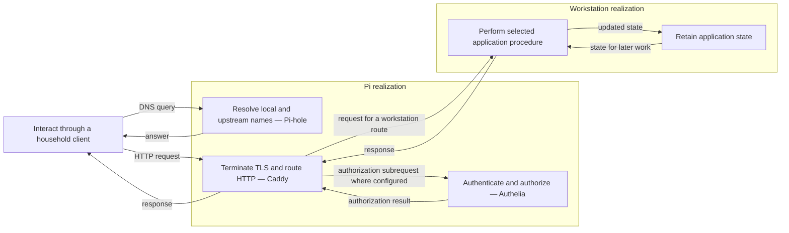
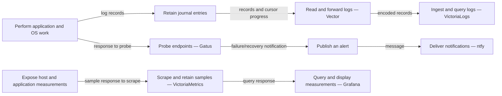
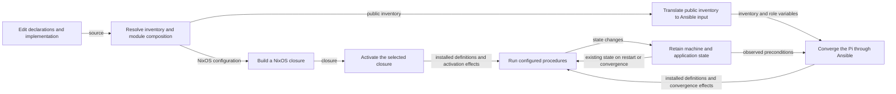

# Homelab as composed processes and flows

Status: design baseline from source inspection, before choosing a rewrite language.
The inspected source is the **two-host migration checkout**, not an observation
of the deployed machines. Its baseline is `06de3381bbe307c08a7ee8524f652a314965cb41`
plus the pending agent-workflow and realization-example changes. Existing inventory,
Nix and Ansible files remain the configuration authority. This document is a
review artifact, not a second configuration database or an enforcement framework.

## Meaning of the drawing

A box denotes a procedure with input and output ports. It can expand into another
diagram. It does not denote an object containing fields and methods. A daemon,
timer job, compiler invocation, request handler and interactive session can all be
represented this way; their invocation and execution lifetimes differ.

```text
                    ┌──────────────────────────────────┐
input at step t ────▶│ perform one process transition    │────▶ output at step t
                    └───────────▲──────────────┬───────┘
                                │              │
                             state t       state t+1
                                │              │
                                └──[retain]◀───┘
```

The feedback crosses an explicit retention/time boundary with an initial state.
It is not an instantaneous algebraic cycle. Retention may be in memory, a file,
a database or a remote service. These differ in restart and failure behavior.
An event log preserves events; a snapshot summarizes history for a particular
future behavior. It need not permit reconstruction of the original history.
Histories across machines are causally related; the model does not assume one
globally ordered log or require event sourcing.

Wire labels name values, streams, requests or responses. A file path is a storage
binding for retained data, not the semantic identity of that data. A database box,
when expanded, denotes executing queries and retaining their resulting state.
Mailboxes similarly expand into receive, buffer and deliver procedures.

Keep these projections distinct:

| Projection | What its edges mean |
|---|---|
| Behavior | Values/messages flow between named process ports |
| Feedback | Resulting state is retained and supplied to a later transition |
| Authority | A principal or process may invoke a port or access a resource |
| Realization | A procedure is implemented, scheduled or hosted in an environment |
| Derivation | One artifact is generated from another |
| Evidence | A source declaration or runtime observation supports a claim |

Hosting and authority relations are not extra data wires. Machines appear as
regions around procedures; disks bind retention to physical resources. A network
dependency usually expands into request and response wires. A systemd ordering
dependency does not by itself establish either wire.

Solid arrows below denote source-supported declared connections, not demonstrated
transport compatibility or successful delivery. Dotted arrows denote
intended/manual/disabled connections and are labelled accordingly. Diagrams are
compositional views, not a claim that every OS thread or application-internal
protocol has been reverse engineered.

## Entry and application behavior



The application box expands into the catalogs below. Pi-hosted applications stay
inside the Pi region. Native application login, OIDC and forward-auth are
different protocols; this drawing does not force every request through Authelia.
Public, LAN and tailnet access are different authority/exposure overlays.
See `inventory/workloads.nix`, each workload's endpoint manifest,
`infra/pi/scripts/generate-inventory.sh`, and
`services/caddy/ansible/templates/Caddyfile.j2`.

## Acquisition and delivery


This is an intended composition with explicit gaps, not an asserted functioning
acquisition pipeline. Recyclarr's configured synchronization and the music-ingest
procedure have more concrete source-defined flows, expanded in the media catalog.
The `music` dataset explicitly relates Lidarr/music-ingest producers to Navidrome
consumption in `inventory/datasets.nix`.

## Operational observation



The request wires for scraping, querying and probing are omitted here for
readability; their response arrows do not mean the exporters initiate pushes.
Journal offsets, log indexes, metric samples and alert suppression state are
different feedback paths. Critical infrastructure notification uses an external
ntfy route; agent attention uses the homelab route. A notification wire is not an
automatic repair loop: workstation agent-fix is explicitly disabled.

## Build, deployment and retained infrastructure state



Build and convergence are procedures too. Their state must not be confused with
the state of the applications they configure. Nix evaluation/build artifacts,
Ansible target observations, deployment credentials and application databases
have different ownership and lifetimes. The current pure inventory compiler and
backend adapters are documented in `inventory/default.nix`,
`lib/machines.nix`, `infra/pi/scripts/generate-inventory.sh`,
`infra/pi/playbooks/pi.yml` and `Justfile`.

## Retention and recovery

| Retained data | Declared physical binding / status |
|---|---|
| OS, home, shared working trees, normal service state | SN750 mounts, including `/var/lib` |
| Family collections and bulk files | IronWolf Pro mounts and library paths |
| Attic cache | MP510 cache directory |
| Historical backup and replica data | Preserved MP510 subvolumes; this does not imply active writers |
| Independent backup destination | OneTouch declaration; backup scheduling disabled |
| Same-filesystem rollback snapshots | btrbk policy; distinct from an independent backup |

Sources: `infra/workstation/disko.nix`, `infra/workstation/disko-media.nix`,
`infra/workstation/disko-mp510.nix`,
`infra/workstation/music-ingest.nix`, `infra/workstation/media-storage.nix`,
`inventory/backup.nix`, and the backup modules. The desired
hot/cold policy is not completely equivalent to the current bindings: downloads
remain on an IronWolf subvolume, while music staging is an ordinary directory on
the SN750 root filesystem and the master music library is on the separately
mounted IronWolf `@library` subvolume. A common `/mnt/media` prefix does not imply
a common filesystem. Record any placement change as a rewrite decision rather
than silently drawing the desired state as current.

```text
state ──[snapshot locally]──▶ local rollback state

state ──[prepare consistent data]──[restic backup]──▶ independent copy
                                 DISABLED

independent copy ──[restore]──▶ recovered state ──[resume procedure]──▶ behavior
```

Backup and restore are separate procedures. A declared backup destination is
neither an active backup flow nor evidence that the restore composition succeeds.

## External and interactive boundaries

The source also includes processes outside the workload inventory:

| Process boundary | Input/output and feedback | Source |
|---|---|---|
| Probe public component availability | Scheduled trigger + HTTP outcomes → latest component rows in D1 | `products/status/src/worker.ts`, `products/status/alchemy.run.ts` |
| Serve public status | GET/HEAD + catalog + retained rows → HTML/JSON; D1 failure yields unknown | `products/status/src/worker.ts`, `products/status/src/status.ts` |
| Relay project MCP requests | Authenticated HTTP → correlated WebSocket request → response; pending correlation/timeouts retained in memory | `infra/cloudflare/workers/herdr-projects-relay.ts` |
| Provision edge routes and access | Alchemy programs + provider responses → edge resources + retained deployment state | `infra/cloudflare/*.alchemy.run.ts`, `infra/cloudflare/alchemy.run.ts` |
| Stream an existing desktop | Logged-in graphical session + remote input → captured/encoded audio/video | `services/sunshine/nixos.nix` |
| Run disposable or operator VMs | VM definitions/images + input → guest behavior + retained guest state | `profiles/desktop/nixos/virt.nix`, `infra/pi/scripts/test-vm.sh`, `tests/e2e-*.nix` |
| Fetch research papers | Operator invocation + resolver responses → files in the Paperless consumption flow | `profiles/research/nixos.nix`, `users/nori/programs/papers-fetch/` |

The public status implementation is a concrete example of state as a summary:
it upserts the latest result per component; it does not retain the complete probe
history. Its current projection does not expire old rows by age. That is observed
source behavior to assess during redesign, not a new guarantee added by this model.
The relay's pending promises are not made durable merely by the platform type's
name; distinguish those process-local correlations from retained platform state.

External clients, internet providers, DNS/ACME, the router, enrolled tailnet,
application UI configuration and secret provisioning are open boundaries. Their
behavior is not established by these source declarations. Interactive desktop
applications, upstream application internals, kernel/filesystem mechanics and
provider internals remain explicitly composed boxes, not silently omitted claims.

## How this guides the rewrite

First settle the required input/output behavior, state ownership and failure
boundaries. Then compare candidate implementations by whether they preserve those
compositions. Preserve required user journeys and retained data; the current
directory structure, profile taxonomy, APIs between internal modules and language
are replaceable. Disabled flows and manual integrations need explicit decisions,
not accidental preservation or automatic activation.

Haskell, TypeScript/Effect and Nix can be evaluated against this model afterward.
No language choice, actor framework, generic effect algebra, or comprehensive
proof system is introduced by this inspection.

## Workload coverage and detailed expansions

The public inventory contains **49 workload identities**. Every identity is
assigned below to a source-inspected expansion. This is workload coverage,
not a claim of 49 OS processes: shared PostgreSQL, nested startup jobs,
exporters, workers and externally implemented boundaries expand differently.

| Expansion | Covered workload identities |
|---|---|
| [media](../archive/reports/2026-09-06-process-media.md) | `bazarr`, `calibre-web`, `filmder`, `jellyfin`, `jellyseerr`, `komga`, `lidarr`, `music-ingest`, `navidrome`, `prowlarr`, `qbittorrent`, `radarr`, `recyclarr`, `sonarr`, `stremio`, `suwayomi` |
| [services](../archive/reports/2026-09-06-process-services.md) | `attic`, `clamor`, `glance`, `heim`, `herdr-projects-mcp`, `hindsight`, `immich`, `mcp-origin-tunnel`, `miniflux`, `ollama`, `open-webui`, `paperless`, `radicale`, `samba`, `syncthing`, `vaultwarden` |
| [platform](../archive/reports/2026-09-06-process-platform.md) | `authelia`, `beszel-agent`, `beszel-hub`, `caddy`, `cloudflare-ddns`, `disk-alert`, `gatus`, `grafana`, `heartbeat`, `node-exporter`, `ntfy-notify`, `ntfy-server`, `nvidia-gpu-exporter`, `pihole`, `restic-target`, `victorialogs-server`, `victoriametrics` |

Inventory selection marks `qbittorrent` and `open-webui` inactive. Other
conditions exist below that layer: for example, selected `restic-target` is
disabled by backup policy, while Clamor has no repository-owned runtime module.
Process selection, activation, readiness and successful delivery remain distinct.

Coverage was checked against a fresh public-inventory evaluation. Sources for
these inspection reports are identified in the [provenance record](../archive/reports/2026-09-06-process-provenance.json).
Source links were checked for existence; declarations and diagrams were not live-tested.
